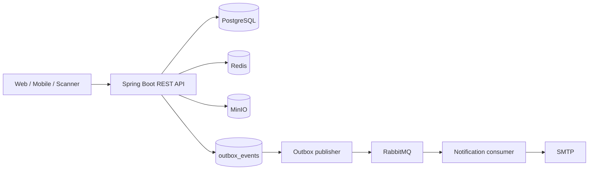

# Smart Event Ticketing Platform — Backend

Backend bán vé sự kiện được xây dựng theo kiến trúc modular monolith bằng Java 17 và Spring Boot. Đây là **đồ án môn học**; Phase 1 tập trung chứng minh luồng bán vé end-to-end, tính nhất quán dữ liệu và xử lý tranh chấp ở các điểm quan trọng.

## Trạng thái hiện tại

**Phase 1 – Core Ticketing: hoàn thành ở mức đồ án.**

Snapshot được đối chiếu ngày 23/08/2026:

- 19 REST controller, 89 endpoint mapping.
- 12 Flyway migration (`V1` đến `V12`).
- 146/146 test pass, không failure/error/skipped theo báo cáo Gradle gần nhất.
- Luồng chính: đăng nhập → tạo/publish sự kiện → cấu hình vé → giữ chỗ → tạo đơn → thanh toán sandbox → phát hành vé/QR → hóa đơn PDF/email → check-in.

Kết luận này **không đồng nghĩa production-ready**. Các việc như publisher confirms, consumer idempotency đầy đủ, kiểm tra nội dung file bằng magic bytes, load test, Testcontainers, rate limiting, CI/CD và backup/restore còn là bước nâng cấp tiếp theo.

## Kiến trúc



PostgreSQL là nguồn dữ liệu chuẩn. Redis hỗ trợ counter/cache, MinIO lưu file, còn RabbitMQ tách việc gửi thông báo khỏi transaction nghiệp vụ. Transactional Outbox giảm rủi ro dual-write; delivery hiện có semantics **at-least-once**, vì vậy duplicate vẫn phải được tính đến.

Các cơ chế quan trọng đã triển khai:

- Atomic compare-and-set cho `AVAILABLE → HELD`, `PENDING → CONFIRMED/EXPIRED` và `ISSUED → USED`.
- Worker giải phóng reservation/order hết hạn mỗi 30 giây.
- Late payment được ghi nhận `Payment.SUCCESS`, hủy order và đưa sang đối soát hoàn tiền thay vì rollback webhook.
- Hóa đơn PDF và email chạy bất đồng bộ qua Outbox/RabbitMQ; retry hữu hạn và DLQ cho lỗi consumer.
- JWT stateless, RBAC, kiểm tra quyền trên tài nguyên sự kiện và chặn truy cập công khai event chưa publish.

Xem [tổng quan kiến trúc](docs/01-architecture/system-architecture.md) và [các luồng giao dịch trọng yếu](docs/01-architecture/critical-flows.md).

## Công nghệ

| Nhóm | Công nghệ |
|---|---|
| Runtime | Java 17, Spring Boot 4.0.7, Gradle |
| API & security | Spring WebMVC, Spring Security, JWT, OpenAPI/Swagger |
| Data | PostgreSQL 16, Spring Data JPA, Flyway |
| Cache/counter | Redis 7 |
| Messaging | RabbitMQ, Transactional Outbox, retry/DLQ |
| Storage | MinIO, presigned URL |
| Document/media | OpenPDF, ZXing, Spring Mail |
| Testing | JUnit 5, Mockito, Spring test starters |

## Các repository

- Backend (repo này): `smartevent-backend`
- Frontend: [smartevent-web](https://github.com/smartevent-ticketing/smartevent-web)
- Hạ tầng local: [smartevent-infra](https://github.com/smartevent-ticketing/smartevent-infra)

Mỗi repository có lịch sử, pipeline và vòng đời phát hành độc lập. PostgreSQL, Redis, RabbitMQ và MinIO được quản lý tại repository infra; Flyway migration vẫn thuộc backend và là nguồn chuẩn duy nhất của database schema.

## Chạy cục bộ

Yêu cầu: JDK 17 và Docker Desktop/Docker Compose.

Khởi động hạ tầng từ repository infra:

```bash
git clone https://github.com/smartevent-ticketing/smartevent-infra.git
cd smartevent-infra
cp .env.example .env
docker compose up -d
```

Sau đó, tại thư mục gốc của repository backend:

```bash
cp .env.example .env
./gradlew test
./gradlew bootRun
```

Trên Windows, dùng `copy`, `gradlew.bat` và `docker compose` tương ứng. File `.env` của infra được Compose tự đọc; Spring Boot chạy từ Gradle vẫn cần nhận biến môi trường qua shell hoặc Run/Debug Configuration của IDE.

Sau khi ứng dụng chạy:

- Swagger UI: `http://localhost:8080/swagger-ui.html`
- Health: `http://localhost:8080/actuator/health`
- RabbitMQ UI: `http://localhost:15672`
- MinIO Console: `http://localhost:9001`

Hướng dẫn chi tiết: [Local development](docs/02-operations/local-development.md).

## Tài liệu

Điểm bắt đầu duy nhất là [docs/README.md](docs/README.md). Tại đây có các lộ trình đọc theo nhu cầu:

- đánh giá Phase 1;
- hiểu kiến trúc và các quyết định kỹ thuật;
- chạy/demo hệ thống;
- kiểm thử, bảo mật và theo dõi rủi ro;
- tra cứu tài liệu chi tiết của từng module.

Tài liệu đặc tả gốc và các hướng dẫn module cũ được giữ nguyên như nguồn tham khảo; tài liệu mới trong `00-overview`, `01-architecture`, `02-operations` và `03-quality` là lớp điều hướng và trạng thái hiện hành.

## Tác giả

Trịnh Đăng Huy — [GitHub](https://github.com/trinhdanghuy-tech)
