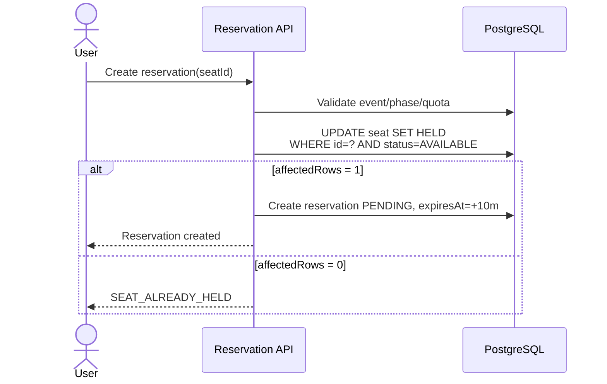
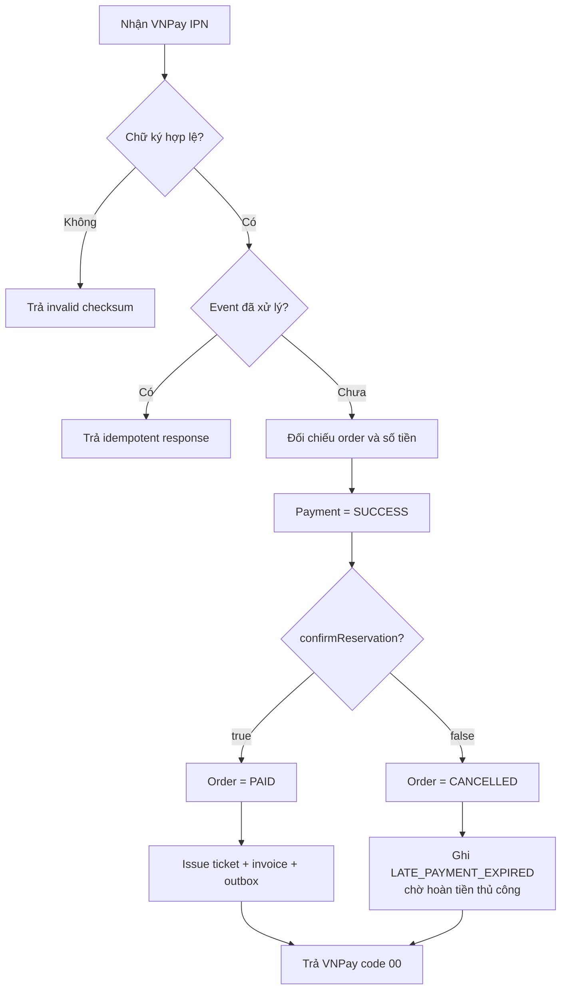
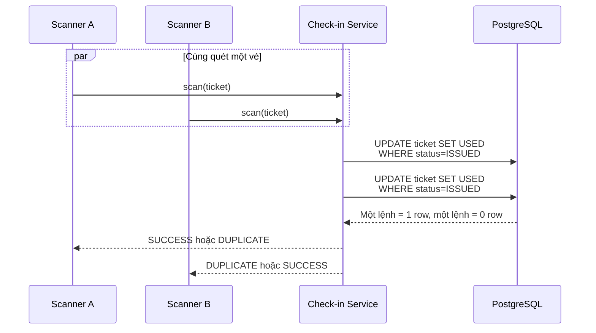

# Các luồng giao dịch trọng yếu

Tài liệu này mô tả các luồng mà thứ tự xử lý, transaction boundary và race condition ảnh hưởng trực tiếp đến tiền, ghế hoặc quyền vào sự kiện.

## 1. Giữ ghế SEATED



Điểm tuyến tính hóa nằm ở conditional update của PostgreSQL. Việc đọc trạng thái ghế trước đó chỉ để validation/hiển thị, không quyết định quyền sở hữu ghế.

## 2. Reservation expiry đua với payment

```mermaid
sequenceDiagram
    participant W as Expiry Worker
    participant DB as PostgreSQL
    participant P as Payment IPN

    par Expiry branch
        W->>DB: CAS PENDING → EXPIRED
    and Payment branch
        P->>DB: CAS PENDING → CONFIRMED
    end

    Note over W,P: Chỉ một CAS cập nhật được 1 row
    alt Payment thắng
        P->>DB: HELD → SOLD; order → PAID
        W-->>W: affectedRows=0, bỏ qua
    else Expiry thắng
        W->>DB: HELD → AVAILABLE; hoàn inventory
        P->>DB: payment → SUCCESS; order → CANCELLED<br/>note=LATE_PAYMENT_EXPIRED
    end
```

`confirmReservation` trả `boolean` thay vì ném exception cho trường hợp đã hết hạn. Điều này tránh transaction thanh toán bị đánh dấu rollback-only khi late payment là một nhánh nghiệp vụ hợp lệ.

## 3. Payment IPN bình thường và late payment



Các bất biến:

- Return URL chỉ phục vụ UI; IPN là nguồn xác nhận tài chính.
- Amount và chữ ký phải được đối chiếu trước khi thay đổi trạng thái.
- Webhook retry không được phát hành thêm ticket/invoice.
- Late payment không được biến mất do rollback; nhưng cũng không được bán lại ghế đã nhả.
- Mã `00` chỉ xác nhận hệ thống đã ghi nhận giao dịch; không có nghĩa khách đã có vé trong nhánh late payment.

## 4. Phát hành hóa đơn và gửi email

```mermaid
sequenceDiagram
    participant S as Invoice/Ticket Service
    participant DB as PostgreSQL
    participant O as Outbox Worker
    participant R as RabbitMQ
    participant C as Consumer
    participant M as SMTP

    S->>DB: Save invoice/ticket + delivery PENDING + outbox
    Note over S,DB: Cùng transaction nghiệp vụ
    O->>DB: Load tối đa 50 PENDING
    O->>R: Publish routing key + JSON payload
    O->>DB: Mark outbox PUBLISHED
    R->>C: Deliver message
    C->>C: Generate PDF/QR payload
    C->>M: Send email
    alt success
        C->>DB: deliveryId → SENT
    else SMTP/handler error
        C->>DB: deliveryId → FAILED + error
        C-->>R: throw; retry tối đa 3 lần
        R->>R: dead-letter nếu vẫn lỗi
    end
```

Giới hạn semantics:

- Outbox loại bỏ việc “commit DB rồi quên tạo event”, nhưng publish và đánh dấu `PUBLISHED` vẫn là hai thao tác khác hệ thống.
- Chưa cấu hình publisher confirms; một vùng mơ hồ vẫn tồn tại khi kết nối lỗi đúng lúc publish.
- Retry có thể gây email trùng nếu SMTP đã nhận mail nhưng consumer lỗi trước khi lưu `SENT`.
- Vì vậy mô tả đúng là **at-least-once + reconciliation**, không phải exactly-once end-to-end.

## 5. Check-in đồng thời



Controller còn kiểm tra organizer/admin có quyền với event tương ứng trước khi cho xem lịch sử hoặc thực hiện thao tác quản trị.

## 6. Checklist khi sửa các luồng này

- State transition mới có conditional predicate ở database chưa?
- Nhánh thất bại có làm transaction bị rollback-only ngoài ý muốn không?
- External callback có idempotency key và amount/signature verification không?
- Side effect bên ngoài transaction có outbox/retry/reconciliation không?
- Consumer chạy lại có tạo duplicate hoặc cập nhật nhầm delivery không?
- Có test race giữa hai nhánh thay vì chỉ test từng service độc lập không?
