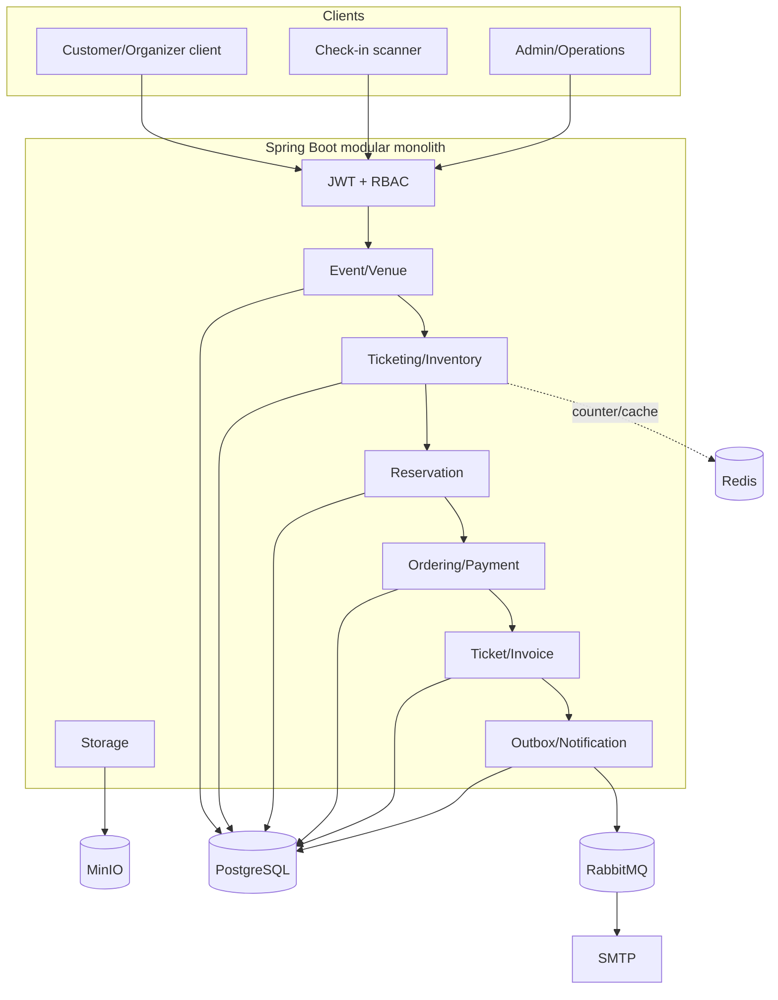
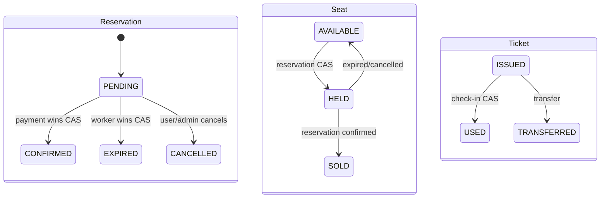

# Kiến trúc hệ thống

## Mục tiêu

Kiến trúc ưu tiên ba thuộc tính cho Phase 1:

1. Không bán trùng ghế và không check-in trùng khi có request đồng thời.
2. Giữ transaction nghiệp vụ nhất quán khi payment callback, worker và message broker lỗi hoặc chạy đua.
3. Dễ phát triển và demo trong phạm vi một đồ án, không gánh chi phí vận hành của microservices.

## Kiểu kiến trúc

Hệ thống là **modular monolith**: một Spring Boot application, một database logic, nhưng code được chia theo module nghiệp vụ. Ranh giới module giúp kiểm soát phụ thuộc và tạo đường nâng cấp nếu sau này cần tách service.

## Vai trò của từng hạ tầng

| Thành phần | Vai trò | Mức nhất quán |
|---|---|---|
| PostgreSQL | Nguồn dữ liệu chuẩn cho trạng thái nghiệp vụ | ACID trong transaction cục bộ |
| Redis | Counter/cache hỗ trợ tốc độ | Dữ liệu dẫn xuất; cần đối soát với DB khi sai lệch |
| RabbitMQ | Vận chuyển event/thông báo bất đồng bộ | At-least-once ở thiết kế hiện tại |
| MinIO | Nội dung file; PostgreSQL giữ metadata | Nhất quán eventual giữa object và metadata ở một số lỗi biên |
| SMTP | Nhà cung cấp giao email | Không thuộc transaction DB; theo dõi bằng delivery record |

## Bản đồ module

| Module | Trách nhiệm | Không nên chịu trách nhiệm |
|---|---|---|
| `identity` | user, role, JWT, refresh token | nghiệp vụ event/order |
| `event` | category, venue, event, area, seat | giữ chỗ và thanh toán |
| `ticketing` | ticket type, sale phase, inventory, quota | vé đã phát hành |
| `reservation` | lease 10 phút, giữ/nhả tài nguyên | xác nhận tài chính |
| `ordering` | order, order item, price snapshot | chữ ký payment gateway |
| `payment` | payment attempt, gateway, IPN/idempotency | render invoice/ticket |
| `ticket` | ticket, QR token, transfer, check-in | tồn kho trước bán |
| `invoice` | invoice, item snapshot, delivery | giao tiếp RabbitMQ trực tiếp |
| `outbox` | lưu/publish integration event | logic gửi email |
| `notification` | consume event, gửi email, cập nhật delivery | thay đổi order/payment |
| `storage` | MinIO object và metadata | vòng đời event |

Các package `analytics`, `audit`, `recommendation`, `resale` thuộc roadmap nâng cao; sự tồn tại của package không được dùng làm bằng chứng module đã hoàn thành.

## Cấu trúc luồng cấu hình sự kiện

Luồng tạo cấu hình sự kiện thuộc `com.smartevent.modules.event`, theo cấu trúc controller, DTO, service và implementation đang dùng trong backend:

- `controller.EventSetupController` nhận `POST /api/v1/events/setup` với quyền ADMIN hoặc ORGANIZER.
- `dto.request.CreateEventSetupRequest` chứa sự kiện và các hạng vé cần tạo.
- `service.EventSetupService` định nghĩa thao tác tạo và gửi duyệt; `service.impl.EventSetupServiceImpl` gọi các service của event và ticketing trong cùng một transaction. Nếu tạo khu vực, ghế, loại vé, đợt bán hoặc gửi duyệt thất bại, toàn bộ cấu hình được rollback.
- `service.impl.EventConfigurationValidator` triển khai `EventConfigurationPolicy`, kiểm tra sức chứa khu vực, địa điểm và điều kiện công bố.
- `service.impl.EventCancellationHandler` nhận `EventCancelled` đồng bộ trong transaction hủy sự kiện. Handler gọi service của ordering, reservation, ticket và payment để xử lý dữ liệu liên quan; nghiệp vụ chi tiết vẫn nằm trong các module đó. Handler yêu cầu transaction hiện hữu (`Propagation.MANDATORY`).

Không có package `application.eventsetup` riêng ở cấp gốc. Các thay đổi vị trí package không làm đổi đường dẫn API, payload hay ranh giới transaction của luồng này.

## State machine cốt lõi

Rule quan trọng: mọi transition có nguy cơ bị hai luồng cập nhật đồng thời phải được quyết định bằng conditional update tại database, không dùng read-then-write làm cơ chế bảo vệ cuối cùng.

## Ranh giới transaction

### Trong transaction database

- tạo reservation và giữ inventory/seat;
- xác nhận reservation và chốt seat;
- ghi kết quả payment/order;
- phát hành ticket/invoice và ghi outbox event;
- cập nhật trạng thái check-in.

### Ngoài transaction database

- publish message sang RabbitMQ;
- gửi SMTP;
- gọi cổng thanh toán bên ngoài;
- đọc/ghi object MinIO.

Các side effect ngoài database không thể rollback cùng PostgreSQL. Vì vậy hệ thống dùng Outbox, retry/DLQ, idempotency và compensating flow thay vì tuyên bố một distributed transaction “all-or-nothing”.

## Consistency và delivery semantics

- Ghế/check-in: quyết định đồng thời tại PostgreSQL bằng CAS.
- Payment webhook: cần idempotent vì gateway có thể retry.
- Outbox: event được lưu cùng transaction nghiệp vụ, sau đó worker publish.
- Rabbit consumer: có thể nhận lại message; handler cần an toàn khi chạy nhiều lần.
- Invoice email: `deliveryId` định danh một lượt gửi cụ thể.
- Late payment: ghi nhận sự thật tài chính trước, sau đó tạo nghĩa vụ hoàn tiền/đối soát.

Chi tiết xem [critical flows](critical-flows.md) và [architecture decisions](architecture-decisions.md).

## Điểm mở rộng hợp lý

Chỉ cân nhắc tách microservice khi có bằng chứng về nhu cầu scale/deploy độc lập. Ranh giới tiềm năng rõ nhất là notification worker, payment adapter, read/search và analytics. Core reservation/order nên giữ cùng transaction database cho tới khi đội ngũ có khả năng vận hành Saga, tracing và reconciliation ở mức cao hơn.
