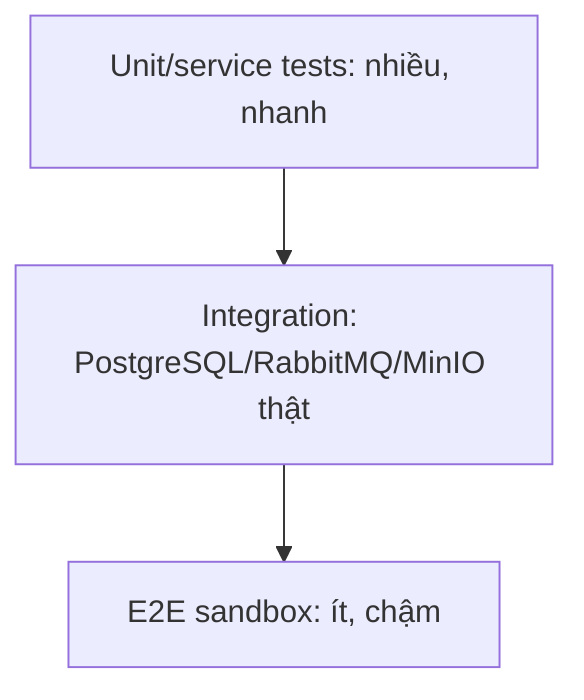

# Chiến lược kiểm thử Phase 1

## Snapshot hiện tại

Báo cáo Gradle gần nhất, ngày 23/08/2026:

| Chỉ số | Kết quả |
|---|---:|
| Tests | 146 |
| Failures | 0 |
| Errors | 0 |
| Skipped | 0 |
| Test suite reports | 25 |

Lệnh chuẩn:

```bash
cd ticketing
./gradlew test
```

Report: `ticketing/build/reports/tests/test/index.html`.

## Phạm vi suite hiện có

| Nhóm | Ví dụ bằng chứng |
|---|---|
| Security | JWT provider, auth service/controller, `/auth/me` protection |
| Event | category, venue, event, area, seat, DRAFT access |
| Ticketing | ticket type, sale phase, inventory, user quota |
| Reservation | validation, confirm/expire CAS outcomes, 50-thread CAS simulation |
| Ordering/payment | order lifecycle, VNPay IPN, idempotency, late payment |
| Fulfillment | ticket, QR/check-in, invoice, PDF generation |
| Messaging | outbox service/worker, notification consumer success/failure |
| Storage | size, extension/MIME, SVG, folder sanitization |
| Migration | Spring context và Flyway history trên PostgreSQL local |

## Test pyramid mục tiêu



Suite hiện tại mạnh ở unit/service test. Integration test hạ tầng và E2E sandbox còn mỏng, vì vậy số lượng test không được dùng thay cho bằng chứng về concurrency database hoặc độ bền messaging.

## Cách hiểu đúng test 50 luồng

`SeatReservationConcurrencyTest` tạo 50 thread nhưng repository là Mockito mock; `AtomicBoolean.compareAndSet` mô phỏng kết quả conditional update. Test chứng minh contract “một success, 49 fail” và logic gọi repository, nhưng **không kiểm chứng PostgreSQL row locking/isolation bằng 50 transaction thật**.

Test cần bổ sung:

1. Khởi động PostgreSQL bằng Testcontainers.
2. Tạo một seat `AVAILABLE` thật.
3. Mỗi thread dùng transaction/connection độc lập và gọi repository/service thật.
4. Đồng bộ thời điểm bắt đầu bằng barrier.
5. Assert đúng một row chuyển `HELD`, không deadlock, dữ liệu cuối nhất quán.

## Quality gates khi đóng Phase 1

### Gate bắt buộc

- Compile và toàn bộ test pass.
- Flyway migrate từ database rỗng thành công.
- Không còn test skipped im lặng.
- Reservation/payment/check-in race có test cho cả nhánh thắng và thua.
- Payment IPN kiểm tra signature, amount và duplicate.
- SMTP failure ném lại exception để kích hoạt retry/DLQ.
- Tài liệu state machine và runbook khớp code.

### Gate nên bổ sung trước buổi demo

- Integration test PostgreSQL cho seat CAS và confirm-vs-expire.
- Integration test RabbitMQ cho retry → DLQ.
- Một E2E happy path từ reservation đến check-in.
- k6/JMeter test 100–500 client tranh một seat; ghi throughput, success count, p95 và error distribution.
- Test late payment qua HTTP/IPN boundary thay vì chỉ service mock.

## Load test demo đề xuất

Kịch bản tối thiểu:

- seed một event/seat `AVAILABLE`;
- 500 virtual user cùng gửi reservation;
- kỳ vọng đúng một response thành công;
- database cuối: một reservation hợp lệ, seat `HELD`, không có dữ liệu bán trùng;
- báo cáo p50/p95/p99, throughput, số `SEAT_ALREADY_HELD`, timeout và lỗi 5xx.

Không dùng chỉ số “request đã gửi” làm kết luận. Kết quả phải được đối chiếu với trạng thái database sau test.

## Tính lặp lại của môi trường test

Test profile hiện dùng PostgreSQL local và có default credential. Điều này làm suite phụ thuộc máy và có rủi ro lộ secret giả/thật. Mục tiêu tiếp theo là Testcontainers + dynamic properties, không hard-code password, và tách unit test khỏi dependency hạ tầng.
