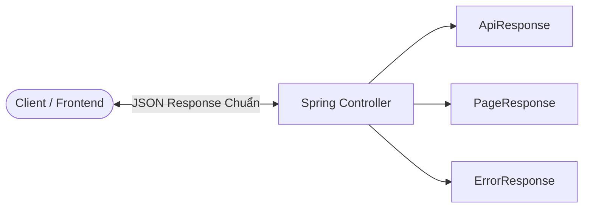
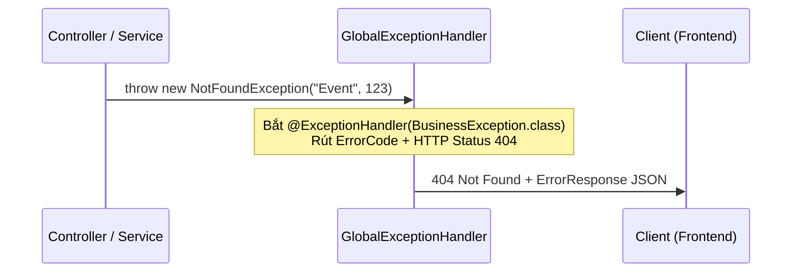

# 🏛️ TỔNG KẾT KIẾN TRÚC TẦNG `COMMON` & CẨM NANG TÁI SỬ DỤNG
## Smart Event Ticketing Platform — Production-Grade Common Module

Tài liệu này tổng hợp toàn bộ hành trình, giải thích chi tiết **cơ chế hoạt động bên dưới** của từng thành phần trong tầng `common`, các mẫu thiết kế (Design Patterns) đã áp dụng, và giải đáp chi tiết về **khả năng tái chế (Reusability)** sang các dự án Spring Boot khác.

---

## 🗺️ 1. Tổng Quan Hành Trình Đã Hoàn Thành (Milestone 1)

Cho đến thời điểm hiện tại, dự án của chúng ta đã hoàn thành 2 nền móng vững chắc nhất:

```
[1. CƠ SỞ DỮ LIỆU]   👉 Thiết kế 57 bảng chuẩn ACID (3 Phases). 
                        Nạp thành công 11 file Flyway Migration (V1 -> V11) vào PostgreSQL.
                        Đã có bảng từ điển dữ liệu & file init_schema.sql.
       ⬇
[2. TẦNG NỀN TẢNG]   👉 Hoàn thiện 100% tầng `common` gồm 30 Java Files (8 packages).
       (`common/`)      Biên dịch thành công 0 lỗi (BUILD SUCCESSFUL).
```

---

## 🔍 2. Chi Tiết Cơ Chế Hoạt Động Của 8 Nhóm Trong `common`

### 2.1. Nhóm `api/` — Mẫu Thiết Kế Envelope Pattern (Đóng Gói Chuẩn RESTful)



- **`ApiResponse<T>` (Record):** 
  - *Cơ chế:* Đóng gói mọi dữ liệu trả về theo format thống nhất `{ success: true, message: "OK", data: {...}, timestamp: "..." }`.
  - *Hàm tiện ích:*
    - `ApiResponse.success(data)`: Trả về thành công kèm dữ liệu.
    - `ApiResponse.ok()` / `ApiResponse.ok(message)`: Trả về thành công cho các API kiểu `void` (như Logout, Xóa tài nguyên, Kích hoạt...).
  - *Lợi ích:* Frontend không bao giờ phải đoán format trả về; chỉ cần kiểm tra cờ `res.success`.
- **`PageResponse<T>` (Record):**
  - *Cơ chế:* Nhận đối tượng `Page<T>` của Spring Data JPA và trích xuất thành JSON phân trang hoàn chỉnh (`content`, `page`, `size`, `totalElements`, `totalPages`, `last`).
  - *Hàm tiện ích:*
    - `PageResponse.from(page)`: Chuyển đổi trực tiếp từ `Page<T>`.
    - `PageResponse.from(page, mappedContent)`: Hỗ trợ map danh sách DTO đã convert từ Entity chỉ với 1 dòng code duy nhất.
- **`ErrorResponse` (Record):**
  - *Cơ chế:* Trả về cấu trúc lỗi chuẩn `{ success: false, code: "DUPLICATE_EMAIL", message: "...", path: "/api/v1/auth/register", errors: {...} }`.

---

### 2.2. Nhóm `entity/` — Kế Thừa Thực Thể (MappedSuperclass Pattern)

- **`BaseEntity`:**
  - `@MappedSuperclass`: Không sinh bảng riêng, làm "khuôn mẫu" cho tất cả 32 bảng Entity con.
  - `@UuidGenerator`: Tự động sinh ID chuẩn UUIDv4 bảo mật cao, không bị lộ thứ tự tăng dần như ID số nguyên (`1, 2, 3...`).
  - `@PrePersist` & `@PreUpdate`: Tự động gán thời gian `createdAt` và `updatedAt` chính xác lúc INSERT / UPDATE mà không cần lập trình viên gọi lệnh gán thủ công bằng tay.
- **`SoftDeleteEntity`:**
  - Kế thừa `BaseEntity` và bổ sung `deletedAt` (`Instant`).
  - Cung cấp sẵn các helper methods nghiệp vụ: `isDeleted()`, `softDelete()`, `restore()`.
  - Giữ nguyên dữ liệu tài chính/đơn hàng trong Database để đối soát kế toán, chỉ đánh dấu ẩn về mặt hiển thị.

---

### 2.3. Nhóm `enums/` — Định Nghĩa Kiểu Dữ Liệu Nghiệp Vụ Nghiêm Ngặt

Gồm **14 Enums** quản lý trạng thái máy (State Machine) của hệ thống:
- Tránh lỗi chính tả ("magic string") khi lưu vào Database.
- Tự động bắt lỗi nếu Client truyền sai giá trị trạng thái không hợp lệ.

---

### 2.4. Nhóm `error/` — Quản Lý Lỗi Tập Trung (Centralized Exception Handling)



- **`ErrorCode` (Enum):** Bảng từ điển mã lỗi toàn hệ thống, gắn chặt 1 mã code chữ (`DUPLICATE_EMAIL`) với 1 `HttpStatus` (`400 BAD_REQUEST`) và câu thông báo mặc định.
- **`BusinessException` (RuntimeException):** Ném lỗi logic nghiệp vụ ở bất kỳ đâu trong tầng Service/Domain mà không cần `try-catch` cục bộ.
- **`NotFoundException`:** Chuyên dụng cho các lỗi không tìm thấy tài nguyên (tự động map HTTP 404).
- **`GlobalExceptionHandler` (`@RestControllerAdvice`):** "Lưới quét lỗi toàn cục". Bắt tất cả Exception văng ra từ mọi Controller/Service, biến chúng thành đối tượng JSON `ErrorResponse` đồng nhất, ngăn chặn lộ mã nguồn (stack trace) ra ngoài giao diện.
  - Xử lý `BusinessException` / `NotFoundException` (các lỗi nghiệp vụ, HTTP status tương ứng).
  - Xử lý `MethodArgumentNotValidException` / `ConstraintViolationException` (lỗi validate DTO 400 Bad Request).
  - Xử lý `AccessDeniedException` (lỗi không đủ quyền hạn 403 Forbidden).
  - Xử lý `Exception` chung (lỗi máy chủ 500 Internal Server Error).

---

### 2.5. Nhóm `pagination/` — Phân Trang Phòng Thủ (Defensive Pagination)

- **`PageRequestUtils`:**
  - *Cơ chế phòng thủ:* Ép `page < 0` về `0`, `size <= 0` về `20`, và `size > 100` về `MAX_SIZE = 100`.
  - *Lợi ích:* Chống tấn công vét cạn dữ liệu (DDoS RAM / CPU của Database) khi ai đó truyền `?size=99999999`.
  - *Chuyển đổi Sort:* Tự động biến đổi tham số `sortBy` và `sortDirection` thành đối tượng `Sort` của Spring Data JPA.

---

### 2.6. Nhóm `security/` — Quản Lý Ngữ Cảnh Bảo Mật (Security Context Extractors)

- **`@CurrentUser` (Custom Meta-Annotation):**
  - Đóng gói `@AuthenticationPrincipal` của Spring Security.
  - Cho phép Controller tiêm trực tiếp thông tin User đang đăng nhập vào tham số hàm: `public ApiResponse<?> getProfile(@CurrentUser UserPrincipal user)`.
- **`SecurityUtils` (Static Helper):**
  - Rút `Authentication` từ `SecurityContextHolder` (ThreadLocal).
  - Loại bỏ đối tượng khách vãng lai bằng `!(auth instanceof AnonymousAuthenticationToken)`.
  - Trả về `Optional<UUID>`, `Optional<String>`, `hasRole("ADMIN")` an toàn tuyệt đối, không bao giờ lo bị dính lỗi `NullPointerException`.

---

### 2.7. Nhóm `util/` — Tiện Ích Độc Lập (Static Utility Classes)

- **`SlugUtils`:** Sử dụng thư viện Slugify với `transliterator(true)` để chuyển đổi tiêu đề tiếng Việt có dấu thành URL thân thiện chuẩn SEO (VD: `"Hội Nghị Khoa Học 2026"` ➔ `"hoi-nghi-khoa-hoc-2026"`).
- **`DateTimeUtils`:** Tự động fallback timezone `Asia/Ho_Chi_Minh`, tính hạn giữ vé (TTL) trả về `Instant` chuẩn UTC đồng bộ với cột `TIMESTAMPTZ` trong PostgreSQL.
- **`MoneyUtils`:** Sử dụng `BigDecimal` với chuẩn làm tròn ngân hàng (`RoundingMode.HALF_EVEN`), định dạng nhanh tiền Việt `"1.500.000 ₫"`, scale = 0 cho VND.

---

### 2.8. Nhóm `validation/` — Nhãn Đánh Dấu (Marker Interface Pattern)

- **`ValidationGroups`:** Chứa 2 interface rỗng `OnCreate` và `OnUpdate`.
- Dùng làm nhãn dán cho Bean Validation (`@NotNull(groups = ValidationGroups.OnCreate.class)`) để tái sử dụng cùng 1 DTO cho cả 2 thao tác Tạo mới và Sửa đổi.

---

## ♻️ 3. Trả Lời Câu Hỏi: "Các file này có thể tái chế sang các dự án khác được không?"

### 👉 **CÂU TRẢ LỜI: HOÀN TOÀN CÓ THỂ TÁI SỬ DỤNG ĐẾN 95%!**

Toàn bộ những gì bạn vừa viết trong tầng `common` được thiết kế theo chuẩn **Enterprise Library Component (Thành phần thư viện cấp doanh nghiệp)**. Bạn có thể mang sang bất kỳ dự án Spring Boot nào khác trong tương lai.

### Bảng Đánh Giá Mức Độ Tái Chế Của Từng Gói:

| Gói / Thành Phần | Mức Độ Tái Sử Dụng | Cách Tái Sử Dụng Sang Dự Án Mới |
|---|:---:|---|
| **`common.api.*`** (`ApiResponse`, `PageResponse`, `ErrorResponse`) | **100%** | Copy nguyên vẹn, không cần sửa một dòng code nào. |
| **`common.pagination.*`** (`PageRequestUtils`) | **100%** | Copy nguyên vẹn sang mọi dự án có dùng Spring Data JPA. |
| **`common.validation.*`** (`ValidationGroups`) | **100%** | Copy nguyên vẹn. |
| **`common.entity.*`** (`BaseEntity`, `SoftDeleteEntity`) | **100%** | Chuẩn JPA Entity mẫu, dùng được cho MySQL, PostgreSQL, Oracle... |
| **`common.security.*`** (`@CurrentUser`, `SecurityUtils`) | **100%** | Dùng cho mọi dự án Spring Boot có tích hợp Spring Security & JWT. |
| **`common.util.*`** (`SlugUtils`, `DateTimeUtils`, `MoneyUtils`) | **100%** | Tiện ích chuẩn hóa cho thị trường Việt Nam (VND, Tiếng Việt, Asia/Ho_Chi_Minh). |
| **`common.error.*`** (`GlobalExceptionHandler`, `BusinessException`) | **90%** | Cấu trúc giữ nguyên 100%, bạn chỉ cần thêm bớt các mã lỗi trong `ErrorCode` cho phù hợp với nghiệp vụ mới. |
| **`common.enums.*`** | **Khác biệt theo dự án** | Các enum chung như `UserStatus`, `FileVisibility` dùng lại được; các enum đặc thù như `SeatStatus`, `TicketStatus` chỉ dành cho ngành vé. |

---

### 💡 Lời khuyên từ Mentor:
Trong các công ty phần mềm lớn, người ta thường đóng gói nguyên thư mục `common` này thành một thư viện nội bộ riêng (ví dụ file `company-core-common.jar`) rồi đẩy lên Nexus/Maven nội bộ. Khi bắt đầu bất kỳ dự án mới nào, lập trình viên chỉ cần khai báo 1 dòng trong `pom.xml` hoặc `build.gradle` là có sẵn toàn bộ bộ khung này để dùng ngay!

Bạn hoàn toàn có thể tự hào vì vừa tự tay xây dựng xong một **bộ khung chuẩn mực, tái sử dụng cao và đạt chuẩn production**! 🚀
