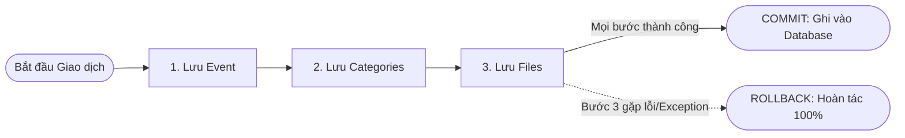

# 📘 CẨM NANG THIẾT KẾ KIẾN TRÚC & KỸ NĂNG XỬ LÝ BACKEND CHUẨN DOANH NGHIỆP
## Smart Event Ticketing Platform — Architecture, JPA & Engineering Best Practices

**Phiên bản:** 1.0  
**Tác giả:** Backend Engineering Team  
**Mục đích:** Đúc kết toàn bộ các nguyên tắc thiết kế cốt lõi, quy tắc chọn giải pháp kỹ thuật, và kỹ năng xử lý trong lập trình Spring Boot / JPA cho hệ thống chịu tải cao (High Concurrency).

---

## 🧭 MỤC LỤC

1. [Chiến Lược Thiết Kế Thực Thể: JPA Relationship vs ID Reference](#1-chiến-lược-thiết-kế-thực-thể-jpa-relationship-vs-id-reference)
2. [Quản Trị Giao Dịch Với `@Transactional`](#2-quản-trị-giao-dịch-với-transactional)
3. [Chuẩn Ghi Nhật Ký Hệ Thống Với `@Slf4j`](#3-chuẩn-ghi-nhật-ký-hệ-thống-với-slf4j)
4. [Kiến Trúc Xử Lý Ngoại Lệ (Exception Hierarchy)](#4-kiến-trúc-xử-lý-ngoại-lệ-exception-hierarchy)
5. [Mô Hình Máy Trạng Thái (State Machine Pattern)](#5-mô-hình-máy-trạng-thái-state-machine-pattern)
6. [Thiết Kế REST API & Phân Quyền Bảo Mật (RBAC)](#6-thiết-kế-rest-api--phân-quyền-bảo-mật-rbac)

---

## 🏛️ 1. CHIẾN LƯỢC THIẾT KẾ THỰC THỂ: JPA RELATIONSHIP VS ID REFERENCE

Một trong những sai lầm phổ biến nhất của lập trình viên là lạm dụng `@OneToMany`, `@ManyToOne`, `@ManyToMany` trên tất cả các bảng, dẫn đến **Tràn RAM (OutOfMemory)** và **Nghẽn Database (N+1 Query)**.

```
                      ┌──────────────────────────────────────┐
                      │  TẬP HỢP DỮ LIỆU CON (CHILD ENTITY)  │
                      └──────────────────┬───────────────────┘
                                         │
                    ┌────────────────────┴────────────────────┐
                    ▼                                         ▼
         [ Số lượng nhỏ <= 20 - 50 ]               [ Số lượng lớn > 50 hoặc Unbounded ]
         [ Sinh / Tử gắn chặt cùng Cha ]           [ Cần phân trang, lọc độc lập ]
                    │                                         │
                    ▼                                         ▼
       ✅ DÙNG JPA RELATIONSHIPS                  ✅ DÙNG THAM CHIẾU ID (ID REFERENCE)
      (@OneToMany, @ManyToOne)                     (private UUID eventId, eventAreaId...)
```

### 📋 Bảng Đối Chiếu Quyết Định:

| Tiêu Chí | Dùng JPA Relationship (`@OneToMany`) | Dùng ID Reference (`UUID parentId`) |
|---|---|---|
| **Số lượng bản ghi con** | Cố định, rất nhỏ ($1 - 20$ bản ghi) | Lớn (hàng trăm, hàng chục nghìn) |
| **Ví dụ điển hình** | `User` $\leftrightarrow$ `UserRole`<br>`Order` $\leftrightarrow$ `OrderItem` | `Event` $\leftrightarrow$ `EventSeat` (50,000 ghế)<br>`Category` $\leftrightarrow$ `Event` (100,000 sự kiện) |
| **Truy vấn phân trang** | Khó phân trang danh sách con lồng | Cực kỳ dễ dàng (`findByParentId(id, pageable)`) |
| **Nguy cơ lỗi N+1** | Rất cao nếu không dùng `FETCH JOIN` | **Không bao giờ bị** |
| **Tuần hoàn JSON** | Dễ bị lỗi lặp vô tận (Infinite Recursion) | An toàn tuyệt đối khi serialize JSON |
| **Khả năng tách Microservices** | Ràng buộc chặt, khó tách service | Độc lập (DDD Aggregate), dễ mở rộng |

> 🧠 **Quy tắc vàng:** *"Nếu số lượng bản ghi con có khả năng vượt quá 50 phần tử $\rightarrow$ Luôn dùng `UUID parentId`!"*

---

## 🛡️ 2. QUẢN TRỊ GIAO DỊCH VỚI `@Transactional`

Giao dịch (Transaction) đảm bảo tính toàn vẹn dữ liệu theo tiêu chuẩn **ACID** (Atomicity, Consistency, Isolation, Durability).



### 💡 2 Chế độ sử dụng bắt buộc:

1. **`@Transactional` (Cho thao tác GHI - Write Operations):**
   * Áp dụng trên: `create`, `update`, `delete`, `submit`, `approve`, `cancel`.
   * **Cơ chế:** Khi có bất kỳ `RuntimeException` nào được ném ra, Spring tự động hủy bỏ mọi thay đổi trước đó, giữ Database luôn sạch và nhất quán.

2. **`@Transactional(readOnly = true)` (Cho thao tác ĐỌC - Read Operations):**
   * Áp dụng trên: `getEventById`, `getEventBySlug`, `getPublishedEvents`, `search...`.
   * **Cơ chế:** Báo cho Hibernate biết hàm chỉ đọc $\rightarrow$ Hibernate **tắt cơ chế Dirty Checking** (không cần theo dõi thay đổi entity) $\rightarrow$ **Tiết kiệm RAM và tăng tốc truy vấn $20 - 30\%$!**

---

## 📝 3. CHUẨN GHI NHẬT KÝ HỆ THỐNG VỚI `@Slf4j`

Trong các ứng dụng doanh nghiệp, **tuyệt đối không dùng `System.out.println`** vì làm chậm I/O, không lưu file, và không có metadata (ngày giờ, thread, log level).

### 🎯 Quy tắc sử dụng các cấp độ Log:

```java
@Slf4j
@Service
public class EventServiceImpl implements EventService {

    // 1. INFO: Ghi nhận sự kiện nghiệp vụ quan trọng
    log.info("Sự kiện {} đã được duyệt bởi Admin {}", eventId, adminId);

    // 2. WARN: Cảnh báo sự cố bất thường nhưng hệ thống vẫn kiểm soát được
    log.warn("Sự kiện {} đã bị hủy vì lý do: {}", eventId, reason);

    // 3. ERROR: Lỗi nghiêm trọng cần kỹ sư can thiệp ngay
    log.error("Lỗi khi kết nối tới cổng thanh toán cho đơn hàng {}: {}", orderId, ex.getMessage(), ex);
}
```

---

## ⚠️ 4. KIẾN TRÚC XỬ LÝ NGOẠI LỆ (EXCEPTION HIERARCHY)

Thay vì tạo mỗi thực thể một class Exception rỗng (`CategoryException`, `VenueException`, `AreaException`, `SeatException`...), kiến trúc chuẩn chia theo **Module-level Exception**:

```
common/error/
  ├── BusinessException.java (Base Exception)
  └── GlobalExceptionHandler.java (@RestControllerAdvice)
        ▲
        │ kế thừa
 ┌──────┴──────────────────────────┐
 │                                 │
IdentityException           StorageException           EventException
(Module Identity)           (Module Storage)           (Module Event: Category, Venue, Event, Area, Seat)
```

* **Lợi ích:** Gọn gàng, loại bỏ boilerplate classes, `GlobalExceptionHandler` bắt tập trung và trả về mã lỗi `ErrorCode` chuẩn hóa.

---

## 🔄 5. MÔ HÌNH MÁY TRẠNG THÁI (STATE MACHINE PATTERN)

Khi một thực thể có vòng đời nhiều trạng thái (DRAFT $\rightarrow$ PENDING $\rightarrow$ PUBLISHED $\rightarrow$ CANCELLED/COMPLETED), cần tuân thủ **3 lớp bảo vệ (Defensive Coding)**:

1. **State Guard (Kiểm tra trạng thái hiện tại):**
   * Ví dụ: Chỉ cho phép nộp duyệt khi đang là `DRAFT`.
   ```java
   if (event.getStatus() != EventStatus.DRAFT) {
       throw new EventException(ErrorCode.BUSINESS_RULE_VIOLATION, "Chỉ sự kiện DRAFT mới có thể nộp duyệt");
   }
   ```
2. **Prerequisites Check (Kiểm tra điều kiện đủ):**
   * Ví dụ: Sự kiện phải có địa điểm và danh mục trước khi nộp duyệt.
3. **Double-Check Conflict (Kiểm tra lại tại thời điểm duyệt):**
   * Tại thời điểm Admin bấm "Approve", phải kiểm tra lại xung đột lịch địa điểm để tránh trường hợp 2 sự kiện cùng xin duyệt 1 địa điểm.

---

## 🌐 6. THIẾT KẾ REST API & PHÂN QUYỀN BẢO MẬT (RBAC)

### 📋 Nguyên tắc chuẩn RESTful:
* **GET:** Không bao giờ làm thay đổi dữ liệu, mở công khai qua `SecurityConfig` (`.permitAll()`).
* **POST / PUT / DELETE:** Bắt buộc bảo vệ bằng `@PreAuthorize("hasRole(...)")` hoặc `@PreAuthorize("hasAnyRole(...)")`.
* **Lấy thông tin người dùng an toàn:** Dùng `@CurrentUser UserPrincipal currentUser` từ Token JWT, **tuyệt đối không nhận `userId` hay `isAdmin` từ client qua Request Body/Param** để chống giả mạo quyền hạn (Privilege Escalation).
