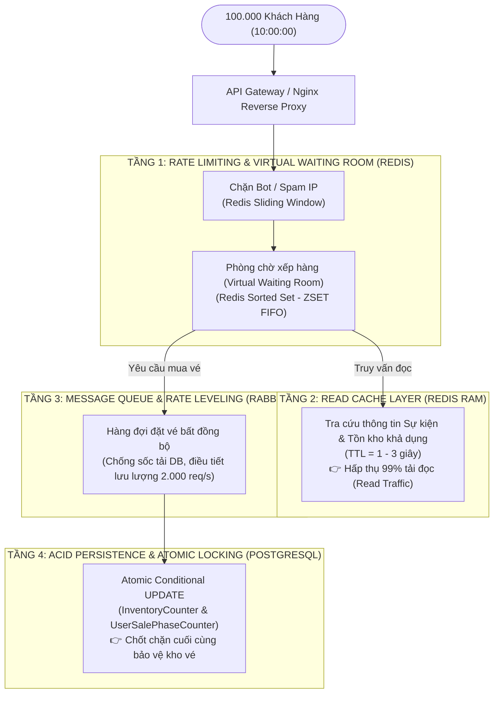
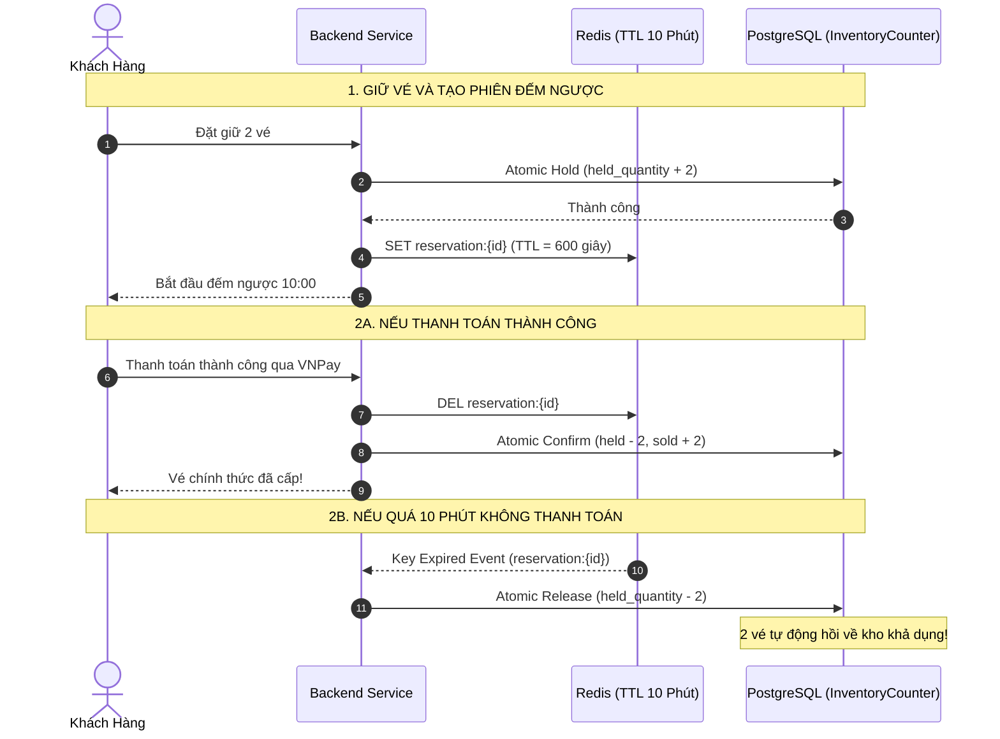

# ⚡ KIẾN TRÚC ĐA TẦNG PHÒNG THỦ: REDIS VS POSTGRESQL TRONG BÀI TOÁN HIGH CONCURRENCY FLASH SALE
## Smart Event Ticketing Platform — System Architecture & Mental Models

**Ngày hoàn thành:** 19/08/2026  
**Chủ đề:** Phân định vai trò Single Source of Truth vs Cache Layer & Đường ống xử lý 100k+ RPS  
**Tác giả / Hệ thống:** Backend Solution Architecture Team  

---

## 🧭 1. Đặt Vấn Đề: Thách Thức Của Hệ Thống Bán Vé Cháy Vé (Flash Sale)

Trong các sự kiện "cháy vé" quy mô hàng trăm nghìn người (Concert BlackPink, Taylor Swift The Eras Tour, Chung kết World Cup):
* **Lưu lượng đỉnh:** 100.000 đến 500.000 requests/giây dồn vào đúng một tích tắc (10:00:00).
* **Số lượng vé hữu hạn:** Chỉ có 1.000 vé VIP hoặc vé đứng (STANDING).
* **Bài toán kinh doanh sống còn:**
  1. Tuyệt đối không được bán lố (Overselling) dù chỉ 1 vé.
  2. Tuyệt đối không để sập Database do nghẽn kết nối (Connection Pool Exhaustion).
  3. Thời gian phản hồi (Response Time) phải dưới 100ms.
  4. Trạng thái giữ vé (Hold 10 phút) phải tự động giải phóng chính xác từng mili-giây nếu khách không thanh toán.

---

## 🏛️ 2. Nguyên Tắc Cốt Lõi: "Single Source of Truth" vs "High-Speed Cache Layer"

Nhiều kỹ sư thường mắc sai lầm: *"Sao không lưu hết tồn kho vào Redis để chạy cho nhanh?"*

```
┌─────────────────────────────────────────────────────────────┬─────────────────────────────────────────────────────────┐
│ POSTGRESQL (TẦNG LÕI DỮ LIỆU BẤT BIẾN - SOURCE OF TRUTH)   │ REDIS (TẦNG CACHE TỐC ĐỘ CAO & PHÒNG TUYẾN PHÍA TRƯỚC)  │
├─────────────────────────────────────────────────────────────┼─────────────────────────────────────────────────────────┤
│ • Lưu trữ trên đĩa cứng (Disk Persistence + WAL Log)        │ • Lưu trữ trên RAM (Siêu nhanh, độ trễ sub-millisecond) │
│ • Chuẩn ACID nghiêm ngặt (Atomicity, Consistency, Isolation)│ • Không đảm bảo ACID đa bảng phức tạp                   │
│ • Không bao giờ mất dữ liệu khi mất điện / sập server      │ • Có rủi ro mất dữ liệu nếu sập node giữa chừng (RAM)   │
│ • Là "chốt chặn pháp lý & tài chính cuối cùng"              │ • Đóng vai trò "lá chắn tải 99%" ngăn request vào DB    │
└─────────────────────────────────────────────────────────────┴─────────────────────────────────────────────────────────┘
```

> ⚠️ **Thảm họa nếu chỉ dùng Redis làm nơi duy nhất trừ tồn kho:**  
> Nếu Redis Cluster bị Restart hoặc gặp sự cố mạng (Split-brain) trong lúc mở bán $\rightarrow$ Toàn bộ dữ liệu ai đang giữ vé nào sẽ **biến mất khỏi RAM** $\rightarrow$ Hệ thống không còn biết vé nào đã bán, vé nào chưa $\rightarrow$ Dẫn đến tranh chấp pháp lý và bồi thường khổng lồ!

---

## 🛡️ 3. Mô Hình Đa Tầng Phòng Thủ (Multi-Tier Defense Architecture)

Để vừa đạt tốc độ xử lý hàng trăm nghìn RPS, vừa bảo vệ tính toàn vẹn 100% của Database, hệ thống triển khai theo mô hình 4 tầng độc lập:



---

## ⚡ 4. So Sánh Chi Tiết Các Cơ Chế Concurrency

```
                                      BẢNG SO SÁNH KỸ THUẬT
┌───────────────────────────┬───────────────────────┬────────────────────────┬─────────────────────────┬──────────────────────────┐
│ Tiêu chí                  │ Read-then-Write       │ SELECT FOR UPDATE      │ Redis Distributed Lock  │ Atomic Conditional UPDATE│
├───────────────────────────┼───────────────────────┼────────────────────────┼─────────────────────────┼──────────────────────────┤
│ Độ an toàn (Oversell)     │ ❌ Rất tệ (Bán lố)    │ ✅ An toàn             │ ✅ An toàn              │ 🌟 Tuyệt đối 100%        │
│ Tốc độ xử lý              │ Nhanh nhưng sai       │ ❌ Chậm (Xếp hàng DB) │ Trung bình (Network hop)│ 🚀 Siêu nhanh (< 1ms/tx) │
│ Nguy cơ Deadlock          │ Không                 │ ❌ Rất cao             │ Thấp (cần TTL)          │ 🌟 Không bao giờ bị      │
│ Tải Connection Pool       │ Thấp                  │ ❌ Cạn kiệt kết nối    │ Tốn kết nối Redis       │ 🌟 Rất thấp              │
│ Kiến trúc phù hợp         │ CRUD cơ bản           │ Ứng dụng ít người      │ Đồng bộ đa dịch vụ      │ 🌟 Flash Sale Core       │
└───────────────────────────┴───────────────────────┴────────────────────────┴─────────────────────────┴──────────────────────────┘
```

---

## 🔄 5. Vòng Đời Tích Hợp Redis TTL & PostgreSQL Trong Module 5 (Sắp Tới)

Ở các module tiếp theo, chúng ta sẽ kết hợp **Redis TTL** và **PostgreSQL Core** như sau:



---

## 🎓 6. TỔNG KẾT NGUYÊN TẮC THIẾT KẾ CHO LẬP TRÌNH VIÊN:

1. **Xây nhà từ móng (Database First):** Phải hoàn thiện tầng Lõi Dữ Liệu Bất Biến (PostgreSQL Atomic Conditional Updates) trước. Đảm bảo dù Redis có sập thì Database vẫn không bao giờ bán lố vé.
2. **Lắp khiên bảo vệ (Cache & Queue Second):** Sau khi tầng móng vững chắc, ta lắp thêm Redis (Read Caching, Rate Limiter, TTL Session) và RabbitMQ (Message Queue) ở các module tiếp theo để nhân tải lên gấp 100 lần.
3. **Phân định ranh giới rõ ràng:** Redis phụ trách **Tốc độ & Trạng thái tạm thời (Ephemeral Data)**. PostgreSQL phụ trách **Sự thật duy nhất & Tính toàn vẹn vĩnh viễn (Persistent Data)**.
