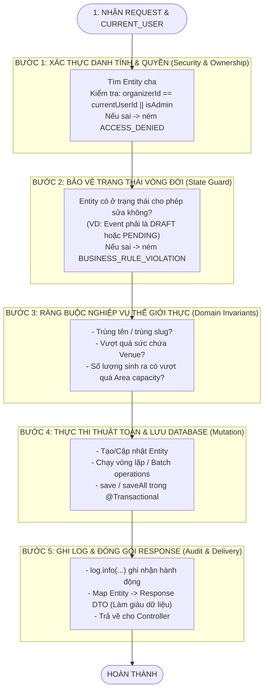

# 🧠 CẨM NANG THIẾT KẾ SERVICE LAYER & PHƯƠNG PHÁP TƯ DUY TỪ YÊU CẦU ĐẾN CODE
## Smart Event Ticketing Platform — Service Architecture & Engineering Mental Model

**Phiên bản:** 1.0  
**Tác giả:** Backend Engineering Team  
**Mục đích:** Giải mã toàn bộ quá trình tư duy của một Senior Backend Developer: *Làm sao để biết một Service cần những gì, phụ thuộc vào ai, kiểm tra những điều kiện nào, và từng bước hiện thực hóa nó thành code Java chuẩn chỉ.*

---

## 🧭 MỤC LỤC

1. [Bản Chất Cốt Lõi Của Tầng Service (The Brain of Backend)](#1-bản-chất-cốt-lõi-của-tầng-service-the-brain-of-backend)
2. [Quy Trình Khám Phá Dependencies: "Làm Sao Biết Cần Inject Cái Gì?"](#2-quy-trình-khám-phá-dependencies-làm-sao-biết-cần-inject-cái-gì)
3. [Khung Tư Duy 5 Bước "Bất Biến" Cho Mọi Hàm Service (The 5-Step Service Blueprint)](#3-khung-tư-duy-5-bước-bất-biến-cho-mọi-hàm-service-the-5-step-service-blueprint)
4. [Mổ Xẻ Case Study 1: `EventAreaServiceImpl`](#4-mổ-xẻ-case-study-1-eventareaserviceimpl)
5. [Mổ Xẻ Case Study 2: `EventSeatServiceImpl`](#5-mổ-xẻ-case-study-2-eventseatserviceimpl)
6. [Bộ Check-list Tự Đánh Giá Chất Lượng Service](#6-bộ-check-list-tự-đánh-giá-chất-lượng-service)

---

## 🏛️ 1. BẢN CHẤT CỐT LÕI CỦA TẦNG SERVICE

Trong mô hình kiến trúc phân lớp (Layered Architecture):
* **Controller:** Chỉ là *Cổng tiếp tân* (Nhận request, bóc tách HTTP param, trả response JSON).
* **Repository:** Chỉ là *Thủ kho* (Lấy dữ liệu thô từ Database lên, lưu dữ liệu xuống).
* **Service:** Chính là **BỘ NÃO TRUNG TÂM (BUSINESS ENGINE)**!

```
┌────────────────────────────────────────────────────────────────────────┐
│                        TẦNG SERVICE LÀM GÌ?                           │
├────────────────────────────────────────────────────────────────────────┤
│  1. Ai đang gọi? Có quyền không? (Authorization & Ownership)           │
│  2. Trạng thái hiện tại có cho phép làm việc này không? (State Guards) │
│  3. Dữ liệu có vi phạm quy tắc thế giới thực không? (Invariants)       │
│  4. Điều phối nhiều Repository cùng lúc (Orchestration)                │
│  5. Quản lý tính toàn vẹn dữ liệu (@Transactional Rollback)            │
│  6. Ghi nhật ký phục vụ truy vết (@Slf4j)                              │
└────────────────────────────────────────────────────────────────────────┘
```

---

## 🔍 2. QUY TRÌNH KHÁM PHÁ DEPENDENCIES: "LÀM SAO BIẾT CẦN INJECT CÁI GÌ?"

Nhiều bạn thường bối rối: *"Làm sao biết đầu class Service cần khai báo những Repository nào?"*.

👉 **Bí quyết:** Hãy dùng phương pháp **"Đặt Câu Hỏi Truy Vết" (Dependency by Questioning)**:

```
[ BÀI TOÁN: Tạo một khán đài mới cho sự kiện ]
      │
      ├─ Câu hỏi 1: "Sự kiện này có tồn tại không? Có phải của tôi không?"
      │  └── 👉 Cần thông tin bảng Event  ===> INJECT EventRepository
      │
      ├─ Câu hỏi 2: "Khán đài này đã bị trùng tên trong sự kiện chưa?"
      │  └── 👉 Cần thông tin bảng Area   ===> INJECT EventAreaRepository
      │
      ├─ Câu hỏi 3: "Sân vận động tổ chức sự kiện này chứa tối đa bao nhiêu người?"
      │  └── 👉 Cần thông tin bảng Venue  ===> INJECT VenueRepository
      │
      └─ Câu hỏi 4: "Hiện tại khán đài này đã có bao nhiêu cái ghế được sinh?"
         └── 👉 Cần thông tin bảng Seat   ===> INJECT EventSeatRepository
```

> 💡 **Kết luận:** Bạn không cần đoán mò! Mỗi khi nghiệp vụ yêu cầu kiểm tra dữ liệu của một thực thể nào, bạn lập tức `inject` Repository của thực thể đó vào Service.

---

## 🛡️ 3. KHUNG TƯ DUY 5 BƯỚC "BẤT BIẾN" CHO MỌI HÀM SERVICE

Dù bạn viết hàm tạo đơn hàng, nộp duyệt sự kiện, hay sinh 10,000 ghế, **mọi hàm Service chuyên nghiệp đều tuân theo đúng 5 bước phòng thủ tuần tự**:



---

## 🔬 4. MỔ XẺ CASE STUDY 1: `EventAreaServiceImpl`

Hãy xem 5 bước trên được hiện thực hóa thế nào trong hàm `createArea`:

```java
@Override
@Transactional
public EventAreaResponse createArea(UUID eventId, UUID currentUserId, boolean isAdmin, EventAreaRequest request) {
    
    // 🛡️ BƯỚC 1: Xác thực sở hữu sự kiện
    Event event = eventRepository.findById(eventId)
            .orElseThrow(() -> new EventException(ErrorCode.RESOURCE_NOT_FOUND, "Không tìm thấy sự kiện"));
    if (!isAdmin && !event.getOrganizerId().equals(currentUserId)) {
        throw new EventException(ErrorCode.ACCESS_DENIED, "Bạn không có quyền quản lý sự kiện này");
    }

    // 🛡️ BƯỚC 2: State Guard (Chỉ cho sửa khi DRAFT / PENDING)
    if (event.getStatus() != EventStatus.DRAFT && event.getStatus() != EventStatus.PENDING_APPROVAL) {
        throw new EventException(ErrorCode.BUSINESS_RULE_VIOLATION, "Không thể thêm khu vực khi sự kiện đã xuất bản hoặc kết thúc");
    }

    // 🛡️ BƯỚC 3: Ràng buộc nghiệp vụ (Chống trùng tên + Giới hạn sức chứa SVĐ)
    if (eventAreaRepository.existsByEventIdAndName(eventId, request.name())) {
        throw new EventException(ErrorCode.BUSINESS_RULE_VIOLATION, "Khu vực '" + request.name() + "' đã tồn tại");
    }
    validateVenueCapacity(event, request.capacity(), null);

    // ⚡ BƯỚC 4: Tạo Entity & Lưu DB
    EventArea area = new EventArea(eventId, request.name(), request.areaType(), request.capacity(), request.sortOrder(), request.description());
    EventArea savedArea = eventAreaRepository.save(area);

    // 📝 BƯỚC 5: Log & Trả về Response
    log.info("Tạo khu vực vé mới: {} cho sự kiện {}", savedArea.getName(), eventId);
    return EventAreaResponse.of(savedArea, 0);
}
```

---

## 🔬 5. MỔ XẺ CASE STUDY 2: `EventSeatServiceImpl` (THUẬT TOÁN BATCH GENERATOR)

Tại sao hàm `generateSeats` lại cần kiểm tra nhiều tầng như vậy?

### 💡 Bối cảnh thế giới thực:
Ban tổ chức yêu cầu hệ thống: *"Hãy sinh cho tôi từ Hàng A đến Hàng F, mỗi hàng 20 ghế"*.

### 🧠 Các bước tư duy bóc tách:
1. **Kiểm tra loại khán đài:** Nếu khán đài là `STANDING` (Khu đứng Fanzone) mà đòi sinh số ghế $\rightarrow$ Vô lý! Bắt buộc chặn ngay: `area.getAreaType() == AreaType.SEATED`.
2. **Kiểm tra thứ tự hàng:** Nếu người dùng nhập `fromRow = 'Z'` và `toRow = 'A'` $\rightarrow$ Vô lý! Bắt buộc `startRow <= endRow`.
3. **Toán học giới hạn sức chứa:**
   * Số hàng = $(F - A + 1) = (70 - 65 + 1) = 6$ hàng.
   * Tổng ghế mới = $6 \times 20 = 120$ ghế.
   * Khán đài sức chứa 100 ghế mà đòi sinh 120 ghế $\rightarrow$ Chặn ngay để bảo vệ tính toàn vẹn!
4. **Vòng lặp 2 chiều (Row $\times$ SeatNumber):** Sinh các nhãn ghế đẹp mắt (`"A-01"`, `"A-02"`, `"B-01"`...) và lưu toàn bộ bằng `eventSeatRepository.saveAll(...)` trong 1 lần ghi.

---

## 🏆 6. BỘ CHECK-LIST TỰ ĐÁNH GIÁ CHẤT LƯỢNG SERVICE (CODE REVIEW CHECKLIST)

Trước khi coi một hàm Service là hoàn thành, hãy tự rà soát lại 6 câu hỏi này:

- [ ] 1. Hàm có gắn `@Transactional` (nếu ghi dữ liệu) hoặc `@Transactional(readOnly = true)` (nếu chỉ đọc) chưa?
- [ ] 2. Đã kiểm tra quyền sở hữu của `currentUserId` chưa?
- [ ] 3. Đã có State Guard kiểm tra trạng thái vòng đời của Entity chưa?
- [ ] 4. Đã bắt các trường hợp trùng lặp hoặc vượt giới hạn vật lý chưa?
- [ ] 5. Có dùng `@Slf4j` để ghi nhận lại các hành động quan trọng (Info/Warn) không?
- [ ] 6. Dữ liệu trả về có được đóng gói an toàn bằng DTO không (không lộ Entity)?
