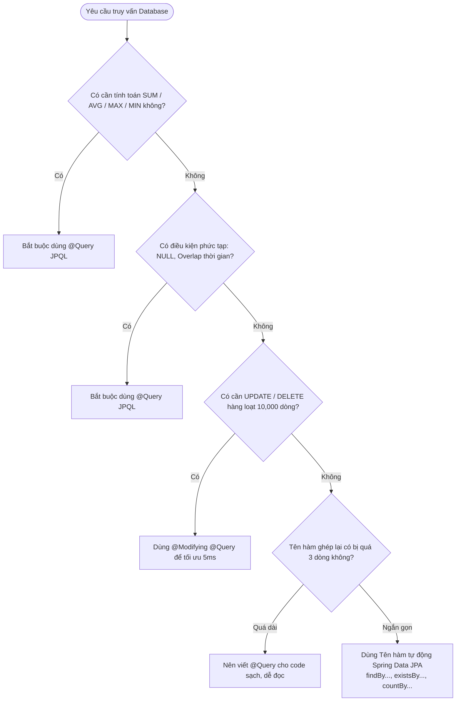

# 🎯 CẨM NANG THIẾT KẾ REPOSITORY & BỘ BÀI TẬP LUYỆN TẬP TƯ DUY SPRING DATA JPA
## Smart Event Ticketing Platform — Repository Design & Practice Guide

**Mục đích:** Giúp bạn rèn luyện phản xạ tự nhiên để chuyển đổi bất kỳ yêu cầu nghiệp vụ thực tế nào thành câu lệnh Spring Data JPA chuẩn xác nhất.

---

## 🧭 PHẦN 1: KHUNG TƯ DUY 3 BƯỚC (THE 3-STEP FRAMEWORK)

Mỗi khi gặp một tính năng mới, hãy tự đặt câu hỏi theo đúng 3 bước sau:

```
[ BƯỚC 1: Nghiệp vụ cần gì? ]
   Ví dụ: "Ban tổ chức muốn xem danh sách các ghế VIP còn trống của Khán đài A."
         │
         ▼
[ BƯỚC 2: Đặt câu hỏi bằng tiếng Việt cho Database ]
   "Lấy tất cả ghế có: event_area_id = A AND row_name = 'VIP' AND status = 'AVAILABLE'"
         │
         ▼
[ BƯỚC 3: Chọn giải pháp kỹ thuật ]
   ├─ Nếu điều kiện đơn giản (AND, OR, Equal, GreaterThan, LessThan) 
   │  👉 Dùng DERIVED METHOD NAME (Tên hàm tự động)
   │
   └─ Nếu có tính toán (SUM, AVG), logic phức tạp (IF NULL, Overlap), hoặc UPDATE hàng loạt 
      👉 Dùng @QUERY (JPQL)
```

---

## 🌳 PHẦN 2: CÂY QUYẾT ĐỊNH (DECISION TREE)



---

## 📋 PHẦN 3: BẢNG TỪ KHÓA TRA CỨU NHANH (CHEAT SHEET)

| Từ khóa JPA | Ý nghĩa SQL tương đương | Ví dụ hàm |
|---|---|---|
| `findBy...` | `SELECT * WHERE col = ?` | `findByEmail(String email)` |
| `existsBy...` | `SELECT COUNT(*) > 0 WHERE col = ?` | `existsBySlug(String slug)` |
| `countBy...` | `SELECT COUNT(*) WHERE col = ?` | `countByStatus(SeatStatus status)` |
| `deleteBy...` | `DELETE FROM table WHERE col = ?` | `deleteByEventId(UUID eventId)` |
| `...And...` | `WHERE col1 = ? AND col2 = ?` | `findByCityAndStatus(String city, String status)` |
| `...Or...` | `WHERE col1 = ? OR col2 = ?` | `findByNameOrSlug(String name, String slug)` |
| `...IgnoreCase` | `WHERE LOWER(col) = LOWER(?)` | `findByCityIgnoreCase(String city)` |
| `...OrderBy...Asc/Desc` | `ORDER BY col ASC / DESC` | `findByEventIdOrderBySortOrderAsc(...)` |
| `...GreaterThan / LessThan` | `WHERE col > ? / col < ?` | `findByStartTimeGreaterThan(Instant now)` |
| `...Between` | `WHERE col BETWEEN ? AND ?` | `findByStartTimeBetween(Instant from, Instant to)` |
| `...In` | `WHERE col IN (?, ?, ?)` | `findByStatusIn(List<EventStatus> statuses)` |

---

## 🏋️ PHẦN 4: 10 BÀI TẬP LUYỆN PHẢN XẠ THỰC CHIẾN

Hãy đọc đề bài, **tự nghĩ tên hàm trong đầu trước**, sau đó bấm mở phần đáp án để so sánh nhé:

---

### 📝 Bài Tập 1 (Cơ bản): Đăng ký tài khoản
* **Yêu cầu:** Trước khi cho người dùng đăng ký, hệ thống cần kiểm tra xem `email` này đã có ai dùng chưa.
<details>
<summary>👉 Bấm vào đây để xem đáp án</summary>

* **Tư duy:** Chỉ cần trả về `true/false`, kiểm tra theo 1 trường `email`.
* **Đáp án:**
  ```java
  boolean existsByEmail(String email);
  ```
</details>

---

### 📝 Bài Tập 2 (Cơ bản): Màn hình danh sách sự kiện
* **Yêu cầu:** Lấy tất cả sự kiện diễn ra ở thành phố "Hà Nội" và đang có trạng thái là `PUBLISHED`.
<details>
<summary>👉 Bấm vào đây để xem đáp án</summary>

* **Tư duy:** Lấy danh sách, ghép 2 điều kiện bằng `And`.
* **Đáp án:**
  ```java
  List<Event> findByCityIgnoreCaseAndStatus(String city, EventStatus status);
  ```
</details>

---

### 📝 Bài Tập 3 (Cơ bản): Sơ đồ ghế
* **Yêu cầu:** Lấy tất cả ghế thuộc một Khán đài (`eventAreaId`), sắp xếp theo Tên hàng (`rowName` tăng dần) và Số ghế (`seatNumber` tăng dần).
<details>
<summary>👉 Bấm vào đây để xem đáp án</summary>

* **Tư duy:** Dùng `findBy` kết hợp `OrderBy...Asc...Asc`.
* **Đáp án:**
  ```java
  List<EventSeat> findByEventAreaIdOrderByRowNameAscSeatNumberAsc(UUID eventAreaId);
  ```
</details>

---

### 📝 Bài Tập 4 (Cơ bản): Thống kê Dashboard
* **Yêu cầu:** Đếm xem sự kiện này hiện đang có bao nhiêu vé đã được bán (`status = 'SOLD'`).
<details>
<summary>👉 Bấm vào đây để xem đáp án</summary>

* **Tư duy:** Đếm số lượng $\rightarrow$ dùng `countBy...`.
* **Đáp án:**
  ```java
  long countByEventAreaIdAndStatus(UUID eventAreaId, SeatStatus status);
  ```
</details>

---

### 📝 Bài Tập 5 (Trung cấp): Dọn dẹp sơ đồ cũ
* **Yêu cầu:** Khi Ban tổ chức muốn xóa sạch toàn bộ các ghế thuộc một Khán đài để vẽ lại từ đầu.
<details>
<summary>👉 Bấm vào đây để xem đáp án</summary>

* **Tư duy:** Xóa theo điều kiện $\rightarrow$ dùng `deleteBy...`.
* **Đáp án:**
  ```java
  void deleteByEventAreaId(UUID eventAreaId);
  ```
</details>

---

### 📝 Bài Tập 6 (Nâng cao): Báo cáo tài chính
* **Yêu cầu:** Tính **tổng doanh thu** (`SUM(amount)`) của tất cả các đơn hàng đã thanh toán thành công (`status = 'PAID'`) của một Ban tổ chức trong tháng này.
<details>
<summary>👉 Bấm vào đây để xem đáp án</summary>

* **Tư duy:** Có hàm tính tổng `SUM` và khoảng thời gian `BETWEEN` $\rightarrow$ **Bắt buộc dùng `@Query`**!
* **Đáp án:**
  ```java
  @Query("""
      SELECT COALESCE(SUM(o.totalAmount), 0) FROM Order o
      WHERE o.organizerId = :organizerId
        AND o.status = 'PAID'
        AND o.createdAt BETWEEN :startDate AND :endDate
  """)
  BigDecimal calculateTotalRevenue(
      @Param("organizerId") UUID organizerId,
      @Param("startDate") Instant startDate,
      @Param("endDate") Instant endDate
  );
  ```
</details>

---

### 📝 Bài Tập 7 (Nâng cao): Kiểm tra sức chứa khán đài
* **Yêu cầu:** Tính tổng sức chứa `capacity` của tất cả các Khán đài trong sự kiện, nhưng **loại trừ** chính Khán đài đang được chỉnh sửa (`excludeAreaId`).
<details>
<summary>👉 Bấm vào đây để xem đáp án</summary>

* **Tư duy:** Có `SUM`, có điều kiện loại trừ `NULL / Not Equal` $\rightarrow$ **Dùng `@Query`**!
* **Đáp án:**
  ```java
  @Query("""
      SELECT COALESCE(SUM(a.capacity), 0) FROM EventArea a
      WHERE a.eventId = :eventId
        AND (:excludeAreaId IS NULL OR a.id != :excludeAreaId)
  """)
  int sumCapacityByEventIdExcluding(
      @Param("eventId") UUID eventId,
      @Param("excludeAreaId") UUID excludeAreaId
  );
  ```
</details>

---

### 📝 Bài Tập 8 (Nâng cao): Tự động nhả ghế hết hạn giữ chỗ (Scheduled Job)
* **Yêu cầu:** Mỗi 1 phút hệ thống chạy 1 lần, tìm tất cả ghế đang ở trạng thái `HELD` mà đã quá hạn (`holdExpiresAt < NOW()`) và chuyển ngay về trạng thái `AVAILABLE`.
<details>
<summary>👉 Bấm vào đây để xem đáp án</summary>

* **Tư duy:** Cập nhật hàng loạt (Bulk Update) $\rightarrow$ **Dùng `@Modifying @Query` để chạy 1 câu SQL mất 5ms**!
* **Đáp án:**
  ```java
  @Modifying
  @Query("""
      UPDATE EventSeat s 
      SET s.status = com.smartevent.ticketing.common.enums.SeatStatus.AVAILABLE,
          s.holdExpiresAt = NULL
      WHERE s.status = com.smartevent.ticketing.common.enums.SeatStatus.HELD
        AND s.holdExpiresAt < :now
  """)
  int releaseExpiredSeats(@Param("now") Instant now);
  ```
</details>
