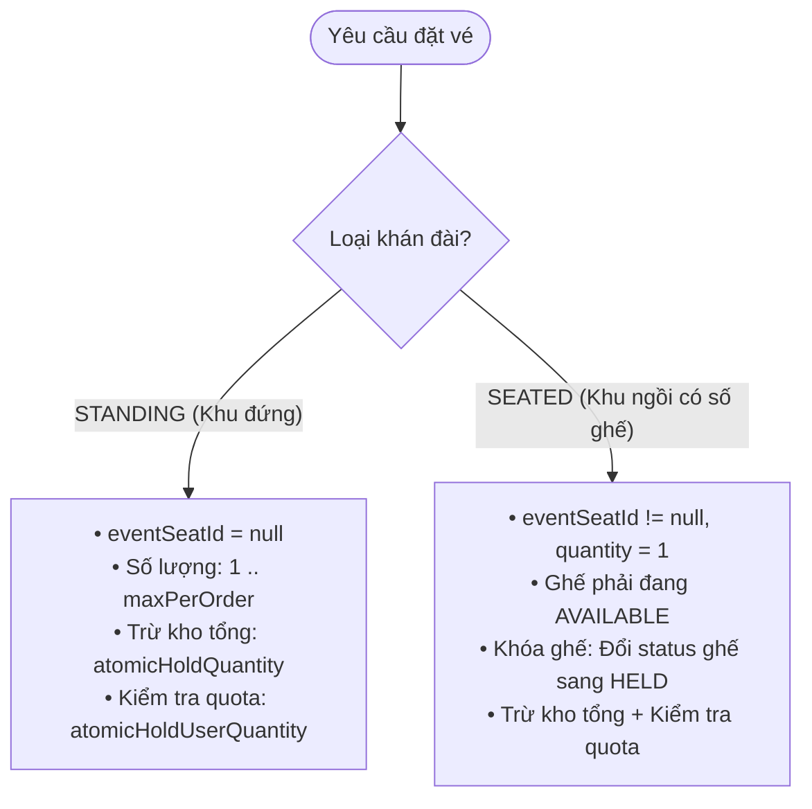

# ⚡ KIẾN TRÚC GIAO DỊCH CÓ THỜI HẠN (TIME-BOUND LEASE) & ĐƯỜNG ỐNG ĐẶT VÉ THỜI GIAN THỰC
## Smart Event Ticketing Platform — System Architecture & Mental Models

**Ngày hoàn thành:** 20/08/2026  
**Chủ đề:** Time-Bound Lease Pattern, Zero-Trust Financial Security, Anti-Hoarding & Automated Resource Reclamation  
**Tác giả / Hệ thống:** Backend Solution Architecture Team  

---

## 🧭 1. Khái Niệm Cốt Lõi: "Time-Bound Lease Pattern" (Giao Dịch Thuê Có Thời Hạn)

Trong các hệ thống thương mại điện tử thông thường (mua quần áo, sách vở), việc thêm sản phẩm vào giỏ hàng thường **không giữ hàng thật sự**. Chỉ khi thanh toán thành công mới trừ tồn kho.  
Tuy nhiên, trong **Hệ thống Bán Vé Concert / Sự Kiện Cháy Vé**, nếu không giữ vé trước:
* Hàng nghìn người cùng điền thông tin thẻ ngân hàng và thanh toán cùng một lúc.
* Khi cổng thanh toán trừ tiền xong quay lại mới phát hiện "Vé đã bị người khác mua mất" $\rightarrow$ Dẫn đến thảm họa tranh chấp bồi thường (Overselling & Chargeback).

> 💡 **Giải Pháp: Time-Bound Lease (Giữ chỗ có thời hạn)**  
> Hệ thống cấp cho người dùng một **"Hợp đồng thuê tài nguyên tạm thời" (Lease)** có hiệu lực trong đúng **10 phút**.  
> Trong 10 phút này, số vé và số ghế được bảo vệ độc quyền cho người dùng đó. Sau 10 phút, nếu giao dịch không hoàn tất, hợp đồng tự động bị hủy và tài nguyên quay trở lại thị trường.

---

## 🛡️ 2. Phòng Thủ Giá Tiền (Zero-Trust Security & Price Tampering Defense)

### ❓ Câu hỏi: *"Tại sao trong Request DTO (`ReservationItemRequest`) không có trường `unitPrice`?"*

```
                              CLIENT (TRÌNH DUYỆT / POSTMAN / MOBILE APP)
                                                 │
                   ┌─────────────────────────────┴─────────────────────────────┐
                   ▼                                                           ▼
    【 THIẾT KẾ SAI LẦM (TIN TƯỞNG CLIENT) 】                    【 THIẾT KẾ CHUẨN ZERO-TRUST (DỰ ÁN NÀY) 】
    Client gửi:                                                 Client chỉ gửi:
    {                                                           {
        "ticketTypeId": "vip-id",                                   "ticketTypeId": "vip-id",
        "salePhaseId": "phase-early-bird",                          "salePhaseId": "phase-early-bird",
        "quantity": 2,                                              "quantity": 2
        "unitPrice": 1000 // ⚠️ Hacker sửa thành 1k!             }
    }                                                           👉 Backend truy vấn Database chính thống:
    👉 LỖ HỔNG PRICE TAMPERING:                                    BigDecimal price = phase.getPrice();
    Hacker mua vé VIP 2 triệu với giá 1 ngàn đồng!              👉 Hacker không có cách nào can thiệp được giá!
```

---

## 🏛️ 3. Phân Định Ranh Giới Kiểm Tra (Validation Architecture)

### ❓ Câu hỏi: *"Tại sao điều kiện `eventSeatId` không viết ở DTO mà phải viết ở Service?"*

```
┌─────────────────────────────────────────────────────────────┬─────────────────────────────────────────────────────────┐
│ TẦNG 1: DTO BEAN VALIDATION (KIỂM TRA CÚ PHÁP THÔ)          │ TẦNG 2: SERVICE BUSINESS LOGIC (KIỂM TRA NGHIỆP VỤ)     │
├─────────────────────────────────────────────────────────────┼─────────────────────────────────────────────────────────┤
│ • Không được phép truy vấn Database                         │ • Bắt buộc phải truy vấn Database                       │
│ • Kiểm tra hình thức: `@NotNull`, `@NotEmpty`, `@Positive`  │ • Kiểm tra ý nghĩa: Khán đài này là Đứng hay Ngồi?      │
│ • DTO chỉ nhìn thấy 2 chuỗi UUID thô vô tri                 │ • Ghế này có thuộc sự kiện không? Có đang trống không?  │
│ 👉 Đặt tại: `ReservationItemRequest`                        │ 👉 Đặt tại: `ReservationServiceImpl`                    │
└─────────────────────────────────────────────────────────────┴─────────────────────────────────────────────────────────┘
```

---

## 🛑 4. Chống Bấm Đúp (Idempotency Key Pattern)

Khi mạng lag, người dùng thường click liên tục 5 lần vào nút "Đặt vé":

```
    Request 1 (Key: "req-123") ──> Chưa có trong DB ──> Tạo Reservation mới (10 phút)
    Request 2 (Key: "req-123") ──> Đã thấy trong DB ──> TRẢ VỀ KẾT QUẢ CŨ (Không trừ thêm vé)
    Request 3 (Key: "req-123") ──> Đã thấy trong DB ──> TRẢ VỀ KẾT QUẢ CŨ (Không tạo đơn mới)
```

---

## 🚫 5. Chống Găm Vé Ảo (Active Cart Guard & Partial Unique Index)

Để ngăn chặn 1 người dùng mở 10 tab trình duyệt để giữ 40 vé ảo:
* Database sử dụng **Partial Unique Index**:
  ```sql
  CREATE UNIQUE INDEX idx_reservations_active_per_user_event 
      ON reservations(user_id, event_id) 
      WHERE status = 'PENDING';
  ```
* Cơ chế này bảo đảm ở cấp độ Database: Mỗi tài khoản chỉ có thể có **tối đa 1 phiên giữ vé đang `PENDING` trên 1 sự kiện**.

---

## 💺 6. Cơ Chế Phân Bổ: Vé Đứng (`STANDING`) vs Vé Ngồi (`SEATED`)



---

## ⏰ 7. Tự Động Thu Hồi Tài Nguyên (Background Sweeper Worker Pattern)

Khi khách hàng tắt trình duyệt đi ăn cơm mà không thanh toán, không hề có HTTP request nào gửi lên server.  
👉 **`ReservationExpiryWorker`** đóng vai trò là người dọn rác tự động:
1. Mỗi **30 giây** quét các bản ghi: `WHERE status = 'PENDING' AND expires_at < NOW()`.
2. Chuyển trạng thái sang `EXPIRED`.
3. Nhả tồn kho tổng (`releaseHeldInventory`) và quota user (`releaseUserHeldTickets`).
4. Mở khóa ghế ngồi từ `HELD` về lại `AVAILABLE`.

---

## 🔐 8. Cơ Chế Nội Tại Của Spring Security SpEL (`isAuthenticated()`)

Khi gắn `@PreAuthorize("isAuthenticated()")`:
* Spring Security sử dụng AOP Interceptor kết hợp với class `SecurityExpressionRoot`.
* Nó kiểm tra `SecurityContextHolder.getContext().getAuthentication()`.
* Nếu có JWT Token hợp lệ $\rightarrow$ Cho phép truy cập.
* Nếu là khách vãng lai (Anonymous) $\rightarrow$ Chặn đứng ngay tại cửa và trả về HTTP `401 Unauthorized` trước khi code trong Controller kịp thực thi.
