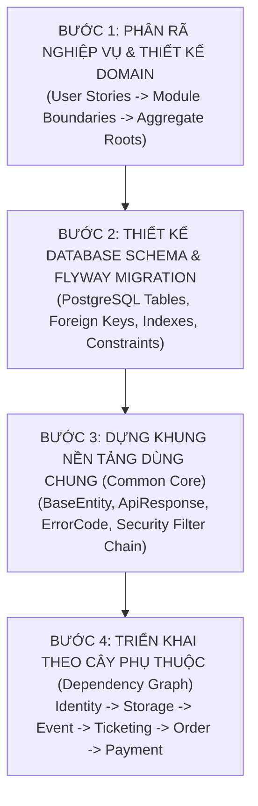
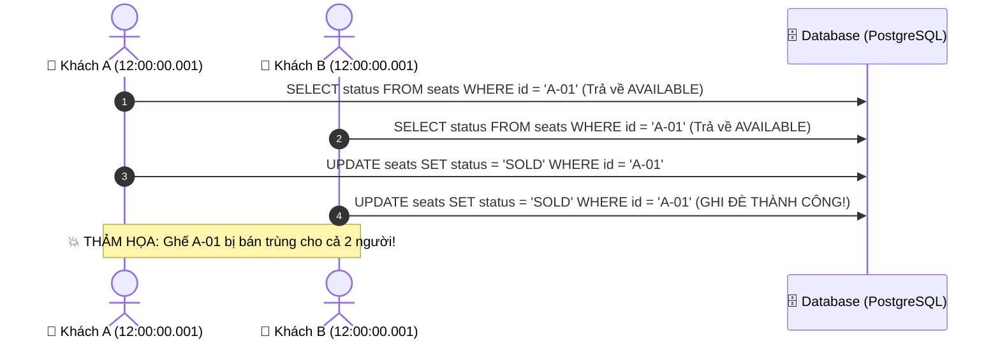

# 🚀 CẨM NANG KHỞI ĐỘNG DỰ ÁN TỪ SỐ 0 & LỘ TRÌNH HỆ THỐNG CHỊU TẢI CAO (HIGH CONCURRENCY)
## Smart Event Ticketing Platform — Zero-to-One Project Inception & High Concurrency Roadmap

**Phiên bản:** 1.0  
**Tác giả:** Backend Engineering Team  
**Mục đích:** Hệ thống hóa toàn bộ phương pháp luận khởi động dự án từ con số 0, tổng kết năng lực nền tảng cốt lõi đã đạt được, và trang bị bản đồ kiến thức chuyên sâu về hệ thống chịu tải cao (High Concurrency / Distributed Systems) trước khi bước vào Module Bán vé & Đơn hàng.

---

## 🧭 MỤC LỤC

1. [Khung Tư Duy Khởi Động Dự Án Từ Con Số 0 (Zero-to-One Blueprint)](#1-khung-tư-duy-khởi-động-dự-án-từ-con-số-0-zero-to-one-blueprint)
2. [Hệ Thống Hóa Nền Tảng Kỹ Sư Đã Làm Chủ (Giai Đoạn 1 Recap)](#2-hệ-thống-hóa-nền-tảng-kỹ-sư-đã-làm-chủ-giai-đoạn-1-recap)
3. [Bước Chuyển Mình: Từ Quản Lý Dữ Liệu Tĩnh Sang Xử Lý Tranh Chấp Đồng Thời](#3-bước-chuyển-mình-từ-quản-lý-dữ-liệu-tĩnh-sang-xử-lý-tranh-chấp-đồng-thời)
4. [3 Bài Toán Sống Còn Trong Module Bán Vé (Ticketing & Inventory)](#4-3-bài-toán-sống-còn-trong-module-bán-vé-ticketing--inventory)
5. [Kho Vũ Khí Công Nghệ Cho Hệ Thống Chịu Tải Cao (Concurrency Toolkit)](#5-kho-vũ-khí-công-nghệ-cho-hệ-thống-chịu-tải-cao-concurrency-toolkit)

---

## 🏗️ 1. KHUNG TƯ DUY KHỞI ĐỘNG DỰ ÁN TỪ CON SỐ 0 (ZERO-TO-ONE BLUEPRINT)

Khi đối mặt với một dự án phần mềm hoàn toàn mới, một Kỹ sư Trưởng (Tech Lead) luôn khởi động theo **4 bước tuần tự**:



### 📋 Chi tiết từng bước khởi động:

1. **Bước 1 — Phân rã Domain (Domain Decomposition):**
   * Xác định thực thể cốt lõi: Ai là trung tâm? (User $\rightarrow$ Event $\rightarrow$ Area $\rightarrow$ Ticket $\rightarrow$ Order).
   * Vẽ sơ đồ luồng người dùng từ lúc Đăng ký $\rightarrow$ Xem sự kiện $\rightarrow$ Chọn ghế $\rightarrow$ Giữ chỗ $\rightarrow$ Thanh toán.
2. **Bước 2 — Database Schema First (Flyway Migrations):**
   * Thiết kế schema trên PostgreSQL bằng các file migration (`V1__identity.sql`, `V2__storage.sql`, `V4__event_schema.sql`...).
   * Khai báo chặt chẽ: `CHECK` constraints, `UNIQUE` composite indexes, `ON DELETE RESTRICT/CASCADE`.
3. **Bước 3 — Dựng Khung Common Core (Nền móng tái sử dụng):**
   * `BaseEntity`: Tự động sinh UUID, `createdAt`, `updatedAt`.
   * `ApiResponse<T>` & `PageResponse<T>`: Chuẩn hóa toàn bộ cấu trúc JSON trả về client.
   * `BusinessException` & `GlobalExceptionHandler`: Bắt lỗi tập trung và map mã HTTP.
   * `SecurityConfig`: Cấu hình Stateless JWT Authentication Filter.
4. **Bước 4 — Triển khai theo Thứ tự Phụ thuộc:**
   * Không bao giờ làm `Payment` hay `Order` trước khi có `User` và `Event`. Phải đi từ gốc rễ lên ngọn!

---

## 🎓 2. HỆ THỐNG HÓA NỀN TẢNG KỸ SƯ ĐÃ LÀM CHỦ (GIAI ĐOẠN 1 RECAP)

Qua 3 Module đầu tiên, bạn đã làm chủ trọn vẹn **Bộ 6 Kỹ Năng Doanh Nghiệp**:

```
                                  BỘ NỀN TẢNG KỸ SƯ BACKEND
   ┌───────────────────────────────────────────┬───────────────────────────────────────────┐
   │ 1. Clean Architecture (Phân lớp chuẩn)    │ 4. State Machine (Vòng đời thực thể)      │
   │    Entity -> Repo -> DTO -> Service -> API│    DRAFT -> PENDING -> PUBLISHED -> ...   │
   ├───────────────────────────────────────────┼───────────────────────────────────────────┤
   │ 2. DTO Design (Bảo vệ dữ liệu & Lỗ hổng)  │ 5. Defensive Programming (Lập trình phòng │
   │    Chống Mass Assignment, from() vs of()  │    thủ: Ownership, Guards, Invariants)    │
   ├───────────────────────────────────────────┼───────────────────────────────────────────┤
   │ 3. JPA ID Reference (Tối ưu RAM & N+1)    │ 6. Automated Unit Testing (Mockito 100%)  │
   │    Dùng UUID parentId thay vì @OneToMany  │    Kiểm thử độc lập, Mock DB & MinIO      │
   └───────────────────────────────────────────┴───────────────────────────────────────────┘
```

---

## ⚡ 3. BƯỚC CHUYỂN MÌNH: TỪ DỮ LIỆU TĨNH SANG TRANH CHẤP ĐỒNG THỜI

```
┌─────────────────────────────────────────────┐        ┌─────────────────────────────────────────────┐
│  GIAI ĐOẠN 1: MODULE 1, 2, 3 (DỮ LIỆU TĨNH) │        │ GIAI ĐOẠN 2: MODULE 4, 5, 6 (HIGH TRAFFIC)  │
├─────────────────────────────────────────────┤        ├─────────────────────────────────────────────┤
│ • Đối tượng: Admin / Organizer              │        │ • Đối tượng: Hàng trăm nghìn người mua vé   │
│ • Tần suất: Vài request / giây              │  ───>  │ • Tần suất: 50,000 - 100,000 request / giây │
│ • Bài toán: CRUD, Validation, State Guards  │        │ • Bài toán: Tranh chấp vé, Khóa phân tán,   │
│ • Database: Đọc / Ghi bình thường           │        │   Hàng đợi ảo, Giữ chỗ tự nhả TTL Redis     │
└─────────────────────────────────────────────┘        └─────────────────────────────────────────────┘
```

---

## 🎟️ 4. BA BÀI TOÁN SỐNG CÒN TRONG MODULE BÁN VÉ (TICKETING & INVENTORY)

---

### 🚨 Bài Toán 1: Bán Trùng Vé (Double-Booking / Race Condition)

* **Kịch bản thảm họa:** Đúng 12:00:00, đêm nhạc Concert mở bán. Có **10,000 người cùng bấm nút MUA cho duy nhất 1 Ghế VIP A-01**.
* **Nguyên nhân lỗi:** 10,000 luồng (Threads) cùng đọc Database thấy ghế đang `AVAILABLE`, sau đó cả 10 luồng cùng ghi nhận đơn hàng $\rightarrow$ **1 ghế bị bán cho 10 người khác nhau!**



---

### ⏳ Bài Toán 2: Giữ Chỗ Tạm Thời (Seat Holding With TTL)

* **Nghiệp vụ thực tế:** Khi khách chọn ghế, ghế phải đổi sang trạng thái `HELD` (Giữ chỗ trong **10 phút**) để khách điền thẻ ngân hàng thanh toán.
* **Yêu cầu kỹ thuật:**
  * Trong 10 phút đó, không ai khác được chọn ghế này.
  * Nếu sau 10 phút khách không thanh toán $\rightarrow$ Hệ thống phải **tự động hoàn trả ghế về `AVAILABLE`** tức thì.

---

### 🚶 Bài Toán 3: Phòng Chờ Ảo Điều Tiết Lưu Lượng (Virtual Waiting Room)

* **Nghiệp vụ thực tế:** Có 500,000 người vào trang mua vé cùng lúc. Nếu thả thẳng 500,000 request vào Database, PostgreSQL sẽ bị quá tải kết nối và sập ngay lập tức.
* **Yêu cầu kỹ thuật:** Dùng Redis để xếp hàng 500,000 người vào hàng đợi ảo, mỗi đợt chỉ cho phép 500 người vào trang mua vé.

---

## 🛠️ 5. KHO VŨ KHÍ CÔNG NGHỆ CHO HỆ THỐNG CHỊU TẢI CAO (CONCURRENCY TOOLKIT)

Để giải quyết triệt để 3 bài toán trên trong Module 4 & 5, chúng ta sẽ lần lượt ứng dụng các kỹ thuật hàng đầu:

| Vũ khí kỹ thuật | Công nghệ | Mục đích sử dụng |
|---|---|---|
| **1. Khóa Lạc Quan (Optimistic Lock)** | JPA `@Version` | Tự động tăng version bản ghi, nếu có người sửa trước thì người sau bị chặn lỗi `OptimisticLockException`. Phù hợp cho tải vừa. |
| **2. Khóa Bi Quan (Pessimistic Lock)** | `SELECT FOR UPDATE` | Khóa cứng dòng dữ liệu trong DB khi đang giao dịch. Đảm bảo an toàn tuyệt đối. |
| **3. Khóa Phân Tán (Distributed Lock)** | **Redis / Redisson** | Khóa theo key (ví dụ: `lock:seat:A-01`) trên RAM Redis trong vài mili-giây. Tốc độ nhanh gấp 100 lần DB Lock. |
| **4. Hết Hạn Tự Động (TTL)** | **Redis Key Expiration** | Tự động hủy giữ chỗ sau 600 giây (10 phút). |
| **5. Hàng Đợi Bất Đồng Bộ (Async Queue)** | **Redis Streams / RabbitMQ** | Gửi email vé, tạo mã QR vé ngầm dưới background mà không làm người dùng phải chờ. |

---

## 🎯 TỔNG KẾT

Tài liệu này là **kim chỉ nam** giúp bạn định vị bản thân:
1. **Bạn đã hoàn thành xuất sắc Giai đoạn 1** (Toàn bộ kiến trúc cốt lõi, bảo mật, CRUD nghiệp vụ, State Machine).
2. **Bạn đã có trong tay tấm bản đồ Giai đoạn 2** (Xử lý đồng thời, Redis Lock, Phòng chờ ảo).

Hãy bước tiếp với sự tự tin của một kỹ sư nắm vững bản chất kiến trúc nhé! 🚀
