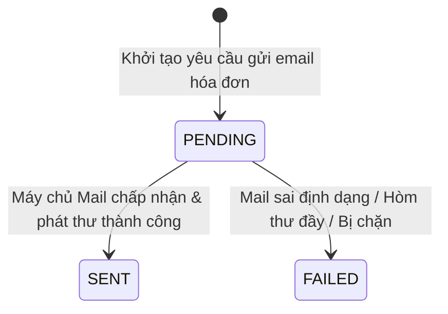

# 📧 MODULE 8 - PHẦN 3: GIAO VẬN HÓA ĐƠN ĐIỆN TỬ & THEO DÕI GỬI EMAIL
## (ASYNC INVOICE EMAIL DISPATCH, RESEND PIPELINE & DELIVERY AUDITING)

**Trạng thái:** Hoàn thành 100% · Production Ready  
**Tác giả / Hệ thống:** Backend Engineering Team · Smart Event Ticketing Platform  

---

## 📖 1. Từ Điển Thuật Ngữ Giao Vận Điện Tử (Electronic Delivery Terminology)

| Thuật Ngữ | Tên Tiếng Việt | Ý Nghĩa Chuyên Sâu Trong Hệ Thống |
|---|---|---|
| **Delivery Channel** | Kênh Giao Vận | Phương thức chuyển hóa đơn đến tay khách (mặc định: `EMAIL`, mở rộng: `SMS`, `ZALO_ZNS`). |
| **Provider Message ID** | Mã Định Danh Thư | Mã biên nhận do máy chủ gửi mail (SMTP, SendGrid, Amazon SES) trả về để đối soát khi khách báo "Tôi chưa nhận được mail". |
| **Resend Capability** | Tính Năng Gửi Lại | Cho phép khách hàng chủ động yêu cầu gửi lại hóa đơn về email mới hoặc gửi sang email công ty để thanh toán nội bộ. |
| **Delivery State Machine** | Máy Trạng Thái Giao Vận | Vòng đời chuyển trạng thái của một lượt gửi email: `PENDING` $\rightarrow$ `SENT` hoặc `FAILED`. |

---

## 🧭 2. Tại Sao Phải Có Bảng Riêng `invoice_deliveries`?

Thay vì chỉ lưu một cột `email_sent = true/false` trong bảng `invoices`, việc tách thành bảng `invoice_deliveries` đem lại các giá trị vận hành thực tế:
1. **Lịch Sử Gửi Nhiều Lần (Multiple Resends):** Khách có thể bấm gửi hóa đơn 3 lần (vào email cá nhân, email công ty, email kế toán). Bảng này lưu vết cả 3 lượt gửi kèm thời gian chính xác.
2. **Đối Soát Khiếu Nại (Dispute Resolution):** Khi khách hàng khiếu nại chưa nhận được hóa đơn, nhân viên hỗ trợ (Support) có thể tra cứu mã `provider_message_id` để kiểm tra với nhà mạng mail xem thư có bị rơi vào hòm Spam hay không.

---

## 🗃️ 3. Lược Đồ Bảng Database Flyway V10 (`invoice_deliveries`)

```sql
CREATE TABLE invoice_deliveries (
    id UUID PRIMARY KEY,
    invoice_id UUID NOT NULL REFERENCES invoices(id) ON DELETE CASCADE,
    channel VARCHAR(30) NOT NULL DEFAULT 'EMAIL',
    recipient_email VARCHAR(255) NOT NULL,
    status VARCHAR(30) NOT NULL DEFAULT 'PENDING',
    sent_at TIMESTAMPTZ,
    provider_message_id VARCHAR(255),
    created_at TIMESTAMPTZ NOT NULL DEFAULT NOW()
);

CREATE INDEX idx_invoice_deliveries_invoice_id ON invoice_deliveries(invoice_id);
CREATE INDEX idx_invoice_deliveries_status ON invoice_deliveries(status);
```

---

## 📊 4. Máy Trạng Thái Giao Vận (`DeliveryStatus` State Machine):


