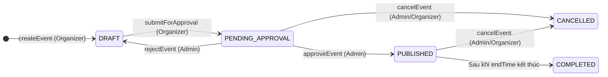

# 🎪 PHẦN 3: QUẢN LÝ SỰ KIỆN CỐT LÕI & VÒNG ĐỜI SỰ KIỆN (EVENT CORE & LIFECYCLE MANAGEMENT)
## Smart Event Ticketing Platform — Module Event · Sub-module Event Core

**Ngày hoàn thành:** 18/08/2026  
**Trạng thái:** Hoàn thành 100% · Biên dịch thành công (`BUILD SUCCESSFUL · 0 errors`)  
**Tác giả / Hệ thống:** Backend Engineering Team  

---

## 🧭 1. Tổng Quan Bài Toán & Vai Trò Nghiệp Vụ

Trong nền tảng bán vé sự kiện thông minh (**Smart Event Ticketing Platform**), **Event Core (Sự kiện cốt lõi)** là trái tim của toàn bộ hệ thống. Mọi luồng nghiệp vụ sau này (tạo khu vực ghế, mở bán vé, phòng chờ ảo Virtual Queue, bán lại vé Resale, thanh toán Payment) đều xoay quanh thực thể `Event`.

### 💡 Quy tắc nghiệp vụ trọng yếu:
1. **Phân quyền chặt chẽ (RBAC):**
   * **Organizer:** Chỉ được phép tạo sự kiện, chỉnh sửa và quản lý các sự kiện do chính mình tạo ra (`organizerId == currentUser.getId()`).
   * **Admin:** Có quyền tối cao duyệt/từ chối xuất bản sự kiện, can thiệp hoặc hủy bất kỳ sự kiện nào vi phạm.
   * **Customer / Guest:** Xem danh sách và chi tiết các sự kiện đã xuất bản (`PUBLISHED`) mà không cần đăng nhập.
2. **Thuật toán chống trùng lịch địa điểm (Venue Overlap Conflict Prevention):**
   * Một địa điểm (`Venue`) không thể diễn ra 2 sự kiện cùng lúc nếu các sự kiện đó đang ở trạng thái `PUBLISHED` hoặc `PENDING_APPROVAL`.
   * Hệ thống tự động quét thời gian giao nhau `(e.startTime < newEndTime AND e.endTime > newStartTime)` và loại trừ chính sự kiện đang sửa (`e.id != eventId`).
3. **Quản lý Vòng đời Trạng thái Sự kiện (State Machine):**



---

## 🗃️ 2. Lược Đồ Database (`events`, `event_categories`, `event_files`)

Được quản lý bởi Flyway Migration [`V4__event_schema.sql`](../../ticketing/src/main/resources/db/migration/V4__event_schema.sql):

```sql
-- 1. Bảng events chính
CREATE TABLE events (
    id                          UUID PRIMARY KEY,
    organizer_id                UUID NOT NULL REFERENCES users(id) ON DELETE RESTRICT,
    venue_id                    UUID REFERENCES venues(id) ON DELETE RESTRICT,
    name                        VARCHAR(255) NOT NULL,
    slug                        VARCHAR(255) NOT NULL UNIQUE,
    description                 TEXT,
    start_time                  TIMESTAMPTZ NOT NULL,
    end_time                    TIMESTAMPTZ NOT NULL,
    status                      VARCHAR(30) NOT NULL DEFAULT 'DRAFT',
    resale_enabled              BOOLEAN NOT NULL DEFAULT false,
    max_resale_price_multiplier NUMERIC(5,2),
    resale_deadline_hours_before INT,
    virtual_queue_enabled       BOOLEAN NOT NULL DEFAULT false,
    queue_batch_size            INT DEFAULT 50,
    city                        VARCHAR(100),
    search_vector               TSVECTOR,
    published_at                TIMESTAMPTZ,
    created_at                  TIMESTAMPTZ NOT NULL DEFAULT NOW(),
    updated_at                  TIMESTAMPTZ NOT NULL DEFAULT NOW(),
    CONSTRAINT chk_events_time CHECK (end_time > start_time),
    CONSTRAINT chk_events_multiplier CHECK (max_resale_price_multiplier IS NULL OR max_resale_price_multiplier > 0),
    CONSTRAINT chk_events_resale_deadline CHECK (resale_deadline_hours_before IS NULL OR resale_deadline_hours_before >= 0)
);

-- 2. Bảng liên kết N:N giữa Event và Category
CREATE TABLE event_categories (
    event_id    UUID NOT NULL REFERENCES events(id) ON DELETE CASCADE,
    category_id UUID NOT NULL REFERENCES categories(id) ON DELETE CASCADE,
    PRIMARY KEY (event_id, category_id)
);

-- 3. Bảng liên kết File ảnh từ Module Storage (Banner, Gallery)
CREATE TABLE event_files (
    id          UUID PRIMARY KEY,
    event_id    UUID NOT NULL REFERENCES events(id) ON DELETE CASCADE,
    file_id     UUID NOT NULL REFERENCES files(id) ON DELETE RESTRICT,
    file_type   VARCHAR(30) NOT NULL,
    sort_order  INT NOT NULL DEFAULT 0,
    created_at  TIMESTAMPTZ NOT NULL DEFAULT NOW()
);
```

---

## 🏗️ 3. Kiến Trúc Code & Danh Sách File Hoàn Chỉnh

```
modules/event/
  ├── entity/
  │     ├── Event.java                      ← JPA Entity sự kiện (kế thừa BaseEntity)
  │     ├── EventCategory.java              ← Composite Entity quan hệ N:N
  │     └── EventFile.java                  ← Entity liên kết file Storage
  ├── repository/
  │     ├── EventRepository.java            ← JPA Repo + Custom Query kiểm tra trùng lịch
  │     ├── EventCategoryRepository.java    ← JPA Repo quan hệ N:N
  │     └── EventFileRepository.java        ← JPA Repo quản lý file
  ├── dto/
  │     ├── request/
  │     │     ├── CreateEventRequest.java   ← DTO tạo sự kiện (Validation chặt chẽ)
  │     │     └── UpdateEventRequest.java   ← DTO cập nhật sự kiện
  │     └── response/
  │           ├── EventResponse.java        ← Chi tiết sự kiện (kèm Venue, Categories, Files)
  │           ├── EventSummaryResponse.java ← DTO vắn tắt cho trang chủ / danh sách
  │           └── EventFileResponse.java    ← DTO thông tin file ảnh
  ├── service/
  │     ├── EventService.java               ← Interface hợp đồng 10 phương thức
  │     └── impl/
  │           └── EventServiceImpl.java     ← Business Logic & State Machine Engine
  ├── controller/
  │     └── EventController.java            ← 10 REST API Endpoints + RBAC Security
  └── exception/
        └── EventException.java             ← Ngoại lệ nghiệp vụ chuyên biệt
```

---

## 📦 4. Chi Tiết Từng Tầng (Layer-by-Layer)

### 🔹 4.1. Entity — [`Event.java`](../../ticketing/src/main/java/com/smartevent/modules/event/entity/Event.java)
* Kế thừa `BaseEntity` $\rightarrow$ Tự động có `id` (UUID), `createdAt`, `updatedAt`.
* Trạng thái ban đầu: `status = EventStatus.DRAFT`.
* Cấu hình bán lại vé: `resaleEnabled`, `maxResalePriceMultiplier` (ví dụ `1.2` = tối đa 120% giá gốc), `resaleDeadlineHoursBefore` (hạn chót đóng bán lại trước giờ diễn bao nhiêu tiếng).

### 🔹 4.2. Repository — Thuật toán kiểm tra trùng lịch trong [`EventRepository.java`](../../ticketing/src/main/java/com/smartevent/modules/event/repository/EventRepository.java)

```java
@Query("""
    SELECT COUNT(e) > 0 FROM Event e
    WHERE e.venueId = :venueId
      AND e.status IN (com.smartevent.ticketing.common.enums.EventStatus.PUBLISHED, 
                       com.smartevent.ticketing.common.enums.EventStatus.PENDING_APPROVAL)
      AND (:excludeEventId IS NULL OR e.id != :excludeEventId)
      AND (e.startTime < :endTime AND e.endTime > :startTime)
""")
boolean hasVenueTimeConflict(
        @Param("venueId") UUID venueId,
        @Param("startTime") Instant startTime,
        @Param("endTime") Instant endTime,
        @Param("excludeEventId") UUID excludeEventId
);
```

* **Toán học kiểm tra giao thoa thời gian:** Hai khoảng thời gian `[A1, A2]` và `[B1, B2]` giao nhau khi và chỉ khi `A1 < B2 AND A2 > B1`.
* **Cơ chế loại trừ chính mình (`excludeEventId`):** Khi tạo mới thì truyền `null` (quét tất cả); khi cập nhật thì truyền `eventId` đang sửa (để không tự coi mình là trùng lịch).

---

### 🔹 4.3. Service Layer — 10 Nghiệp Vụ Trong [`EventServiceImpl.java`](../../ticketing/src/main/java/com/smartevent/modules/event/service/impl/EventServiceImpl.java)

1. **`toEventResponse(Event event)` (Helper Method):** Gom đồng thời thông tin từ `VenueRepository`, `CategoryRepository`, `EventFileRepository` và trả về `EventResponse.of(...)`.
2. **`createEvent`:** Validate `startTime < endTime`, `startTime > now`, kiểm tra Venue Conflict, sinh slug bằng `Slugify`, lưu Event nháp (`DRAFT`), lưu danh mục liên kết và danh sách files ảnh.
3. **`updateEvent`:** Kiểm tra quyền sở hữu (`organizerId == currentUserId` hoặc Admin), chặn sửa sự kiện `COMPLETED`/`CANCELLED`, kiểm tra lại Venue conflict với `excludeEventId`, đồng bộ lại danh mục và files.
4. **`getEventBySlug`:** API công khai xem chi tiết qua URL SEO slug.
5. **`getEventById`:** Xem chi tiết sự kiện theo UUID.
6. **`getPublishedEvents`:** Lấy danh sách sự kiện `PUBLISHED` cho trang chủ (`PageResponse.from(...)`).
7. **`getEventsByOrganizer`:** Ban tổ chức xem danh sách sự kiện của mình.
8. **`submitForApproval`:** Kiểm tra điều kiện đủ (phải có Venue, phải có Category) $\rightarrow$ chuyển từ `DRAFT` sang `PENDING_APPROVAL`.
9. **`approveEvent`:** Admin duyệt $\rightarrow$ Double check Venue conflict $\rightarrow$ chuyển sang `PUBLISHED` và set `publishedAt = Instant.now()`.
10. **`rejectEvent`:** Admin từ chối $\rightarrow$ chuyển về `DRAFT` kèm lý do log.
11. **`cancelEvent`:** Organizer/Admin hủy sự kiện $\rightarrow$ chuyển sang `CANCELLED` kèm lý do.

---

### 🔹 4.4. Controller Layer — [`EventController.java`](../../ticketing/src/main/java/com/smartevent/modules/event/controller/EventController.java)

* Sử dụng `@CurrentUser UserPrincipal currentUser` để lấy danh tính người dùng bảo mật từ Token JWT.
* Sử dụng `@PreAuthorize` để phân quyền linh hoạt theo từng vai trò (`ROLE_ORGANIZER`, `ROLE_ADMIN`).

---

## 🌐 5. Danh Sách 10 REST API Endpoints

| # | HTTP Method | Endpoint | Quyền hạn (RBAC) | Tham số (Params / Body) | Mô tả nghiệp vụ |
|:---:|:---:|---|:---:|---|---|
| 1 | `POST` | `/api/v1/events` | `ORGANIZER`, `ADMIN` | Body: `CreateEventRequest` | Tạo sự kiện mới (trạng thái `DRAFT`) |
| 2 | `PUT` | `/api/v1/events/{id}` | `ORGANIZER`, `ADMIN` | Path: `id`, Body: `UpdateEventRequest` | Cập nhật thông tin sự kiện |
| 3 | `GET` | `/api/v1/events` | **Công khai** | `page`, `size`, `sort` | Danh sách sự kiện trang chủ (phân trang) |
| 4 | `GET` | `/api/v1/events/my-events` | `ORGANIZER`, `ADMIN` | `page`, `size`, `sort` | Ban tổ chức xem sự kiện của mình |
| 5 | `GET` | `/api/v1/events/slug/{slug}` | **Công khai** | Path: `slug` | Chi tiết sự kiện theo đường dẫn URL |
| 6 | `GET` | `/api/v1/events/{id}` | **Công khai** | Path: `id` | Chi tiết sự kiện theo UUID |
| 7 | `POST` | `/api/v1/events/{id}/submit` | `ORGANIZER`, `ADMIN` | Path: `id` | Gửi sự kiện lên Admin chờ duyệt |
| 8 | `POST` | `/api/v1/events/{id}/approve` | **Chỉ `ADMIN`** | Path: `id` | Admin phê duyệt & xuất bản sự kiện |
| 9 | `POST` | `/api/v1/events/{id}/reject` | **Chỉ `ADMIN`** | Path: `id`, Query: `reason` | Admin từ chối phê duyệt (trả về DRAFT) |
| 10 | `POST` | `/api/v1/events/{id}/cancel` | `ORGANIZER`, `ADMIN` | Path: `id`, Query: `reason` | Hủy sự kiện |

---

## 🔐 6. Cấu Hình Bảo Mật ([`SecurityConfig.java`](../../ticketing/src/main/java/com/smartevent/config/SecurityConfig.java))

```java
.requestMatchers(HttpMethod.GET, "/api/v1/categories/**").permitAll()
.requestMatchers(HttpMethod.GET, "/api/v1/venues/**").permitAll()
.requestMatchers(HttpMethod.GET, "/api/v1/events/**").permitAll() // Công khai cho khách xem sự kiện
```

* Tất cả các request `GET` xem danh mục, địa điểm, sự kiện đều được mở công khai (`permitAll()`).
* Tất cả các thao tác thay đổi trạng thái và dữ liệu bắt buộc có Token JWT hợp lệ và phân quyền đúng vai trò qua `@PreAuthorize`.
