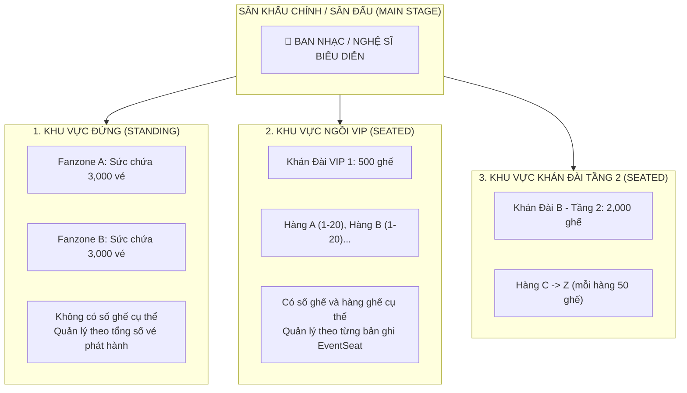

# 🎟️ PHẦN 4: QUẢN LÝ KHU VỰC VÉ & SƠ ĐỒ CHỖ NGỒI (EVENT AREAS & SEATS MANAGEMENT)
## Smart Event Ticketing Platform — Module Event · Sub-module Area & Seat

**Ngày tạo:** 18/08/2026  
**Trạng thái:** Thiết kế hoàn chỉnh · Đã có Entity, Repository, DTOs  
**Tác giả / Hệ thống:** Backend Engineering Team  

---

## 🧭 1. Tổng Quan Bài Toán & Vai Trò Nghiệp Vụ

Trong các sự kiện âm nhạc, thể thao và hội thảo quy mô lớn, không gian tổ chức luôn được chia thành nhiều **Khu vực vé (Event Areas)** với các trải nghiệm và mức giá khác nhau:



### ⚖️ Phân biệt 2 loại khu vực (`AreaType`):

| Đặc tính | 🚶 Khu vực ĐỨNG (`STANDING`) | 💺 Khu vực NGỒI (`SEATED`) |
|---|---|---|
| **Ví dụ thực tế** | Fanzone, Sân cỏ, Vé GA (General Admission) | Khán đài A, VIP Tribune, Hàng ghế Sapphire |
| **Bản ghi trong `event_seats`** | **KHÔNG CÓ** (0 bản ghi) | **CÓ ĐẦY ĐỦ** từng ghế (500 ghế = 500 dòng DB) |
| **Cách chọn vé khi mua** | Khách chọn: *"Mua 2 vé Fanzone A"* | Khách click chọn từng vị trí trên sơ đồ: *"Ghế A-12, A-13"* |
| **Cách tạo dữ liệu** | Chỉ cần tạo `EventArea(capacity = 3000)` | Tạo `EventArea` $\rightarrow$ Chạy **Batch Seat Generator** để sinh hàng loạt ghế |

---

## 🗃️ 2. Lược Đồ Database (`event_areas` & `event_seats`)

Được quản lý bởi Flyway Migration [`V4__event_schema.sql`](../../ticketing/src/main/resources/db/migration/V4__event_schema.sql):

```sql
-- 1. Bảng Khu vực vé (Areas)
CREATE TABLE event_areas (
    id          UUID PRIMARY KEY,
    event_id    UUID NOT NULL REFERENCES events(id) ON DELETE CASCADE,
    name        VARCHAR(100) NOT NULL,          -- VD: "Khán Đài VIP A"
    area_type   VARCHAR(30) NOT NULL DEFAULT 'STANDING', -- STANDING / SEATED
    capacity    INT NOT NULL,                   -- Sức chứa: 500
    sort_order  INT NOT NULL DEFAULT 0,         -- Thứ tự hiển thị trên giao diện
    description TEXT,
    created_at  TIMESTAMPTZ NOT NULL DEFAULT NOW(),
    updated_at  TIMESTAMPTZ NOT NULL DEFAULT NOW(),
    CONSTRAINT chk_area_capacity CHECK (capacity > 0)
);

CREATE INDEX idx_event_areas_event_id ON event_areas(event_id);

-- 2. Bảng Ghế ngồi chi tiết (Seats - Chỉ dành cho khu vực SEATED)
CREATE TABLE event_seats (
    id              UUID PRIMARY KEY,
    event_area_id   UUID NOT NULL REFERENCES event_areas(id) ON DELETE CASCADE,
    row_name        VARCHAR(50) NOT NULL,       -- VD: "A", "B", "VIP-1"
    seat_number     VARCHAR(50) NOT NULL,       -- VD: "01", "02", "15"
    label           VARCHAR(100),               -- VD: "A-01", "VIP-01"
    status          VARCHAR(30) NOT NULL DEFAULT 'AVAILABLE', -- AVAILABLE, HELD, SOLD, BLOCKED
    hold_expires_at TIMESTAMPTZ,                -- Hạn giữ chỗ tạm thời (5-10 phút)
    created_at      TIMESTAMPTZ NOT NULL DEFAULT NOW(),
    updated_at      TIMESTAMPTZ NOT NULL DEFAULT NOW(),
    UNIQUE (event_area_id, row_name, seat_number) -- Chặn trùng ghế trong cùng 1 khán đài
);

CREATE INDEX idx_event_seats_area_status ON event_seats(event_area_id, status);
CREATE INDEX idx_event_seats_hold_expires ON event_seats(hold_expires_at) WHERE status = 'HELD';
```

---

## 🏗️ 3. Kiến Trúc Code & Danh Sách File

```
modules/event/
  ├── entity/
  │     ├── EventArea.java             ← Thực thể Khu vực vé
  │     └── EventSeat.java             ← Thực thể Ghế ngồi chi tiết
  ├── repository/
  │     ├── EventAreaRepository.java   ← Query kiểm tra sức chứa & sắp xếp
  │     └── EventSeatRepository.java   ← Query lọc ghế trống & thống kê
  ├── dto/
  │     ├── request/
  │     │     ├── EventAreaRequest.java    ← Tạo / Sửa khán đài
  │     │     ├── EventSeatRequest.java    ← Tạo 1 ghế đơn lẻ thủ công
  │     │     └── GenerateSeatsRequest.java← ✨ Sinh hàng loạt ghế tự động (Batch)
  │     └── response/
  │           ├── EventAreaResponse.java   ← Chi tiết khán đài + số ghế đã sinh
  │           └── EventSeatResponse.java   ← Chi tiết trạng thái từng ghế
```

---

## 🧠 4. Tư Duy Thiết Kế DTOs (Request / Response Architecture)

### ❓ Vì sao không dùng trực tiếp Entity mà bắt buộc qua DTO?
1. **Lỗ hổng Mass Assignment:** Chặn đứng việc Client cố tình gửi kèm `status = "SOLD"` hoặc `id` giả mạo.
2. **Ẩn cấu trúc Database nội bộ:** Không để lộ các thông tin kỹ thuật không cần thiết ra ngoài Client.
3. **Làm giàu dữ liệu (Data Enrichment):**
   * Trong `EventAreaResponse`, có thêm trường **`totalSeatsConfigured`** (số ghế thực tế đã sinh trong DB). Trường này được tầng Service tính toán linh hoạt mà không cần thêm cột vào Database.

### 📋 So Sánh Static Factory Methods Trong Response DTO:
* **Dùng `from(entity)`:** Khi chỉ chuyển đổi từ 1 đối tượng duy nhất (ví dụ: `EventSeatResponse.from(seat)`).
* **Dùng `of(entity, extraData)`:** Khi cần gom Entity với dữ liệu tính toán bên ngoài (ví dụ: `EventAreaResponse.of(area, totalSeatsConfigured)`).

---

## ⚡ 5. Thuật Toán Sinh Ghế Hàng Loạt (Batch Seat Generator)

Khi Ban tổ chức tạo một khán đài có 500 ghế, họ không thể tạo tay từng cái ghế. Họ chỉ cần gửi DTO:
```json
{
    "fromRow": "A",
    "toRow": "E",
    "seatsPerRow": 20
}
```

### 💡 Thuật toán lặp ký tự hàng ghế:
```
Duyệt từ ký tự 'A' đến 'E' (A, B, C, D, E):
    Với mỗi hàng:
        Duyệt số ghế từ 1 đến 20:
            rowName    = "A"
            seatNumber = "01", "02", ..., "20" (Format 2 chữ số với %02d)
            label      = "A-01", "A-02", ...
            status     = AVAILABLE
            
            Tạo đối tượng EventSeat và gom vào danh sách.

Gọi eventSeatRepository.saveAll(seats) để lưu toàn bộ 100 ghế vào DB trong 1 lần!
```

---

## 🔍 6. Logic Nghiệp Vụ Repositories Cốt Lõi

### 🔹 1. Tính tổng sức chứa trong [`EventAreaRepository.java`](../../ticketing/src/main/java/com/smartevent/modules/event/repository/EventAreaRepository.java)
Đảm bảo tổng số vé của tất cả các khán đài không vượt quá sức chứa SVĐ Mỹ Đình (40,000 người):
```java
@Query("""
    SELECT COALESCE(SUM(a.capacity), 0) FROM EventArea a
    WHERE a.eventId = :eventId
      AND (:excludeAreaId IS NULL OR a.id != :excludeAreaId)
""")
int sumCapacityByEventIdExcluding(@Param("eventId") UUID eventId, @Param("excludeAreaId") UUID excludeAreaId);
```

### 🔹 2. Thống kê & Lọc ghế trong [`EventSeatRepository.java`](../../ticketing/src/main/java/com/smartevent/modules/event/repository/EventSeatRepository.java)
* `findByEventAreaIdOrderByRowNameAscSeatNumberAsc(...)`: Vẽ ma trận ghế trên giao diện chọn chỗ.
* `findByEventAreaIdAndStatus(areaId, SeatStatus.AVAILABLE)`: Lấy danh sách ghế màu xanh (ghế còn trống).
* `countByEventAreaIdAndStatus(...)`: Báo cáo tỷ lệ lấp đầy rạp chiếu / sân vận động.
