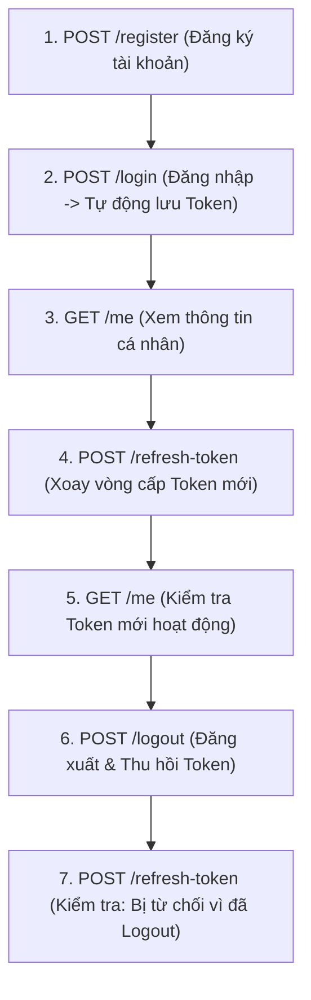

# 📮 HƯỚNG DẪN TEST API IDENTITY & AUTH BẰNG POSTMAN
## Smart Event Ticketing Platform — Module Identity & Authentication

**Ngày tạo:** 16/08/2026  
**Thư mục chứa file Postman:** [`docs/postman/`](../postman/)

---

## 📥 1. Hướng Dẫn Import Vào Postman

Trong thư mục [`docs/postman/`](../postman/) đã có sẵn 2 file:

1. 📄 [**`Smart_Event_Ticketing_Auth_Postman_Collection.json`**](../postman/Smart_Event_Ticketing_Auth_Postman_Collection.json): Chứa toàn bộ các Request và Test Scripts tự động.
2. 📄 [**`Smart_Event_Ticketing_Local_Environment.json`**](../postman/Smart_Event_Ticketing_Local_Environment.json): Chứa các biến môi trường (`baseUrl`, `accessToken`, `refreshToken`).

### Các bước Import:
1. Mở ứng dụng **Postman**.
2. Bấm nút **Import** (ở góc trên bên trái).
3. Kéo thả cả 2 file trên vào Postman.
4. Ở góc trên bên phải, chọn Environment là: **`Smart Event Ticketing - Local Env`**.

---

## ⚡ 2. Tính Năng Tự Động Hóa Thông Minh (Auto-Extract Tokens)

Bạn không cần phải copy/paste token thủ công:

* **Khi gọi `POST /login`:** Script của Postman sẽ **tự động bóc tách** `accessToken` và `refreshToken` từ JSON response và lưu thẳng vào biến `{{accessToken}}` và `{{refreshToken}}` của Environment.
* **Khi gọi `GET /me`:** Postman tự động lấy `{{accessToken}}` đính kèm vào Header `Authorization: Bearer <token>`.
* **Khi gọi `POST /refresh-token`:** Postman tự động gửi `{{refreshToken}}` cũ và cập nhật cặp `accessToken` + `refreshToken` mới vào Environment.

---

## 🧭 3. Thứ Tự Các Bước Kiểm Thử (Test Flow)



---

## 📋 4. Danh Sách Các Request Có Sẵn Trong Collection

### 📁 Thư mục 01: Authentication Flow (Luồng chuẩn)

| # | Tên Request | Method | URL | Mô Tả & Kiểm Tra |
|:---:|---|:---:|---|---|
| 1 | **Đăng ký tài khoản** | `POST` | `{{baseUrl}}/api/v1/auth/register` | Đăng ký user mới với email sinh tự động `customer{{$timestamp}}@example.com`. |
| 2 | **Đăng nhập** | `POST` | `{{baseUrl}}/api/v1/auth/login` | Đăng nhập tài khoản `testuser@example.com` / `Password@123`, tự động lưu Token. |
| 3 | **Lấy thông tin profile** | `GET` | `{{baseUrl}}/api/v1/auth/me` | Lấy profile kèm Roles (`CUSTOMER`) từ Security Context. |
| 4 | **Xoay vòng Refresh Token** | `POST` | `{{baseUrl}}/api/v1/auth/refresh-token` | Xoay vòng (Rotation) cấp cặp token mới. |
| 5 | **Đăng xuất** | `POST` | `{{baseUrl}}/api/v1/auth/logout` | Thu hồi Refresh Token trong Database. |

---

### 📁 Thư mục 02: Error & Security Test Cases (Kiểm thử bảo mật)

| # | Kịch Bản Kiểm Thử Lỗi | Kết Quả Mong Đợi | Giải Thích Bản Chất |
|:---:|---|:---:|---|
| 2.1 | **Đăng nhập sai mật khẩu** | `401 UNAUTHORIZED`<br>`code: "INVALID_CREDENTIALS"` | Không cho phép đăng nhập khi sai password. |
| 2.2 | **Đăng ký email đã tồn tại** | `400 BAD REQUEST`<br>`code: "DUPLICATE_EMAIL"` | Bắt trùng email trong Database. |
| 2.3 | **Gọi API bảo mật không có Token** | `401 UNAUTHORIZED`<br>`code: "UNAUTHORIZED"` | `JwtAuthenticationEntryPoint` chặn và trả JSON chuẩn. |
| 2.4 | **Gọi API với Token giả mạo** | `401 UNAUTHORIZED`<br>`code: "UNAUTHORIZED"` | `JwtAuthenticationFilter` phát hiện sai chữ ký và từ chối. |

---

## 💻 5. Các Lệnh cURL Nhanh (Dành Cho Terminal / Command Prompt)

Nếu bạn muốn test nhanh qua Terminal mà không cần bật Postman:

### 1. Đăng ký:
```bash
curl -X POST http://localhost:8080/api/v1/auth/register \
  -H "Content-Type: application/json" \
  -d "{\"email\":\"demo@example.com\",\"password\":\"Password@123\",\"fullName\":\"Nguyen Van A\",\"phone\":\"0901234567\"}"
```

### 2. Đăng nhập:
```bash
curl -X POST http://localhost:8080/api/v1/auth/login \
  -H "Content-Type: application/json" \
  -d "{\"email\":\"demo@example.com\",\"password\":\"Password@123\"}"
```

### 3. Lấy thông tin cá nhân:
```bash
curl -X GET http://localhost:8080/api/v1/auth/me \
  -H "Authorization: Bearer <DÁN_ACCESS_TOKEN_VÀO_ĐÂY>"
```
