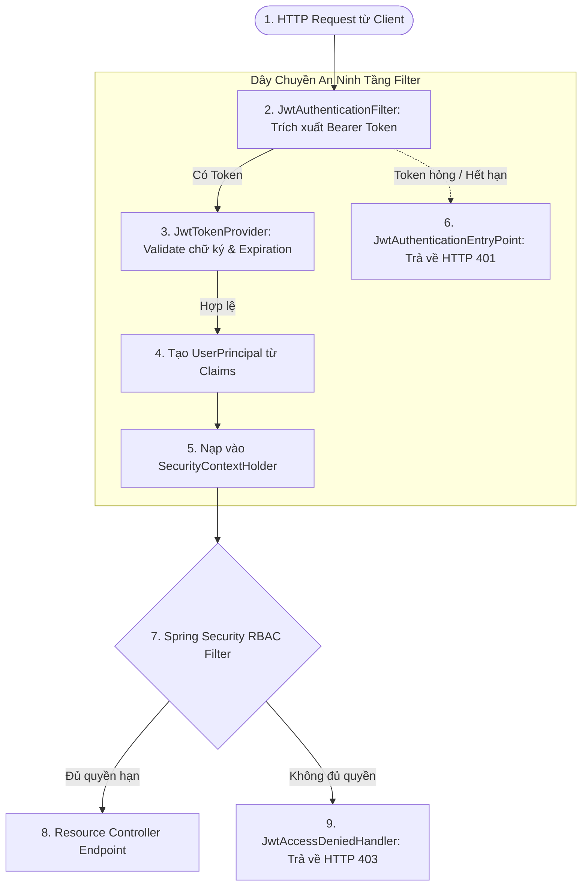

# 🛡️ PHẦN 3: HẠ TẦNG BẢO MẬT CORE & DÂY CHUYỀN XỬ LÝ JWT
## Smart Event Ticketing Platform — Module Identity & Authentication

**Ngày tạo:** 16/08/2026  
**Trạng thái:** Hoàn thành & Đã kiểm tra biên dịch (`BUILD SUCCESSFUL`)  
**Tác giả / Hệ thống:** Backend Engineering Team  

---

## 🧭 1. Tổng Quan Kiến Trúc Dây Chuyền An Ninh JWT

Hệ thống sử dụng cơ chế **Stateless Authentication** thông qua chuỗi kiểm soát gồm 6 thành phần cốt lõi tại gói [`infrastructure/security`](../../ticketing/src/main/java/com/smartevent/infrastructure/security/):



---

## 🔍 2. Chi Tiết Các Thành Phần Hạ Tầng Đã Triển Khai

### 2.1. [`UserPrincipal.java`](../../ticketing/src/main/java/com/smartevent/infrastructure/security/UserPrincipal.java) — Chiếc Cầu Nối Giữa JPA User Và Spring Security

* **Mẫu thiết kế (Adapter Pattern):** Đóng gói dữ liệu của Entity `User` thành `UserDetails` để Spring Security nhận diện.
* **Cấu trúc trường:**
  ```java
  private final UUID id;
  private final String email;
  private final String fullName;

  @JsonIgnore // Chống lộ password ra JSON response
  private final String password;

  private final Collection<? extends GrantedAuthority> authorities;
  private final boolean active;
  ```
* **Chuyển đổi Roles chuẩn Spring Security:**
  Tất cả các Role (ví dụ `CUSTOMER`, `ADMIN`) đều được tự động chuẩn hóa gắn thêm tiền tố `ROLE_` (`ROLE_CUSTOMER`, `ROLE_ADMIN`) theo quy chuẩn của Spring Security.
* **Hỗ trợ Annotation `@CurrentUser`:**
  Cho phép Controller tiêm trực tiếp `UserPrincipal` vào tham số hàm:
  ```java
  @GetMapping("/me")
  public ApiResponse<UserProfileResponse> getProfile(@CurrentUser UserPrincipal currentUser) {
      // currentUser.getId(), currentUser.getEmail() có sẵn ngay lập tức
  }
  ```

---

### 2.2. [`CustomUserDetailsService.java`](../../ticketing/src/main/java/com/smartevent/infrastructure/security/CustomUserDetailsService.java) — Nạp Dữ Liệu Tài Khoản Cho Authentication Manager

* **Bản chất:** Triển khai `UserDetailsService` để nạp User từ PostgreSQL:
  ```java
  @Override
  @Transactional(readOnly = true)
  public UserDetails loadUserByUsername(String email) throws UsernameNotFoundException {
      User user = userRepository.findByEmailWithRoles(email)
              .orElseThrow(() -> new UsernameNotFoundException("User not found with email: " + email));
      return UserPrincipal.create(user);
  }
  ```
* **Tối ưu hóa:** Sử dụng method `findByEmailWithRoles()` nạp sẵn các Role trong 1 query duy nhất.

---

### 2.3. [`JwtTokenProvider.java`](../../ticketing/src/main/java/com/smartevent/infrastructure/security/JwtTokenProvider.java) — Động Cơ Ký & Kiểm Tra Token (JJWT 0.12.6)

* **1. Quản lý Secret Key (`getSigningKey`):**
  - Hỗ trợ cả chuỗi Base64 và UTF-8 raw bytes.
  - Đảm bảo độ dài khóa luôn $\ge 256$ bits (32 bytes) cho thuật toán `HS256`.
* **2. Tạo Access Token (`generateAccessToken`):**
  - Gói gọn `userId`, `email`, `fullName`, `roles` vào Claims.
  - Thiết lập thời gian phát hành (`issuedAt`) và thời gian hết hạn (`expiration`).
  - Ký số bằng `Jwts.SIG.HS256`.
* **3. Validate Token Đa Tầng (`validateToken`):**
  Bắt và log chi tiết 4 loại lỗi thường gặp:
  - `SecurityException / MalformedJwtException`: Sai chữ ký hoặc token bị giả mạo.
  - `ExpiredJwtException`: Token đã quá hạn 15 phút.
  - `UnsupportedJwtException`: Token không đúng chuẩn định dạng.
  - `IllegalArgumentException`: Chuỗi token rỗng.
* **4. Sinh Chuỗi & Băm Refresh Token:**
  - `generateSecureRandomToken()`: Sinh chuỗi ngẫu nhiên 64-byte an toàn tuyệt đối qua `SecureRandom` + Base64 URL-safe.
  - `hashToken(String rawToken)`: Băm SHA-256 trước khi lưu vào bảng `refresh_tokens`.

---

### 2.4. [`JwtAuthenticationFilter.java`](../../ticketing/src/main/java/com/smartevent/infrastructure/security/JwtAuthenticationFilter.java) — Trạm Kiểm Soát Từng Request

* **Bản chất:** Kế thừa `OncePerRequestFilter` đảm bảo filter chỉ kích hoạt duy nhất 1 lần trên mỗi chu trình HTTP Request.
* **Luồng xử lý (Filter Pipeline):**
  1. Trích xuất chuỗi JWT từ Header `Authorization: Bearer <token>`.
  2. Gọi `jwtTokenProvider.validateToken(jwt)` kiểm tra tính hợp lệ.
  3. **Tối ưu hóa Stateless (Không query DB):** Rút trực tiếp `userId`, `email`, `fullName`, `roles` từ Claims để tạo `UserPrincipal`.
  4. Khởi tạo `UsernamePasswordAuthenticationToken` và nạp vào `SecurityContextHolder.getContext().setAuthentication(...)`.
  5. Tiếp tục chuỗi Filter qua `filterChain.doFilter(request, response)`.

---

### 2.5. Xử Lý Ngoại Lệ Bảo Mật Chuẩn RESTful (401 & 403)

Khi xảy ra lỗi bảo mật ở tầng Filter, các ngoại lệ không đi vào `GlobalExceptionHandler` bình thường vì Filter nằm trước `DispatcherServlet`. Hai Handler sau đây giải quyết triệt để vấn đề này:

#### 1. [`JwtAuthenticationEntryPoint.java`](../../ticketing/src/main/java/com/smartevent/infrastructure/security/JwtAuthenticationEntryPoint.java) (HTTP 401 UNAUTHORIZED)
- Kích hoạt khi Client **chưa đăng nhập** hoặc truyền token không hợp lệ / hết hạn.
- Ghi thẳng đối tượng JSON `ErrorResponse` vào Response Stream:
  ```json
  {
    "success": false,
    "code": "UNAUTHORIZED",
    "message": "Yêu cầu xác thực: Token không hợp lệ hoặc đã hết hạn",
    "path": "/api/v1/orders/checkout",
    "timestamp": "2026-08-16T05:35:00Z"
  }
  ```

#### 2. [`JwtAccessDeniedHandler.java`](../../ticketing/src/main/java/com/smartevent/infrastructure/security/JwtAccessDeniedHandler.java) (HTTP 403 FORBIDDEN)
- Kích hoạt khi Client đã đăng nhập nhưng **không có đủ quyền hạn Role** truy cập tài nguyên (ví dụ: tài khoản `CUSTOMER` gọi API `/api/v1/admin/venues`).
- Ghi đối tượng JSON `ErrorResponse` HTTP 403:
  ```json
  {
    "success": false,
    "code": "ACCESS_DENIED",
    "message": "Bạn không có quyền truy cập tài nguyên này",
    "path": "/api/v1/admin/venues",
    "timestamp": "2026-08-16T05:35:00Z"
  }
  ```

---

### 2.6. Cải Tiến [`SecurityUtils.java`](../../ticketing/src/main/java/com/smartevent/common/security/SecurityUtils.java)

* **Khắc phục lỗi trích xuất ID:** Khi `auth.getPrincipal()` là `UserPrincipal`, `auth.getName()` trả về email chứ không phải UUID.
* **Cơ chế mới:**
  ```java
  Object principal = auth.getPrincipal();
  if (principal instanceof UserPrincipal userPrincipal) {
      return Optional.ofNullable(userPrincipal.getId());
  }
  ```
  Giúp các hàm tiện ích `SecurityUtils.getCurrentUserId()` và `SecurityUtils.getCurrentUserEmail()` hoạt động chính xác 100% ở mọi nơi trong dự án.

---

## 📊 3. Bảng Tổng Kết Bộ 6 File Bảo Mật Core

| STT | File Kỹ Thuật | Vai Trò Chính | Trạng Thái |
|:---:|---|---|:---:|
| 1 | `UserPrincipal.java` | Adapter UserDetails đóng gói thông tin người dùng | ✅ Hoàn thành |
| 2 | `CustomUserDetailsService.java` | Nạp User + Roles từ DB cho Spring Security | ✅ Hoàn thành |
| 3 | `JwtTokenProvider.java` | Sinh Access Token, Validate Token, Hash Refresh Token | ✅ Hoàn thành |
| 4 | `JwtAuthenticationFilter.java` | Filter chặn request, bóc tách Bearer token | ✅ Hoàn thành |
| 5 | `JwtAuthenticationEntryPoint.java` | Bắt lỗi 401 Unauthorized trả JSON chuẩn | ✅ Hoàn thành |
| 6 | `JwtAccessDeniedHandler.java` | Bắt lỗi 403 Forbidden trả JSON chuẩn | ✅ Hoàn thành |
| + | `SecurityUtils.java` | Helper tĩnh trích xuất User hiện tại an toàn | ✅ Đã cập nhật |
