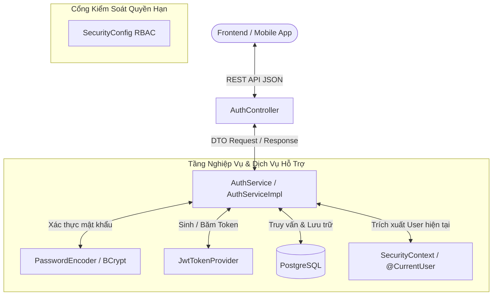

# 💼 PHẦN 4: LOGIC NGHIỆP VỤ XÁC THỰC, API ENDPOINTS, RBAC & TEST SUITE
## Smart Event Ticketing Platform — Module Identity & Authentication

**Ngày hoàn thành:** 16/08/2026  
**Trạng thái:** Hoàn thành 100% · Đã kiểm thử tự động toàn diện (`BUILD SUCCESSFUL · 16 tests passed`)  
**Tác giả / Hệ thống:** Backend Engineering Team  

---

## 🧭 1. Tổng Quan Kiến Trúc Tầng Nghiệp Vụ (Business & API Layer)

Tầng này chịu trách nhiệm tiếp nhận yêu cầu từ Client, thực thi các quy tắc kiểm tra logic (Business Rules), tương tác với Database và trả về kết quả theo chuẩn RESTful Envelope Pattern:

---

## 📋 2. Chi Tiết 5 Luồng Nghiệp Vụ Cốt Lõi (Core Business Flows)

### 🔹 Nghiệp Vụ 1: Đăng Ký Tài Khoản Khách Mua Vé (`POST /api/v1/auth/register`)

#### 1. Quy tắc nghiệp vụ (Business Rules):
1. **Kiểm tra tính hợp lệ dữ liệu (DTO Validation):**
   - `email`: Bắt buộc (`@NotBlank`), đúng định dạng email RFC 5322 (`@Email`).
   - `password`: Bắt buộc, tối thiểu 8 ký tự (`@Size(min = 8)`).
   - `fullName`: Bắt buộc.
   - `phone`: Tùy chọn (được phép null hoặc chuỗi số).
2. **Kiểm tra trùng lặp (Uniqueness Check):**
   - Gọi `userRepository.existsByEmail(request.email())`. Nếu đã tồn tại ➔ Ném lỗi `DUPLICATE_EMAIL` (HTTP 400).
3. **Mã hóa mật khẩu (Password Hashing):**
   - Tuyệt đối không lưu plaintext password. Sử dụng `BCryptPasswordEncoder` với salt tự động sinh để tạo ra chuỗi hash 60 ký tự.
4. **Gán vai trò mặc định (Default Role Assignment):**
   - Mọi tài khoản tự đăng ký trên hệ thống đều được tự động gán vai trò mặc định là **`CUSTOMER`**.
   - Trạng thái tài khoản ban đầu luôn là `UserStatus.ACTIVE`.

---

### 🔹 Nghiệp Vụ 2: Đăng Nhập & Khởi Tạo Phiên Kép (`POST /api/v1/auth/login`)

#### 1. Quy tắc nghiệp vụ & Phòng chống tấn công (Security Rules):
1. **Chống Tấn Công Dò Email (Anti-Email Enumeration):**
   - Khi email không tồn tại **HOẶC** mật khẩu nhập sai ➔ Hệ thống đều trả về cùng một mã lỗi chung: **`INVALID_CREDENTIALS` ("Email hoặc mật khẩu không chính xác")**. Không trả về "Email không tồn tại" để tránh hacker lợi dụng dò danh sách tài khoản.
2. **Kiểm tra trạng thái tài khoản:**
   - Nếu `user.getStatus() != ACTIVE` hoặc tài khoản đã bị xóa mềm (`isDeleted() == true`) ➔ Ném lỗi **`ACCOUNT_DISABLED` ("Tài khoản của bạn đã bị vô hiệu hóa hoặc đã bị xóa")**.
3. **Vai trò của `UserPrincipal.create(user)`:**
   - Đóng vai trò là **Factory Transformer**: Biến Entity `User` từ Database (chứa `userRoles`) thành đối tượng `UserPrincipal` mang danh sách quyền hạn chuẩn Spring Security `ROLE_CUSTOMER`.
4. **Sinh Access Token (Stateless):**
   - Chứa `id`, `email`, `fullName`, `roles`, thời hạn sống **15 phút**.
5. **Sinh & Băm Refresh Token (Long-lived Session):**
   - Sinh chuỗi ngẫu nhiên an toàn 64 bytes (`rawRefreshToken`).
   - Băm SHA-256 (`tokenHash`) và lưu vào bảng `refresh_tokens` với thời hạn **7 ngày**.
   - Trả về `rawRefreshToken` cho Client (chỉ có Client mới giữ token gốc, DB chỉ giữ hash).

---

### 🔹 Nghiệp Vụ 3: Cấp Mới Token & Xoay Vòng Bảo Mật (`POST /api/v1/auth/refresh-token`)

#### ❓ Cơ chế Xoay Vòng Token (Refresh Token Rotation) hoạt động như thế nào?
Mỗi khi Client gửi Refresh Token lên để xin Access Token mới:
1. Hệ thống **hủy bỏ ngay lập tức (Revoke)** Refresh Token cũ đó (`revoked_at = Instant.now()`).
2. Hệ thống cấp một cặp gồm: **Access Token MỚI + Refresh Token MỚI**.
3. **Phát hiện Tấn Công Tái Sử Dụng Token (Token Reuse Attack):**
   - Nếu một token đã bị thu hồi trước đó (`token.isRevoked()`) lại được gửi lên một lần nữa ➔ Đây là dấu hiệu chắc chắn token đó đã bị kẻ xấu đánh cắp và dùng lại!
   - **Hành động phản ứng:** Hệ thống lập tức gọi `refreshTokenRepository.revokeAllUserTokens(userId)` để hủy toàn bộ tất cả các phiên đăng nhập khác của người dùng đó nhằm bảo vệ tài khoản, và từ chối cấp token.

---

### 🔹 Nghiệp Vụ 4: Đăng Xuất An Toàn (`POST /api/v1/auth/logout`)

#### 1. Quy tắc nghiệp vụ:
1. Client gửi `refreshToken` hiện tại lên server.
2. Server băm SHA-256 chuỗi token, tìm trong bảng `refresh_tokens` và đánh dấu `revoked_at = Instant.now()`.
3. Client xóa Access Token và Refresh Token khỏi bộ nhớ (LocalStorage / Cookies).
4. Kể từ lúc này, Refresh Token đó không thể dùng để xin cấp token mới được nữa.

---

### 🔹 Nghiệp Vụ 5: Lấy Thông Tin Tài Khoản Hiện Tại (`GET /api/v1/auth/me`)

#### 1. Quy tắc nghiệp vụ:
1. Endpoint này được bảo vệ bởi Spring Security (yêu cầu Header `Authorization: Bearer <token>`).
2. Controller sử dụng annotation **`@CurrentUser UserPrincipal currentUser`** để trích xuất danh tính người dùng trực tiếp từ Security Context mà không cần query lại DB.
3. Service gọi `userRepository.findByIdWithRoles(currentUser.getId())` để nạp đầy đủ thông tin:
   - Thông tin cá nhân: `id`, `email`, `fullName`, `phone`, `avatarFileId`, `status`.
   - Danh sách quyền hạn: `roles` (`CUSTOMER`, `ORGANIZER`, `ADMIN`).
   - Hồ sơ ban tổ chức: `organizerProfile` (nếu tài khoản là Organizer).
4. Trả về `UserProfileResponse`.

---

## 🛡️ 3. Phân Quyền RBAC Trong `SecurityConfig.java`

Ma trận phân quyền trên các Endpoint hệ thống được thiết lập chặt chẽ:

| Dải Endpoint | Quyền Hạn Yêu Cầu | Ghi Chú |
|---|:---:|---|
| **`/api/v1/auth/**`** | `permitAll()` | Mở công khai cho mọi khách vãng lai (Register, Login, Refresh Token, Logout). |
| **`/actuator/health`, `/actuator/info`** | `permitAll()` | Endpoint giám sát hệ thống của Docker / Kubernetes Probe. |
| **`/swagger-ui/**`, `/v3/api-docs/**`** | `permitAll()` | Trang tài liệu OpenAPI Documentation. |
| **`/api/v1/admin/**`** | `hasRole('ADMIN')` | Dành riêng cho Quản trị viên (quản lý Venues, Categories, duyệt Event, cấu hình hệ thống). |
| **`/api/v1/organizer/**`** | `hasAnyRole('ORGANIZER', 'ADMIN')` | Dành cho Ban tổ chức tạo sự kiện, sơ đồ ghế, đợt mở bán vé, thống kê doanh thu. |
| **Tất cả các API còn lại** | `authenticated()` | Bắt buộc phải đăng nhập và có Access Token hợp lệ. |

---

## 🧪 4. Bộ Test Tự Động Toàn Diện (Automated Test Suite)

Toàn bộ logic bảo mật và nghiệp vụ đã được kiểm thử với 3 bộ test:

### 4.1. [`JwtTokenProviderTest.java`](../../ticketing/src/test/java/com/smartevent/infrastructure/security/JwtTokenProviderTest.java)
- ✅ `shouldGenerateAccessTokenAndExtractClaims`: Sinh Access Token và trích xuất đúng `userId`, `email`, `roles`.
- ✅ `shouldFailValidationOnTamperedToken`: Phát hiện token bị can thiệp, sửa đổi hoặc sai chữ ký số.
- ✅ `shouldGenerateAndHashRefreshToken`: Sinh chuỗi 64-byte ngẫu nhiên và băm SHA-256 chính xác 64 ký tự hex.

### 4.2. [`AuthServiceTest.java`](../../ticketing/src/test/java/com/smartevent/modules/identity/service/AuthServiceTest.java)
- ✅ `register_Success`: Đăng ký thành công, gán quyền `CUSTOMER`.
- ✅ `register_DuplicateEmail_ThrowsException`: Bắt lỗi trùng email `DUPLICATE_EMAIL`.
- ✅ `login_Success`: Đăng nhập thành công trả về cặp token.
- ✅ `login_WrongPassword_ThrowsException`: Bắt lỗi sai mật khẩu `INVALID_CREDENTIALS`.
- ✅ `refreshToken_Success`: Xoay vòng token thành công (thu hồi token cũ, sinh token mới).
- ✅ `refreshToken_TokenReuseAttack_RevokesAllTokens`: **Phát hiện tấn công Token Reuse và hủy toàn bộ phiên của User**.
- ✅ `logout_Success`: Thu hồi token trong database.
- ✅ `getProfile_Success`: Nạp thông tin hồ sơ User.

### 4.3. [`AuthControllerTest.java`](../../ticketing/src/test/java/com/smartevent/modules/identity/controller/AuthControllerTest.java)
- ✅ `register_ReturnsSuccess`: MockMvc POST `/register` trả về 200 OK + `ApiResponse<UserResponse>`.
- ✅ `login_ReturnsSuccess`: MockMvc POST `/login` trả về 200 OK + `ApiResponse<LoginResponse>`.
- ✅ `refreshToken_ReturnsSuccess`: MockMvc POST `/refresh-token` trả về 200 OK + `ApiResponse<TokenRefreshResponse>`.
- ✅ `logout_ReturnsSuccess`: MockMvc POST `/logout` trả về 200 OK + `ApiResponse.ok()`.
