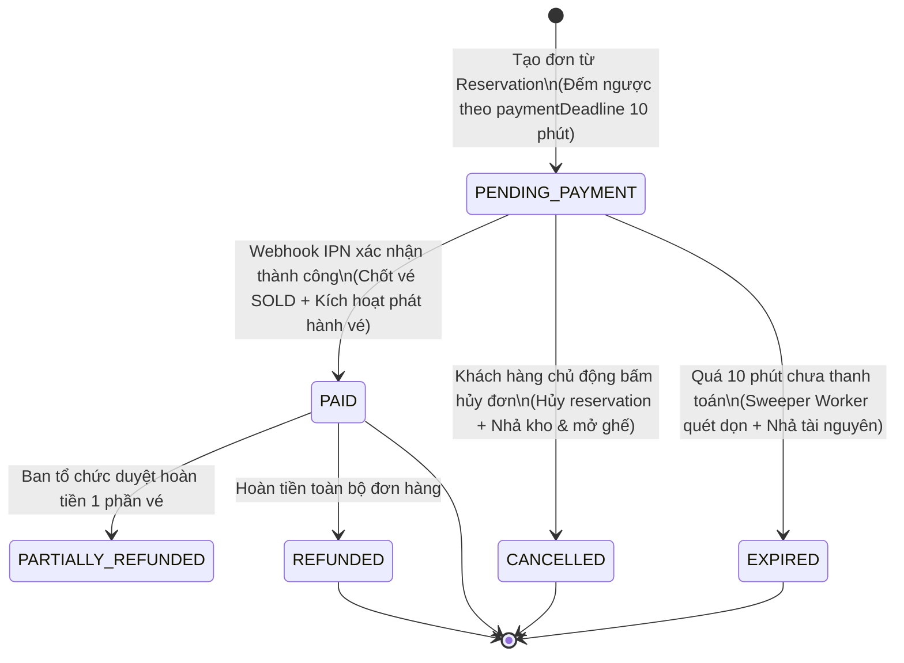

# 📦 MODULE 6: ORDERING PIPELINE & PRICE SNAPSHOT IMMUTABILITY
## (QUẢN LÝ ĐƠN HÀNG, ĐÓNG BĂNG GIÁ BẤT BIẾN & ĐẾM NGƯỢC THANH TOÁN)

**Trạng thái:** Đang triển khai · Sẵn sàng tích hợp Payment  
**Tác giả / Hệ thống:** Backend Engineering Team · Smart Event Ticketing Platform  

---

## 🧭 1. Tổng Quan Bài Toán Nghiệp Vụ

Trong kiến trúc hệ thống bán vé chịu tải cao:
* **Module 5 (Reservation)** đã thực hiện việc **giữ chỗ thời gian thực trong 10 phút** (`expiresAt = NOW() + 10 phút`), tạm khóa ghế `HELD` và trừ tồn kho tạm thời (`held_quantity`) để ngăn chặn tuyệt đối tình trạng bán vượt số lượng vé (Overselling).
* **Module 6 (Ordering)** đóng vai trò là chiếc cầu nối tài chính, **chuyển đổi giỏ giữ chỗ tạm thời thành một Hợp đồng Đơn hàng chính thức (Order)** trước khi chuyển sang cổng thanh toán:
  1. **Đóng băng giá vé (Price Snapshot Immutability):** Sao chép toàn bộ danh sách vé và giá gốc từ `ReservationItem` sang `OrderItem`. Giá vé được lấy trực tiếp từ nguồn sự thật Database, **tuyệt đối không nhận giá từ Request Body của Client** để ngăn chặn tấn công sửa giá trên trình duyệt (Price Tampering Attack).
  2. **Định danh đơn hàng thân thiện (Order Code):** Tự động sinh mã định danh duy nhất (VD: `ORD-20260820-A1B2C3D4`) phục vụ việc hiển thị cho khách hàng, in trên vé và đối soát giao dịch ngân hàng.
  3. **Đồng bộ thời hạn thanh toán (Deadline Synchronization):** Thiết lập `paymentDeadline = reservation.expiresAt`. Khi hết 10 phút đếm ngược mà khách chưa thanh toán, hệ thống tự động quét và chuyển trạng thái đơn hàng sang `EXPIRED`, đồng thời hoàn trả ghế và vé về trạng thái mở bán (`AVAILABLE`).

```
                          KHÁCH HÀNG CÓ PHIÊN GIỮ CHỖ (MODULE 5)
                                             │
                                             ▼
                      【 BƯỚC 1: TẠO ĐƠN HÀNG (CREATE ORDER) 】
                      POST /api/v1/orders (Body: reservationId)
                                             │
                     ┌───────────────────────┴───────────────────────┐
                     ▼                                               ▼
          【 SNAPSHOT DỮ LIỆU VÉ 】                        【 ĐẾM NGƯỢC THANH TOÁN 】
          • Copy toàn bộ reservation_items                  • `payment_deadline = reservation.expiresAt`
          • Đóng băng `unit_price`, `total_price`           • Hết hạn 10 phút: Đơn -> `EXPIRED`
          • Ghi nhận mã ghế `event_seat_id`                 • Tự động nhả kho & mở khóa ghế `AVAILABLE`
                     │                                               │
                     └───────────────────────┬───────────────────────┘
                                             ▼
                         TẠO BẢN GHI `orders` (STATUS = 'PENDING_PAYMENT')
                             CHỜ CHUYỂN TIẾP SANG CỔNG THANH TOÁN
```

---

## 🗃️ 2. Lược Đồ Database (`V7__ordering_schema.sql`)

```sql
-- 1. Bảng Đơn Hàng Mua Vé
CREATE TABLE orders (
    id                      UUID PRIMARY KEY,
    user_id                 UUID NOT NULL REFERENCES users(id) ON DELETE RESTRICT,
    reservation_id          UUID REFERENCES reservations(id) ON DELETE RESTRICT,
    order_code              VARCHAR(50) NOT NULL UNIQUE,
    subtotal                DECIMAL(15,2) NOT NULL,
    discount_amount         DECIMAL(15,2) NOT NULL DEFAULT 0,
    fee_amount              DECIMAL(15,2) NOT NULL DEFAULT 0,
    total_amount            DECIMAL(15,2) NOT NULL,
    currency                VARCHAR(10) NOT NULL DEFAULT 'VND',
    payment_deadline        TIMESTAMPTZ,
    customer_note           TEXT,
    coupon_id               UUID,
    selected_payment_method VARCHAR(30),
    status                  VARCHAR(30) NOT NULL DEFAULT 'PENDING_PAYMENT',
    created_at              TIMESTAMPTZ NOT NULL DEFAULT NOW(),
    updated_at              TIMESTAMPTZ NOT NULL DEFAULT NOW(),
    CONSTRAINT chk_orders_amounts CHECK (
        subtotal >= 0 AND total_amount >= 0 AND discount_amount >= 0 AND fee_amount >= 0
    )
);

CREATE INDEX idx_orders_user_id ON orders(user_id);
CREATE INDEX idx_orders_reservation_id ON orders(reservation_id);
CREATE INDEX idx_orders_order_code ON orders(order_code);
CREATE INDEX idx_orders_status ON orders(status);
CREATE INDEX idx_orders_deadline ON orders(payment_deadline) WHERE status = 'PENDING_PAYMENT';

-- 2. Bảng Chi Tiết Từng Mục Vé Trong Đơn Hàng
CREATE TABLE order_items (
    id             UUID PRIMARY KEY,
    order_id       UUID NOT NULL REFERENCES orders(id) ON DELETE CASCADE,
    ticket_type_id UUID NOT NULL REFERENCES ticket_types(id) ON DELETE RESTRICT,
    sale_phase_id  UUID NOT NULL REFERENCES ticket_sale_phases(id) ON DELETE RESTRICT,
    event_seat_id  UUID REFERENCES event_seats(id) ON DELETE RESTRICT,
    quantity       INT NOT NULL,
    unit_price     DECIMAL(15,2) NOT NULL,
    total_price    DECIMAL(15,2) NOT NULL,
    created_at     TIMESTAMPTZ NOT NULL DEFAULT NOW(),
    CONSTRAINT chk_order_item_qty CHECK (quantity > 0),
    CONSTRAINT chk_order_item_price CHECK (unit_price >= 0 AND total_price >= 0)
);

CREATE INDEX idx_order_items_order_id ON order_items(order_id);
CREATE INDEX idx_order_items_ticket_type ON order_items(ticket_type_id);
CREATE INDEX idx_order_items_sale_phase ON order_items(sale_phase_id);
CREATE INDEX idx_order_items_seat_id ON order_items(event_seat_id) WHERE event_seat_id IS NOT NULL;
```

---

## 🔄 3. Vòng Đời 6 Trạng Thái Của Đơn Hàng (Order State Machine)



---

## 🏗️ 4. Chi Tiết Triển Khai Từng Tầng (Layer-by-Layer)

```
src/main/java/com/smartevent/modules/ordering/
  ├── entity/
  │     ├── Order.java                 ← Kế thừa BaseEntity, chứa subtotal, totalAmount, orderCode, status
  │     └── OrderItem.java             ← Snapshot chi tiết từng vé, unitPrice, totalPrice, eventSeatId
  ├── repository/
  │     ├── OrderRepository.java       ← findByOrderCode, findByUserId, findByStatusAndPaymentDeadlineBefore
  │     └── OrderItemRepository.java   ← findByOrderId, findByEventSeatId
  ├── dto/
  │     ├── request/
  │     │     └── CreateOrderRequest.java  ← reservationId, customerNote, paymentMethod
  │     └── response/
  │           ├── OrderItemResponse.java   ← Thông tin chi tiết vé, mã ghế, đơn giá, thành tiền
  │           └── OrderResponse.java       ← Thông tin đơn hàng kèm orderCode, tổng tiền và hạn thanh toán
  ├── service/
  │     ├── OrderService.java          ← Interface nghiệp vụ tạo đơn, hủy đơn, tra cứu đơn hàng
  │     ├── OrderExpiryWorker.java     ← Background Sweeper quét dọn các đơn hàng quá hạn thanh toán
  │     └── impl/
  │           └── OrderServiceImpl.java← Xử lý chuyển đổi giỏ hàng, đóng băng giá và kiểm tra bảo mật
  ├── controller/
  │     └── OrderController.java       ← 5 REST API Endpoints phân quyền isAuthenticated()
  └── exception/
        └── OrderingException.java     ← Custom exception cho phân hệ Đơn hàng
```

---

## 🛡️ 5. Các Quy Tắc Nghiệp Vụ Cốt Lõi (Core Business Rules)

> [!IMPORTANT]
> **1. Quy Tắc Bất Biến Của Giá (Price Snapshot):**  
> Giá vé của từng mục (`unit_price`) và tổng tiền thanh toán (`total_amount`) phải được tính toán trực tiếp từ `ReservationItem` (dữ liệu trong database), tuyệt đối không nhận giá từ Request Body của Client.

> [!TIP]
> **2. Quy Tắc Đồng Bộ Thời Hạn Thanh Toán (Deadline Sync):**  
> Thời hạn thanh toán `payment_deadline` của Đơn hàng được thừa hưởng trực tiếp từ `expires_at` của phiên giữ chỗ `Reservation`. Nếu người dùng không hoàn tất thanh toán trước thời điểm này, hệ thống sẽ tự động hủy đơn và giải phóng vé.

> [!NOTE]
> **3. Quy Tắc Độc Quyền Truy Cập (Ownership Guard):**  
> Khách hàng chỉ có quyền xem và hủy các đơn hàng do chính tài khoản của mình tạo ra (`order.userId == currentUser.id`). Quyền quản trị viên (`ROLE_ADMIN`) có thể xem toàn bộ đơn hàng trong hệ thống.
