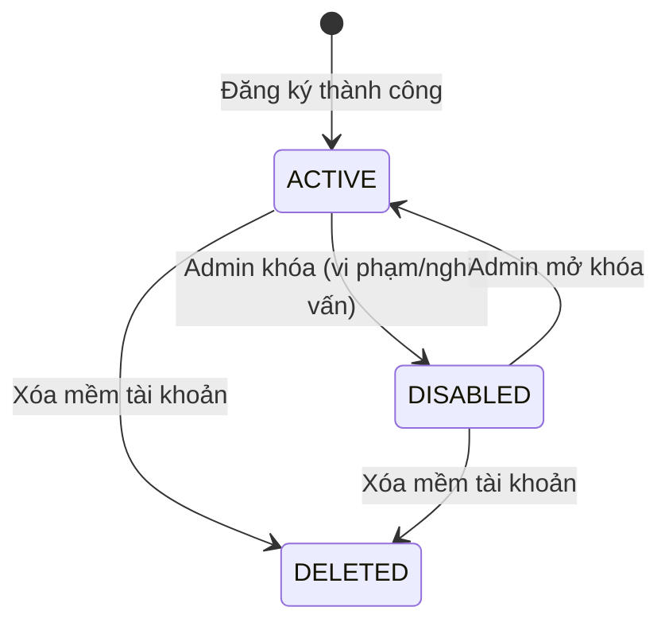
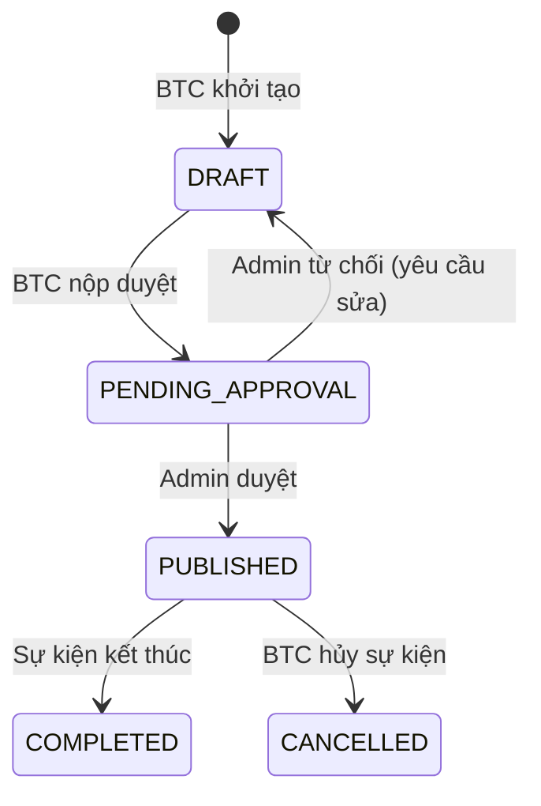
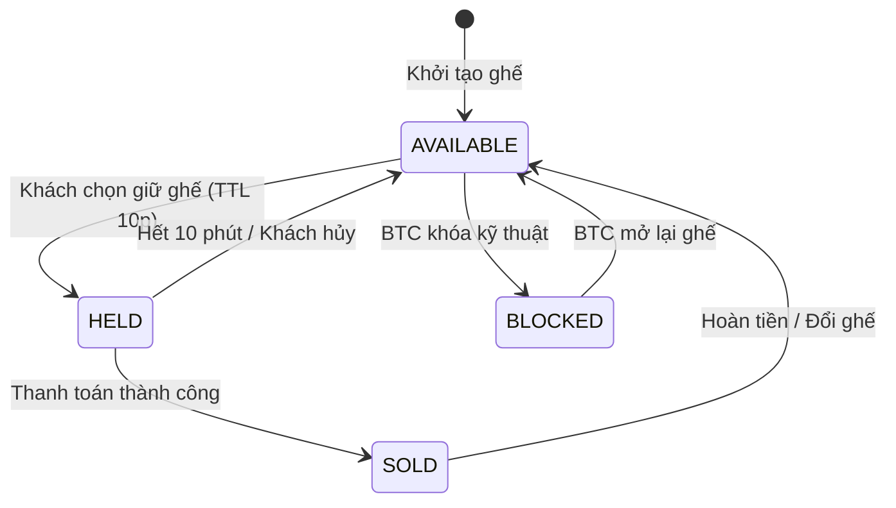
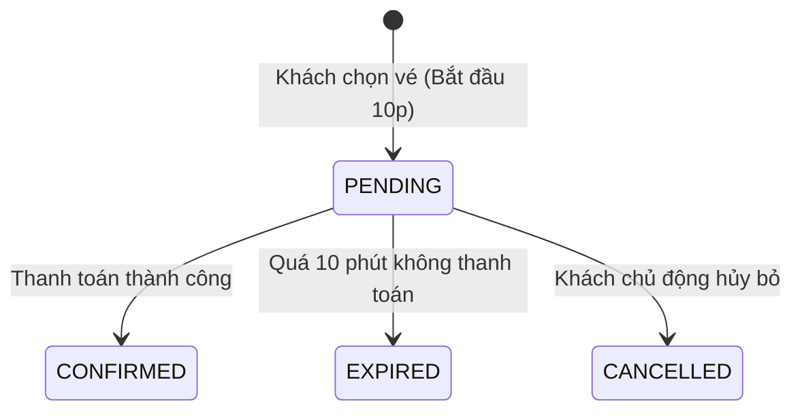
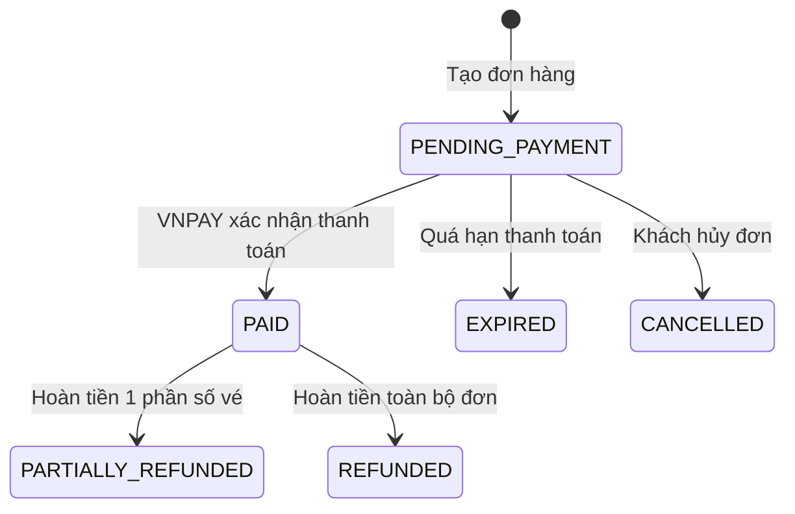
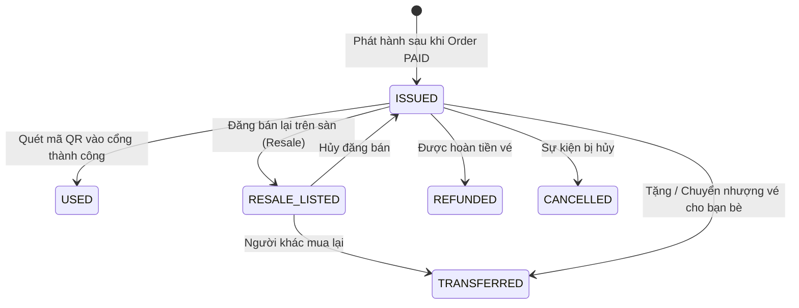

# 📋 TỔNG HỢP & GIẢI THÍCH TOÀN BỘ ENUMS (PHASE 1)
## Smart Event Ticketing Platform

Tài liệu này tổng hợp toàn bộ **14 Enums** được sử dụng xuyên suốt hệ thống (từ Cơ sở dữ liệu PostgreSQL, JPA Entities đến tầng API DTOs), kèm theo sơ đồ chuyển đổi trạng thái (State Machine) và giải thích chi tiết ý nghĩa nghiệp vụ.

---

## 📑 Bảng Tra Cứu Nhanh 14 Enums

| # | Tên Enum | Thuộc Module | Bảng DB Áp Dụng | Số Giá Trị |
|---|---|---|---|:---:|
| 1 | [`UserStatus`](#1-userstatus) | Identity | `users.status` | 3 |
| 2 | [`EventStatus`](#2-eventstatus) | Event | `events.status` | 5 |
| 3 | [`AreaType`](#3-areatype) | Event | `event_areas.area_type` | 2 |
| 4 | [`SeatStatus`](#4-seatstatus) | Event / Seat | `event_seats.status` | 4 |
| 5 | [`SalePhaseStatus`](#5-salephasestatus) | Ticketing | `ticket_sale_phases.status` | 6 |
| 6 | [`ReservationStatus`](#6-reservationstatus) | Reservation | `reservations.status` | 4 |
| 7 | [`OrderStatus`](#7-orderstatus) | Ordering | `orders.status` | 6 |
| 8 | [`PaymentStatus`](#8-paymentstatus) | Payment | `payments.status` | 6 |
| 9 | [`PaymentMethod`](#9-paymentmethod) | Payment / Event | `event_payment_methods.method`, `payments.payment_method` | 3 |
| 10 | [`TicketStatus`](#10-ticketstatus) | Ticket | `tickets.status` | 6 |
| 11 | [`CheckinResult`](#11-checkinresult) | Ticket / Gate | `ticket_checkins.result` | 3 |
| 12 | [`FileVisibility`](#12-filevisibility) | Storage | `files.visibility` | 2 |
| 13 | [`FileScanStatus`](#13-filescanstatus) | Storage | `files.scan_status` | 4 |
| 14 | [`InvoiceStatus`](#14-invoicestatus) | Billing | `invoices.status` | 2 |

---

## 🔍 Chi Tiết & Sơ Đồ Trạng Thái Từng Enum

---

### 1. `UserStatus`
*Quản lý vòng đời tài khoản người dùng.*

| Giá Trị | Ý Nghĩa Nghiệp Vụ | Khi Nào Chuyển Sang Trạng Thái Này? |
|---|---|---|
| `ACTIVE` | Tài khoản đang hoạt động bình thường. | Mặc định sau khi đăng ký tài khoản thành công. |
| `DISABLED` | Tài khoản bị tạm khóa / vô hiệu hóa. | Admin khóa khi phát hiện hành vi gian lận (đầu cơ vé, spam, vi phạm chính sách). User không thể đăng nhập. |
| `DELETED` | Tài khoản đã bị xóa mềm (Soft Delete). | Khi người dùng yêu cầu xóa tài khoản (cột `deleted_at` được gán thời gian). Dữ liệu lịch sử mua vé vẫn được giữ để đối soát tài chính. |

---

### 2. `EventStatus`
*Vòng đời của sự kiện do Ban Tổ Chức (BTC) đăng ký.*

| Giá Trị | Ý Nghĩa Nghiệp Vụ |
|---|---|
| `DRAFT` | Bản nháp. BTC đang soạn thông tin, thiết lập sơ đồ ghế, đợt bán vé. Chưa hiển thị ra ngoài cho khách hàng. |
| `PENDING_APPROVAL` | Đang chờ duyệt. BTC đã hoàn tất cấu hình và gửi yêu cầu để Quản trị viên (Admin) phê duyệt. |
| `PUBLISHED` | Đã công khai mở bán. Khách hàng có thể tìm kiếm, xem thông tin và tiến hành mua vé. |
| `CANCELLED` | Sự kiện bị hủy bỏ (do thời tiết, BTC, hoặc sự cố bất khả kháng). Hệ thống sẽ kích hoạt quy trình hoàn tiền vé. |
| `COMPLETED` | Sự kiện đã diễn ra xong và kết thúc thành công. Đóng toàn bộ cổng soát vé và chốt doanh thu. |

---

### 3. `AreaType`
*Phân loại tính chất khu vực / khán đài của sự kiện.*

| Giá Trị | Ý Nghĩa Nghiệp Vụ | Cơ Chế Quản Lý Tồn Kho |
|---|---|---|
| `STANDING` | **Khu vực vé đứng** (VD: Fanzone, GA, Sân cỏ). Khách không có ghế cố định. | Quản lý số lượng qua bộ đếm tồn kho `inventory_counters` (dùng cơ chế trừ số lượng Atomic). |
| `SEATED` | **Khu vực ghế ngồi** (VD: Khán đài VIP, Ghế rạp hát, Hàng A-01). | Quản lý đích danh từng ghế trên bảng `event_seats` (khóa ghế theo mã định danh `event_seat_id`). |

---

### 4. `SeatStatus`
*Trạng thái của từng chiếc ghế cụ thể trong khu vực `SEATED`.*

| Giá Trị | Ý Nghĩa Nghiệp Vụ |
|---|---|
| `AVAILABLE` | Ghế đang trống, sẵn sàng để khách hàng chọn mua. |
| `HELD` | Ghế đang bị **giữ chỗ tạm thời trong 10 phút** cho một khách hàng đang thực hiện thanh toán. Người khác không thể chọn. |
| `SOLD` | Ghế đã được thanh toán thành công và gắn vào vé điện tử của người mua. |
| `BLOCKED` | Ghế bị khóa kỹ thuật (dành riêng cho khách mời VIP, góc nhìn bị che khuất, vị trí đặt máy quay phim của ban tổ chức). |

---

### 5. `SalePhaseStatus`
*Trạng thái của đợt mở bán vé (Early Bird, Regular, Last Minute...).*

| Giá Trị | Ý Nghĩa Nghiệp Vụ |
|---|---|
| `DRAFT` | Đợt bán đang được tạo nháp, chưa công bố lịch bán. |
| `SCHEDULED` | Đã lên lịch mở bán tự động (hiển thị đồng hồ đếm ngược chờ đến giờ `sale_start_at`). |
| `ACTIVE` | Đang trong thời gian mở bán. Khách hàng có thể nhấn mua vé. |
| `PAUSED` | Tạm dừng bán khẩn cấp (do BTC cần điều chỉnh kỹ thuật hoặc xử lý sự cố). |
| `CLOSED` | Đã đóng đợt bán (do hết thời gian `sale_end_at` hoặc BTC chủ động kết thúc). |
| `SOLD_OUT` | Đã hết sạch vé của đợt bán này (`sold_quantity == total_quantity`). |

---

### 6. `ReservationStatus`
*Trạng thái của phiên giữ chỗ (10 phút) của khách hàng.*

| Giá Trị | Ý Nghĩa Nghiệp Vụ |
|---|---|
| `PENDING` | Đang giữ vé hợp lệ. Khách hàng có 10 phút để hoàn tất thanh toán. |
| `CONFIRMED` | Giữ vé thành công và đã chuyển đổi thành Đơn hàng thanh toán hoàn tất (`PAID`). |
| `EXPIRED` | Phiên giữ chỗ đã quá hạn 10 phút. Ghế/số lượng vé tự động được nhả về kho (`AVAILABLE`) cho người khác mua. |
| `CANCELLED` | Khách hàng chủ động nhấn nút "Hủy giữ vé" để chọn lại ghế khác. |

---

### 7. `OrderStatus`
*Vòng đời đơn hàng mua vé.*

| Giá Trị | Ý Nghĩa Nghiệp Vụ |
|---|---|
| `PENDING_PAYMENT` | Đơn hàng vừa tạo, đang chờ cổng thanh toán VNPAY xử lý. |
| `PAID` | Đã thanh toán thành công toàn bộ số tiền. Hệ thống tiến hành phát hành vé QR. |
| `CANCELLED` | Đơn hàng bị hủy do khách hàng không tiếp tục thanh toán. |
| `EXPIRED` | Đơn hàng hết hạn thời gian thanh toán cho phép. |
| `PARTIALLY_REFUNDED`| Đã hoàn tiền một phần (VD: Mua 4 vé nhưng hủy trả lại 2 vé). |
| `REFUNDED` | Đã hoàn tiền 100% toàn bộ đơn hàng. |

---

### 8. `PaymentStatus`
*Trạng thái của từng lần thực hiện giao dịch thanh toán.*

| Giá Trị | Ý Nghĩa Nghiệp Vụ |
|---|---|
| `INITIATED` | Vừa tạo URL thanh toán chuyển hướng sang cổng VNPAY. |
| `PENDING` | Khách hàng đang thao tác nhập OTP / quét mã VNPAY-QR trên ứng dụng ngân hàng. |
| `SUCCESS` | VNPAY gửi Webhook (IPN) xác nhận trừ tiền thành công. |
| `FAILED` | Giao dịch thất bại (sai mã OTP, thẻ hết hạn, tài khoản không đủ số dư). |
| `CANCELLED` | Khách hàng bấm nút "Hủy thanh toán" trên trang VNPAY. |
| `REFUNDED` | Giao dịch đã được hoàn tiền lại vào tài khoản ngân hàng của khách. |

---

### 9. `PaymentMethod`
*Danh mục các phương thức thanh toán được hỗ trợ.*

| Giá Trị | Ý Nghĩa Nghiệp Vụ |
|---|---|
| `VNPAY` | Cổng thanh toán VNPAY (Quét mã VNPAY-QR, Thẻ ATM nội địa, Thẻ quốc tế Visa/Mastercard). **(Sử dụng Sandbox trong Phase 1)**. |
| `MOMO` | Ví điện tử MoMo *(Dự phòng mở rộng)*. |
| `BANK_TRANSFER` | Chuyển khoản ngân hàng trực tiếp qua mã QR VietQR *(Dự phòng mở rộng)*. |

---

### 10. `TicketStatus`
*Vòng đời của từng chiếc vé điện tử sau khi phát hành.*

| Giá Trị | Ý Nghĩa Nghiệp Vụ |
|---|---|
| `ISSUED` | Vé điện tử đã phát hành hợp lệ, sẵn sàng để sử dụng vào cổng. |
| `USED` | Vé **đã được quét mã vào cổng** tại sự kiện (không thể quét lần 2). |
| `RESALE_LISTED` | Vé đang được chủ sở hữu niêm yết bán lại trên sàn giao dịch vé thứ cấp (tạm thời bị khóa không cho check-in). |
| `TRANSFERRED` | Vé đã được chuyển giao thành công cho chủ sở hữu mới (Vé cũ bị hủy, cấp vé mới cho người nhận). |
| `REFUNDED` | Vé đã được hoàn tiền cho khách. |
| `CANCELLED` | Vé bị hủy (do sự kiện bị hủy hoặc phát hiện gian lận). |

---

### 11. `CheckinResult`
*Kết quả ghi nhận khi nhân viên quét mã QR vé tại cửa ra vào.*

| Giá Trị | Ý Nghĩa Nghiệp Vụ | Phản Hồi Trên Màn Hình Máy Quét |
|---|---|---|
| `SUCCESS` | **Hợp lệ:** Vé đúng sự kiện, đúng giờ, chưa từng quét. | 🟢 **Màu xanh:** Cho phép khách vào cửa. |
| `INVALID` | **Không hợp lệ:** Mã QR sai, vé đã bị hủy, vé đã bị hoàn tiền, hoặc sai sự kiện. | 🔴 **Màu đỏ:** Từ chối vào cửa. |
| `DUPLICATE` | **Quét trùng lặp:** Vé này đã được quét vào cổng trước đó rồi. | 🟡 **Màu vàng cảnh báo:** Nghi vấn dùng chung 1 mã vé hoặc gian lận. |

---

### 12. `FileVisibility`
*Phân quyền xem tệp tin trên Object Storage (MinIO).*

| Giá Trị | Ý Nghĩa Nghiệp Vụ | Ví Dụ |
|---|---|---|
| `PUBLIC` | Tệp tin công khai, truy cập trực tiếp qua URL công khai. | Ảnh đại diện, Banner sự kiện, Poster, Sơ đồ khán đài. |
| `PRIVATE` | Tệp tin bảo mật, bắt buộc phải có quyền và chỉ truy cập thông qua **Presigned URL** ngắn hạn (hết hạn sau vài phút). | File PDF vé điện tử có mã QR, File PDF hóa đơn, Hợp đồng pháp nhân của BTC. |

---

### 13. `FileScanStatus`
*Quy trình quét mã độc và an toàn tệp tin tải lên hệ thống.*

| Giá Trị | Ý Nghĩa Nghiệp Vụ |
|---|---|
| `PENDING` | Tệp vừa tải lên, đang chờ worker quét virus/kiểm tra định dạng. |
| `CLEAN` | Tệp đã được quét và xác nhận an toàn, hợp lệ. |
| `INFECTED` | Tệp bị phát hiện nhiễm mã độc hoặc vi phạm chính sách; hệ thống khóa tệp ngay lập tức. |
| `SCAN_FAILED` | Quá trình quét gặp sự cố kỹ thuật (timeout hoặc lỗi dịch vụ scan). |

---

### 14. `InvoiceStatus`
*Trạng thái của Hóa đơn điện tử.*

| Giá Trị | Ý Nghĩa Nghiệp Vụ |
|---|---|
| `ISSUED` | Hóa đơn đã được xuất chính thức sau khi thanh toán thành công. |
| `VOID` | Hóa đơn bị hủy bỏ / vô hiệu hóa (khi đơn hàng bị hoàn tiền toàn bộ). Bản ghi vẫn được giữ lại để đối soát kế toán. |
