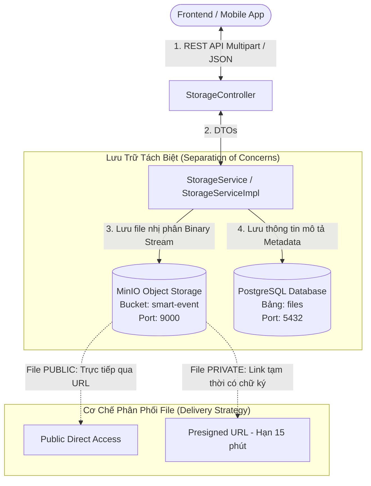

# 🗄️ PHẦN 1: TỔNG QUAN, KIẾN TRÚC & TRIỂN KHAI MODULE STORAGE (MINIO INTEGRATION)
## Smart Event Ticketing Platform — Module Storage & File Management

**Ngày hoàn thành:** 16/08/2026  
**Trạng thái:** Hoàn thành 100% · Đã kiểm thử tự động toàn diện (`BUILD SUCCESSFUL · 19/19 tests passed`)  
**Tác giả / Hệ thống:** Backend Engineering Team  

---

## 🧭 1. Tổng Quan Bài Toán & Kiến Trúc Lưu Trữ (Object Storage Architecture)

Trong hệ thống bán vé sự kiện quy mô lớn (Smart Event Ticketing Platform), hệ thống phải xử lý nhiều loại tệp tin khác nhau với các yêu cầu bảo mật khác nhau:
* **Ảnh công khai (Public Assets):** Avatar người dùng, ảnh Banner sự kiện, Poster ban nhạc, Logo nhà tài trợ.
* **Tài liệu riêng tư (Private & Secure Documents):** File PDF vé điện tử (e-Ticket có mã QR), Hóa đơn thanh toán (Invoice PDF), Báo cáo doanh thu sự kiện.



### 💡 Nguyên tắc vàng trong thiết kế:
1. **Không lưu file nhị phân (Binary Blob) vào Database:** Lưu file vào DB làm database phình to, backup chậm và nghẽn I/O. PostgreSQL chỉ lưu **Metadata** (tên file, dung lượng, đường dẫn `object_name`, người sở hữu `owner_id`).
2. **MinIO tương thích chuẩn AWS S3:** MinIO hỗ trợ 100% giao thức Amazon S3 SDK. Sau này khi đưa lên Cloud (AWS/GCP), ta chỉ cần đổi cấu hình `endpoint` mà không cần sửa bất kỳ dòng code Java nào.

---

## 🔐 2. Cơ Chế Bảo Mật & Phân Quyền File (`PUBLIC` vs `PRIVATE`)

| Thuộc Tính | File `PUBLIC` | File `PRIVATE` |
|---|---|---|
| **Ví dụ thực tế** | Avatar, Banner, Poster sự kiện, Logo đối tác. | Vé điện tử PDF, Hóa đơn VAT, Báo cáo tài chính. |
| **Đường dẫn truy cập** | Cố định: `http://localhost:9000/smart-event/{folder}/{uuid}.ext` | Tạm thời: Có chữ ký bảo mật HMAC của MinIO. |
| **Thời hạn sống của Link** | Vĩnh viễn (cho đến khi file bị xóa). | **15 phút** (hết 15 phút link tự hủy). |
| **Kiểm tra quyền truy cập** | Ai có link cũng xem được. | Bắt buộc kiểm tra `owner_id == currentUser.getId()`. |

---

## 🗃️ 3. Chi Tiết Lược Đồ Database & `FileEntity`

Bảng `files` được quản lý bởi Flyway Migration [`V3__storage_schema.sql`](../../ticketing/src/main/resources/db/migration/V3__storage_schema.sql):

```sql
CREATE TABLE files (
    id UUID PRIMARY KEY,
    owner_id UUID REFERENCES users(id) ON DELETE SET NULL,
    bucket_name VARCHAR(100) NOT NULL,
    object_name VARCHAR(500) NOT NULL,
    original_name VARCHAR(255) NOT NULL,
    content_type VARCHAR(100) NOT NULL,
    file_size BIGINT NOT NULL,
    checksum VARCHAR(64),
    visibility VARCHAR(30) NOT NULL DEFAULT 'PRIVATE',
    scan_status VARCHAR(30) NOT NULL DEFAULT 'PENDING',
    created_at TIMESTAMPTZ NOT NULL DEFAULT NOW()
);
```

### ⚠️ Lưu ý kỹ thuật về Entity JPA:
* **Không kế thừa `BaseEntity`:** File đã tải lên hệ thống là đối tượng bất biến (Immutable), không bao giờ có thao tác sửa đổi nội dung tại chỗ (`updated_at`), chỉ có upload mới hoặc xóa bỏ $\rightarrow$ `FileEntity` tự quản lý `@Id`, `@UuidGenerator` và `@PrePersist createdAt`.
* **Enum chuẩn hóa:** 
  - `visibility`: `FileVisibility.PUBLIC`, `FileVisibility.PRIVATE`.
  - `scanStatus`: `FileScanStatus.PENDING`, `FileScanStatus.CLEAN`, `FileScanStatus.INFECTED`.

---

## 📋 4. Chi Tiết 4 Nghiệp Vụ Cốt Lõi Trong `StorageServiceImpl`

### 🔹 4.1. Nghiệp Vụ Tải File Lên (`uploadFile`)
1. **Kiểm tra hợp lệ:** Chặn file rỗng (`file.isEmpty()`) bằng `FileException(VALIDATION_ERROR)`.
2. **Sinh tên file độc nhất (Unique Object Name):**
   - Bóc tách phần mở rộng (Extension) của file (ví dụ: `.png`, `.jpg`, `.pdf`).
   - Sinh chuỗi ngẫu nhiên `UUID.randomUUID()` để chống trùng tên file khi nhiều user cùng upload:
     `objectName = folder + "/" + UUID.randomUUID() + extension` (Ví dụ: `avatars/550e8400-e29b-41d4-a716-446655440000.png`).
3. **Đẩy luồng Stream lên MinIO:** Dùng `minioClient.putObject(...)`.
4. **Lưu Metadata vào Database:** Lưu đối tượng `FileEntity` vào bảng `files`.
5. **Xác định URL trả về:** Nếu file là PUBLIC thì trả URL trực tiếp; nếu PRIVATE thì sinh Presigned URL 15 phút.

---

### 🔹 4.2. Nghiệp Vụ Lấy Presigned URL (`getPresignedUrl`)
1. Tìm `FileEntity` trong Database bằng `fileId`.
2. **Kiểm tra quyền sở hữu (Bảo mật nghiêm ngặt):**
   - Nếu file là `PRIVATE`, kiểm tra xem `ownerId` có trùng với `currentUserId` không.
   - Nếu không trùng $\rightarrow$ Ném lỗi `FileException(ACCESS_DENIED, "Bạn không có quyền truy cập file này")` (ngăn chặn User A xem trộm vé/hóa đơn của User B).
3. **Sinh link có chữ ký:** Gọi `minioClient.getPresignedObjectUrl(Method.GET, expiry = 15 phút)`.
4. Trả về `PresignedUrlResponse` mang `fileId`, `url`, `expiresAt`.

---

### 🔹 4.3. Nghiệp Vụ Xóa File (`deleteFile`)
1. Tìm `FileEntity` $\rightarrow$ Kiểm tra quyền sở hữu của `currentUserId`.
2. **Xóa file vật lý trên MinIO trước:** Dùng `minioClient.removeObject(...)` để giải phóng dung lượng ổ cứng.
3. **Xóa Metadata trong PostgreSQL sau:** `fileRepository.delete(fileEntity)`.

---

### 🔹 4.4. Nghiệp Vụ Lấy Entity Nội Bộ (`getFileEntity`)
* Phục vụ các module khác (Module User, Module Event): Trả về trực tiếp `FileEntity` để kiểm tra sự tồn tại và gắn quan hệ khóa ngoại (Foreign Key) khi cập nhật Avatar hoặc Banner sự kiện.

---

## 🌐 5. Danh Sách REST API Endpoints

| HTTP Method | Endpoint | Yêu Cầu Header / Auth | Tham Số (Params / Body) | Mô Tả Nghiệp Vụ |
|:---:|---|:---:|---|---|
| `POST` | `/api/v1/storage/upload` | `Authorization: Bearer <Token>` | `file` (Multipart), `folder` (String), `visibility` (`PUBLIC`/`PRIVATE`) | Tải file lên hệ thống, lưu MinIO & DB. |
| `GET` | `/api/v1/storage/{fileId}/presigned-url` | `Authorization: Bearer <Token>` | `fileId` (UUID) | Lấy link tạm thời (15 phút) cho file riêng tư. |
| `DELETE` | `/api/v1/storage/{fileId}` | `Authorization: Bearer <Token>` | `fileId` (UUID) | Xóa file trên MinIO và Database. |

---

## 🧪 6. Bộ Kiểm Thử Tự Động Toàn Diện (`StorageServiceTest.java`)

Toàn bộ logic đã được kiểm thử độc lập bằng **Mockito** (không phụ thuộc vào mạng hay MinIO thật):

1. ✅ **`uploadFile_Success_Public`:** Kiểm tra upload file thành công, sinh đúng URL tiền tố `http://localhost:9000/smart-event/avatars/` và lưu DB.
2. ✅ **`uploadFile_EmptyFile_ThrowsException`:** Kiểm tra bắt lỗi ném `VALIDATION_ERROR` khi file rỗng.
3. ✅ **`getPresignedUrl_OtherUserPrivateFile_ThrowsAccessDenied`:** Kiểm tra cơ chế an ninh, chặn không cho User lạ truy cập file PRIVATE của người khác.
4. ✅ **`deleteFile_Success`:** Kiểm tra gọi lệnh xóa cả trên MinIO lẫn Database.
