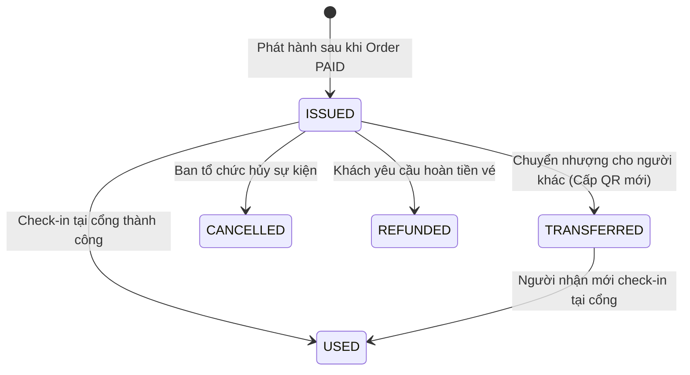

# 🔄 MODULE 7 - PHẦN 3: CHUYỂN NHƯỢNG VÉ CHÍNH CHỦ & QUẢN LÝ VÒNG ĐỜI VÉ
## (IN-APP TICKET TRANSFER, INSTANT REVOCATION & STATE MACHINE PIPELINE)

**Trạng thái:** Hoàn thành 100% · ACID Transaction Guaranteed  
**Tác giả:** Backend Engineering Team · Smart Event Ticketing Platform  

---

## 🧭 1. Quy Trình Chuyển Nhượng Vé Chính Chủ (Transfer Pipeline)

Để triệt phá nạn phe vé lừa đảo (1 ảnh QR gửi bán cho 10 người), hệ thống cung cấp tính năng **Chuyển nhượng vé chính chủ trong ứng dụng (`TicketTransferService`)**:

```
 [ Người Gửi A ] ──► Gọi API `POST /api/v1/tickets/{id}/transfer` (Gửi sang Email B)
                           │
                           ▼
 ┌────────────────────────────────────────────────────────────────────────┐
 │  TIẾN TRÌNH XỬ LÝ 7 BƯỚC NGUYÊN TỬ (TRANSACTIONAL):                     │
 │                                                                        │
 │  1. Xác thực quyền sở hữu: `ticket.currentOwnerUserId == currentUserId`│
 │  2. Kiểm tra trạng thái vé: Chỉ vé `ISSUED` mới được phép chuyển.      │
 │  3. Tìm tài khoản người nhận theo Email từ `UserRepository`.           │
 │  4. THU HỒI TOÀN BỘ MÃ QR TOKEN CŨ CỦA A:                              │
 │     • Tìm tất cả token có `status == 'ACTIVE'` ──► Đổi sang `REVOKED`  │
 │     • Lưu thời điểm `revokedAt = Instant.now()`                        │
 │  5. Chuyển quyền sở hữu `ticket.currentOwnerUserId = recipient.id`     │
 │  6. SINH MÃ QR TOKEN MỚI TOÀN BỘ cho tài khoản của B                   │
 │  7. Lưu bản ghi kiểm toán vào bảng `ticket_transfers`                  │
 └────────────────────────────────────────────────────────────────────────┘
                           │
                           ▼
 [ KẾT QUẢ AN TOÀN TUYỆT ĐỐI ]:
 • Người gửi A có giữ 1.000 tấm ảnh chụp màn hình cũ thì khi quét tại cổng,
   máy quét cũng BÁO LỖI: "MÃ QR ĐÃ BỊ THU HỒI DO ĐÃ CHUYỂN NHƯỢNG!" ❌
 • Chỉ duy nhất Người Nhận B mang mã QR mới là được qua cửa thành công! ✅
```

---

## 📊 2. Máy Trạng Thái Toàn Diện Của Tấm Vé (Ticket State Machine)



---

## 🗃️ 3. Lược Đồ Bảng Database Flyway V9 (`ticket_transfers` & `ticket_checkins`)

```sql
-- Bảng lịch sử soát vé
CREATE TABLE ticket_checkins (
    id UUID PRIMARY KEY,
    ticket_id UUID NOT NULL REFERENCES tickets(id) ON DELETE RESTRICT,
    event_id UUID NOT NULL REFERENCES events(id) ON DELETE RESTRICT,
    checked_by_user_id UUID REFERENCES users(id) ON DELETE SET NULL,
    gate_name VARCHAR(100),
    result VARCHAR(30) NOT NULL, -- SUCCESS, INVALID, DUPLICATE
    checked_at TIMESTAMPTZ NOT NULL DEFAULT NOW()
);

-- Bảng lịch sử chuyển nhượng vé
CREATE TABLE ticket_transfers (
    id UUID PRIMARY KEY,
    ticket_id UUID NOT NULL REFERENCES tickets(id) ON DELETE RESTRICT,
    from_user_id UUID NOT NULL REFERENCES users(id) ON DELETE RESTRICT,
    to_user_id UUID NOT NULL REFERENCES users(id) ON DELETE RESTRICT,
    source_type VARCHAR(30) NOT NULL, -- DIRECT_TRANSFER, RESALE, ADMIN
    source_id UUID,
    status VARCHAR(30) NOT NULL DEFAULT 'COMPLETED',
    transferred_at TIMESTAMPTZ NOT NULL DEFAULT NOW()
);
```
