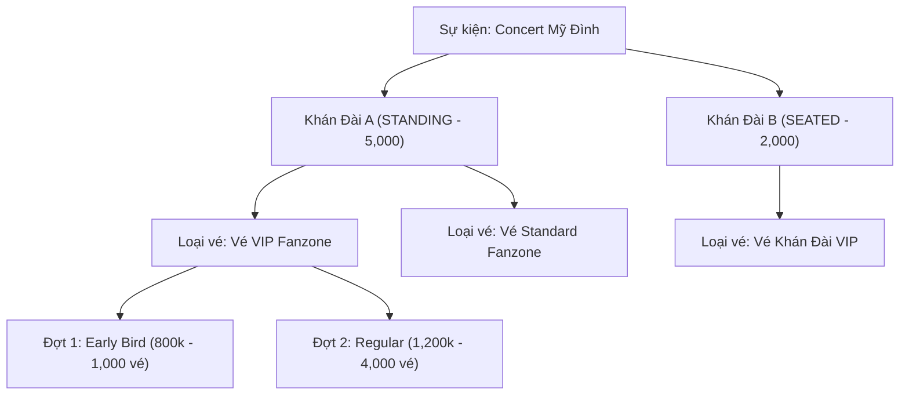

# 🎟️ PHẦN 1: QUẢN LÝ LOẠI VÉ (TICKET TYPES MANAGEMENT)
## Smart Event Ticketing Platform — Module Ticketing · Sub-module TicketType

**Ngày hoàn thành:** 18/08/2026  
**Trạng thái:** Hoàn thành 100% · Test Pass 100% · Biên dịch thành công (`BUILD SUCCESSFUL`)  
**Tác giả / Hệ thống:** Backend Engineering Team  

---

## 🧭 1. Tổng Quan Bài Toán & Vai Trò Nghiệp Vụ

Trong hệ thống bán vé sự kiện, **Loại vé (TicketType)** là đại diện cho các hạng vé khác nhau mà Ban tổ chức (Organizer) thiết lập cho từng khu vực/khán đài của sự kiện. Ví dụ:
* 🌟 **Vé VIP Fanzone** — Áp dụng cho Khán đài A (Đứng), vị trí sát sân khấu.
* 💺 **Vé Hạng Vàng (Gold Seated)** — Áp dụng cho Khán đài B (Ngồi hàng 1-5).
* 🎫 **Vé Tiêu Chuẩn (Standard GA)** — Áp dụng cho Khán đài C (Tầng 2).



### 💡 Câu hỏi thiết kế cốt lõi: *"Vì sao `ticket_types` không lưu giá (`price`) và số lượng (`quantity`)?"*
* **Tư duy thực chiến:** Trong một sự kiện, cùng là một hạng vé (ví dụ "VIP Fanzone"), Ban tổ chức có thể mở bán qua **nhiều đợt khác nhau** với các mức giá và số lượng khác nhau (Early Bird giá rẻ hơn Regular, Last Minute giá cao hơn).
* Do đó, `ticket_types` chỉ đóng vai trò là **Định nghĩa danh mục hạng vé**. Còn `price`, `quantity`, thời gian mở bán sẽ được quản lý tại bảng `ticket_sale_phases` (Đợt mở bán).

---

## 🗃️ 2. Lược Đồ Database (`ticket_types`)

Được quản lý bởi Flyway Migration [`V5__ticketing_schema.sql`](../../ticketing/src/main/resources/db/migration/V5__ticketing_schema.sql):

```sql
CREATE TABLE ticket_types (
    id            UUID PRIMARY KEY,
    event_id      UUID NOT NULL REFERENCES events(id) ON DELETE CASCADE,
    event_area_id UUID NOT NULL REFERENCES event_areas(id) ON DELETE RESTRICT,
    name          VARCHAR(100) NOT NULL,
    description   TEXT,
    status        VARCHAR(30) NOT NULL DEFAULT 'ACTIVE',
    created_at    TIMESTAMPTZ NOT NULL DEFAULT NOW(),
    updated_at    TIMESTAMPTZ NOT NULL DEFAULT NOW()
);

CREATE INDEX idx_ticket_types_event_id ON ticket_types(event_id);
CREATE INDEX idx_ticket_types_area_id ON ticket_types(event_area_id);
```

| Cột | Kiểu | Mô tả | Ràng buộc |
|---|---|---|---|
| `id` | UUID | Khóa chính | PRIMARY KEY (UUIDv4) |
| `event_id` | UUID | Sự kiện sở hữu loại vé | NOT NULL, FK `events(id)` ON DELETE CASCADE |
| `event_area_id`| UUID | Khán đài áp dụng loại vé | NOT NULL, FK `event_areas(id)` ON DELETE RESTRICT |
| `name` | VARCHAR(100) | Tên loại vé: "Vé VIP Fanzone" | NOT NULL |
| `description` | TEXT | Quyền lợi đi kèm loại vé | Nullable |
| `status` | VARCHAR(30) | Trạng thái: `ACTIVE` / `INACTIVE` | NOT NULL, DEFAULT `'ACTIVE'` |
| `created_at` | TIMESTAMPTZ | Thời điểm tạo | NOT NULL, DEFAULT NOW() |
| `updated_at` | TIMESTAMPTZ | Thời điểm cập nhật | NOT NULL, DEFAULT NOW() |

> 🔒 **Ràng buộc toàn vẹn `ON DELETE RESTRICT`:** Ngăn chặn việc xóa một Khán đài (`event_areas`) nếu khán đài đó đang có các Loại vé liên kết.

---

## 🏗️ 3. Kiến Trúc Code & Danh Sách File

```
src/main/java/com/smartevent/modules/ticketing/
  ├── entity/
  │     └── TicketType.java                  ← JPA Entity kế thừa BaseEntity
  ├── repository/
  │     └── TicketTypeRepository.java        ← Spring Data JPA Repository
  ├── dto/
  │     ├── request/
  │     │     └── TicketTypeRequest.java     ← Request DTO với Bean Validation
  │     └── response/
  │           └── TicketTypeResponse.java    ← Response DTO làm giàu tên khán đài (Enrichment)
  ├── service/
  │     ├── TicketTypeService.java           ← Interface nghiệp vụ 6 phương thức
  │     └── impl/
  │           └── TicketTypeServiceImpl.java ← Xử lý nghiệp vụ với 5 bước phòng thủ
  ├── controller/
  │     └── TicketTypeController.java        ← REST API Endpoints + RBAC Security
  └── exception/
        └── TicketingException.java          ← Module Exception bắt lỗi tập trung

src/test/java/com/smartevent/modules/ticketing/service/
  └── TicketTypeServiceTest.java             ← 100% Mockito Unit Tests (12 Test cases)
```

---

## 📦 4. Chi Tiết Từng Tầng (Layer-by-Layer)

### 🔹 4.1. Entity — [`TicketType.java`](../../ticketing/src/main/java/com/smartevent/modules/ticketing/entity/TicketType.java)
- Kế thừa `BaseEntity` (tự động có `id`, `createdAt`, `updatedAt`).
- Dùng **ID Reference** (`UUID eventId`, `UUID eventAreaId`) thay vì `@ManyToOne` để tối ưu hiệu năng và tránh N+1 Query.

### 🔹 4.2. Repository — [`TicketTypeRepository.java`](../../ticketing/src/main/java/com/smartevent/modules/ticketing/repository/TicketTypeRepository.java)
- `findByEventId(UUID eventId)`: Lấy toàn bộ loại vé của sự kiện.
- `findByEventAreaId(UUID eventAreaId)`: Lấy loại vé theo từng khán đài.
- `existsByEventIdAndName(UUID eventId, String name)`: Kiểm tra trùng tên loại vé trong cùng 1 sự kiện.
- `existsByEventAreaId(UUID eventAreaId)`: Kiểm tra xem khán đài đã gắn loại vé nào chưa.

### 🔹 4.3. DTOs — Request & Response
- **[`TicketTypeRequest`](../../ticketing/src/main/java/com/smartevent/modules/ticketing/dto/request/TicketTypeRequest.java):** Nhận `@NotNull UUID eventAreaId`, `@NotBlank @Size(max = 100) String name`, `description`, `status`. Chặn đứng lỗ hổng Mass Assignment.
- **[`TicketTypeResponse`](../../ticketing/src/main/java/com/smartevent/modules/ticketing/dto/response/TicketTypeResponse.java):** Sử dụng Static Factory Method `of(TicketType ticketType, String areaName, AreaType areaType)` để làm giàu dữ liệu, trả về cả tên khán đài và loại khán đài (`STANDING`/`SEATED`) cho Client hiển thị.

### 🔹 4.4. Service — [`TicketTypeServiceImpl.java`](../../ticketing/src/main/java/com/smartevent/modules/ticketing/service/impl/TicketTypeServiceImpl.java)
Tuân thủ nghiêm ngặt **5 bước phòng thủ**:
1. **Security & Ownership:** Kiểm tra sự kiện tồn tại và `event.organizerId == currentUserId || isAdmin`.
2. **State Guard:** Chỉ cho phép tạo/sửa/xóa loại vé khi sự kiện đang ở trạng thái `DRAFT` hoặc `PENDING_APPROVAL`. Chặn khi `PUBLISHED` để bảo vệ tính toàn vẹn vé đã bán.
3. **Domain Invariants:** Khán đài phải tồn tại và thuộc đúng sự kiện (`area.eventId == eventId`). Tên loại vé không được trùng lặp trong sự kiện.
4. **Mutation:** Thực hiện lưu/sửa/xóa qua Repository trong `@Transactional`.
5. **Audit & Delivery:** Ghi nhật ký `@Slf4j` (INFO/WARN) và đóng gói Response DTO.

### 🔹 4.5. Controller — [`TicketTypeController.java`](../../ticketing/src/main/java/com/smartevent/modules/ticketing/controller/TicketTypeController.java)
- Áp dụng phân quyền RBAC: `@PreAuthorize("hasAnyRole('ORGANIZER', 'ADMIN')")` cho các thao tác POST, PUT, DELETE.
- Rút trích an toàn danh tính người dùng qua `@CurrentUser UserPrincipal currentUser`.
- Kích hoạt Bean Validation với `@Valid @RequestBody`.

---

## 🌐 5. Danh Sách REST API Endpoints

| HTTP Method | Endpoint | Phân Quyền | Request Body / Params | Mô Tả |
|:---:|---|:---:|---|---|
| `POST` | `/api/v1/events/{eventId}/ticket-types` | `ORGANIZER`, `ADMIN` | `TicketTypeRequest` | Tạo loại vé mới cho sự kiện |
| `GET` | `/api/v1/events/{eventId}/ticket-types` | **Công khai** | Path: `eventId` | Lấy danh sách loại vé theo Sự kiện |
| `GET` | `/api/v1/areas/{areaId}/ticket-types` | **Công khai** | Path: `areaId` | Lấy danh sách loại vé theo Khán đài |
| `GET` | `/api/v1/ticket-types/{id}` | **Công khai** | Path: `id` | Xem chi tiết 1 loại vé |
| `PUT` | `/api/v1/ticket-types/{id}` | `ORGANIZER`, `ADMIN` | Path: `id`, `TicketTypeRequest` | Cập nhật thông tin loại vé |
| `DELETE` | `/api/v1/ticket-types/{id}` | `ORGANIZER`, `ADMIN` | Path: `id` | Xóa loại vé |

### Ví dụ Request & Response:

**POST `/api/v1/events/550e8400-e29b-41d4-a716-446655440000/ticket-types`**
```json
// Request Body
{
    "eventAreaId": "660e8400-e29b-41d4-a716-446655440001",
    "name": "Vé VIP Fanzone A",
    "description": "Vị trí đứng sát sân khấu, tặng kèm lighstick và áo concert",
    "status": "ACTIVE"
}

// Response 200 OK
{
    "success": true,
    "message": "Success",
    "data": {
        "id": "770e8400-e29b-41d4-a716-446655440002",
        "eventId": "550e8400-e29b-41d4-a716-446655440000",
        "eventAreaId": "660e8400-e29b-41d4-a716-446655440001",
        "areaName": "Khán Đài A",
        "areaType": "STANDING",
        "name": "Vé VIP Fanzone A",
        "description": "Vị trí đứng sát sân khấu, tặng kèm lighstick và áo concert",
        "status": "ACTIVE",
        "createdAt": "2026-08-18T15:30:00Z"
    }
}
```

---

## 🧪 6. Kết Quả Kiểm Thử Unit Test (Mockito 100%)

Toàn bộ **12 Test Cases** trong [`TicketTypeServiceTest.java`](../../ticketing/src/test/java/com/smartevent/modules/ticketing/service/TicketTypeServiceTest.java) đều đạt kết quả **PASSED**:
- ✅ `createTicketType_Success`
- ✅ `createTicketType_Success_WhenAdmin`
- ✅ `createTicketType_EventNotFound_ThrowsException`
- ✅ `createTicketType_AccessDenied_WhenNotOwner`
- ✅ `createTicketType_EventNotDraft_ThrowsException`
- ✅ `createTicketType_AreaNotFound_ThrowsException`
- ✅ `createTicketType_AreaNotBelongToEvent_ThrowsException`
- ✅ `createTicketType_DuplicateName_ThrowsException`
- ✅ `getTicketTypesByEventId_Success`
- ✅ `getTicketTypesByAreaId_Success`
- ✅ `getTicketTypeById_Success`
- ✅ `updateTicketType_Success`
- ✅ `deleteTicketType_Success`
