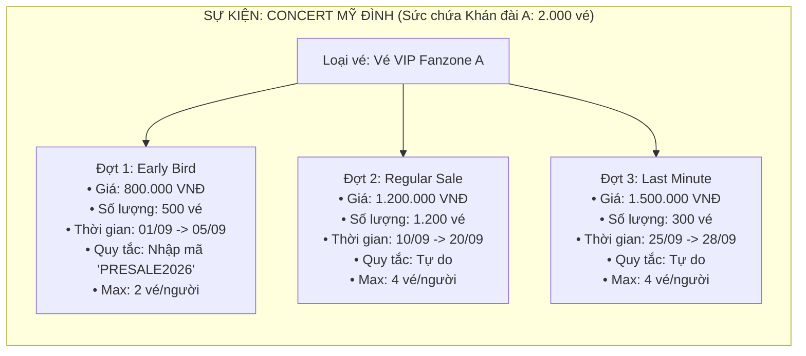

# 🎟️ PHẦN 2: QUẢN LÝ ĐỢT MỞ BÁN & QUY TẮC (SALE PHASES & RULES)
## Smart Event Ticketing Platform — Module Ticketing · Sub-module SalePhase & Rules

**Ngày hoàn thành:** 19/08/2026  
**Trạng thái:** Hoàn thành 100% · Test Pass 100% · Server Khởi Động Thành Công (Port 8080)  
**Tác giả / Hệ thống:** Backend Engineering Team  

---

## 🧭 1. Tổng Quan Bài Toán & Vai Trò Nghiệp Vụ

Trong các sự kiện quy mô lớn (Concert âm nhạc, Đại hội thể thao, Hội nghị quốc tế), Ban tổ chức (Organizer) **không bao giờ bán hết toàn bộ vé trong một lần duy nhất**, mà phân chia thành các **Đợt mở bán (Sale Phases)** theo từng khung thời gian, mức giá, số lượng và quy tắc tiếp cận khác nhau:



### 💡 Các bài toán kỹ thuật cốt lõi:
1. **Capacity Guard (Chống phát hành vé ảo / Quá tải sức chứa):**  
   Tổng số lượng vé được phân bổ ở tất cả các đợt bán thuộc cùng một khán đài **không được vượt quá sức chứa thực tế (`EventArea.capacity`)**.  
   `∑(Quantity các Phase trong Area) <= Area.Capacity`
2. **Time Guard (Bảo vệ thời gian mở bán):**  
   Bắt buộc `saleEndAt > saleStartAt`. Chặn các lỗi logic thời gian từ phía Client.
3. **State Machine (Vòng đời đợt bán):**  
   Chuyển trạng thái đợt bán theo chu trình hợp lệ (`DRAFT` $\rightarrow$ `SCHEDULED` $\rightarrow$ `ACTIVE` $\rightleftharpoons$ `PAUSED` $\rightarrow$ `CLOSED` / `SOLD_OUT`). Chặn hành vi mở lại tùy tiện khi đợt bán đã kết thúc (`CLOSED`).
4. **Anti-Scalping (Chống đầu cơ bước đầu):**  
   Thiết lập giới hạn số vé trên mỗi đơn hàng (`max_per_order`) và trên mỗi tài khoản (`max_per_user`).
5. **Phase Rules (Quy tắc mở rộng):**  
   Hỗ trợ cấu hình `ACCESS_CODE` (Mã presale độc quyền), `MEMBER_ONLY` (Chỉ thành viên VIP), `EARLY_ACCESS` cho từng đợt mở bán.

---

## 🗃️ 2. Lược Đồ Database (`ticket_sale_phases` & `ticket_phase_rules`)

Được định nghĩa trong Flyway Migration [`V5__ticketing_schema.sql`](../../ticketing/src/main/resources/db/migration/V5__ticketing_schema.sql):

```sql
-- 1. Bảng Đợt Mở Bán
CREATE TABLE ticket_sale_phases (
    id            UUID PRIMARY KEY,
    ticket_type_id UUID NOT NULL REFERENCES ticket_types(id) ON DELETE CASCADE,
    name          VARCHAR(100) NOT NULL,
    price         DECIMAL(15,2) NOT NULL,
    quantity      INT NOT NULL,
    sale_start_at TIMESTAMPTZ NOT NULL,
    sale_end_at   TIMESTAMPTZ NOT NULL,
    sold_out_at   TIMESTAMPTZ,
    max_per_order INT NOT NULL DEFAULT 4,
    max_per_user  INT,
    status        VARCHAR(30) NOT NULL DEFAULT 'DRAFT',
    created_at    TIMESTAMPTZ NOT NULL DEFAULT NOW(),
    updated_at    TIMESTAMPTZ NOT NULL DEFAULT NOW(),
    CONSTRAINT chk_phase_price CHECK (price >= 0),
    CONSTRAINT chk_phase_quantity CHECK (quantity > 0),
    CONSTRAINT chk_phase_max_per_order CHECK (max_per_order > 0),
    CONSTRAINT chk_phase_max_per_user CHECK (max_per_user IS NULL OR max_per_user > 0),
    CONSTRAINT chk_phase_sale_time CHECK (sale_end_at > sale_start_at)
);

CREATE INDEX idx_ticket_sale_phases_ticket_type ON ticket_sale_phases(ticket_type_id);
CREATE INDEX idx_ticket_sale_phases_status ON ticket_sale_phases(status);
CREATE INDEX idx_ticket_sale_phases_timing ON ticket_sale_phases(sale_start_at, sale_end_at);

-- 2. Bảng Quy Tắc Đợt Mở Bán
CREATE TABLE ticket_phase_rules (
    id            UUID PRIMARY KEY,
    sale_phase_id UUID NOT NULL REFERENCES ticket_sale_phases(id) ON DELETE CASCADE,
    rule_type     VARCHAR(50) NOT NULL, -- ACCESS_CODE, MEMBER_ONLY, EARLY_ACCESS
    rule_value    TEXT,
    created_at    TIMESTAMPTZ NOT NULL DEFAULT NOW()
);

CREATE INDEX idx_ticket_phase_rules_phase_id ON ticket_phase_rules(sale_phase_id);
```

---

## 🏗️ 3. Kiến Trúc Code & Danh Sách File

```
src/main/java/com/smartevent/modules/ticketing/
  ├── entity/
  │     ├── TicketSalePhase.java             ← JPA Entity kế thừa BaseEntity
  │     └── TicketPhaseRule.java             ← JPA Entity độc lập (id + createdAt)
  ├── repository/
  │     ├── TicketSalePhaseRepository.java   ← Query JPQL tính tổng Capacity loại trừ
  │     └── TicketPhaseRuleRepository.java   ← Tìm kiếm và chống trùng RuleType
  ├── dto/
  │     ├── request/
  │     │     ├── TicketSalePhaseRequest.java
  │     │     ├── UpdateSalePhaseStatusRequest.java
  │     │     └── TicketPhaseRuleRequest.java
  │     └── response/
  │           ├── TicketSalePhaseResponse.java ← Làm giàu dữ liệu (TicketTypeName + Rules)
  │           └── TicketPhaseRuleResponse.java
  ├── service/
  │     ├── TicketSalePhaseService.java      ← Interface nghiệp vụ 9 phương thức
  │     └── impl/
  │           └── TicketSalePhaseServiceImpl.java ← Xử lý Capacity Guard & State Machine
  └── controller/
        └── TicketSalePhaseController.java   ← REST API Controller + RBAC Security

src/test/java/com/smartevent/modules/ticketing/service/
  └── TicketSalePhaseServiceTest.java        ← 100% Mockito Unit Tests (10 Test Cases)
```

---

## 📦 4. Chi Tiết Từng Tầng (Layer-by-Layer)

### 🔹 4.1. Entity Design
- **[`TicketSalePhase.java`](../../ticketing/src/main/java/com/smartevent/modules/ticketing/entity/TicketSalePhase.java):** Kế thừa `BaseEntity` (có `id`, `createdAt`, `updatedAt`). Quản lý giá tiền (`BigDecimal`), số lượng (`Integer`), khung giờ mở bán (`Instant`), giới hạn mua (`maxPerOrder`, `maxPerUser`) và trạng thái (`SalePhaseStatus`).
- **[`TicketPhaseRule.java`](../../ticketing/src/main/java/com/smartevent/modules/ticketing/entity/TicketPhaseRule.java):** Không kế thừa `BaseEntity` vì lược đồ DB chỉ có `created_at` (bất biến, chỉ thêm hoặc xóa). Sử dụng `@PrePersist` để sinh UUID và timestamp.

### 🔹 4.2. Repository Layer
- **`sumQuantityByEventAreaIdExcluding(UUID eventAreaId, UUID excludePhaseId)`:**  
  Sử dụng JPQL JOIN giữa `TicketSalePhase` và `TicketType` để tính toán chính xác tổng số vé đã phân bổ trên một Khán đài (có hỗ trợ loại trừ phase hiện tại khi thực hiện cập nhật):
  ```java
  @Query("""
      SELECT COALESCE(SUM(sp.quantity), 0) FROM TicketSalePhase sp
      JOIN TicketType tt ON sp.ticketTypeId = tt.id
      WHERE tt.eventAreaId = :eventAreaId
        AND (:excludePhaseId IS NULL OR sp.id != :excludePhaseId)
  """)
  int sumQuantityByEventAreaIdExcluding(@Param("eventAreaId") UUID eventAreaId, @Param("excludePhaseId") UUID excludePhaseId);
  ```

### 🔹 4.3. Service Layer & Ba Tấm Khiên Bảo Vệ
1. **Ownership & State Guard:** Chỉ cho phép Organizer sở hữu sự kiện (hoặc ADMIN) chỉnh sửa, và chỉ khi sự kiện ở trạng thái `DRAFT` hoặc `PENDING_APPROVAL`.
2. **Time Guard:** Kiểm tra `request.saleEndAt().isAfter(request.saleStartAt())`.
3. **Capacity Guard:** Kiểm tra `sumQuantityByEventAreaIdExcluding(...) + request.quantity() <= area.getCapacity()`.
4. **Tích hợp Tồn kho (`InventoryService`):**
   - Tự động gọi `inventoryService.initCounter(...)` ngay sau khi tạo thành công Đợt mở bán.
   - Gọi `inventoryService.updateTotalQuantity(...)` khi Organizer thay đổi số lượng vé của phase.
5. **State Machine Transitions:**
   ```
   DRAFT -> SCHEDULED | ACTIVE
   SCHEDULED -> ACTIVE | CLOSED
   ACTIVE -> PAUSED | CLOSED | SOLD_OUT
   PAUSED -> ACTIVE | CLOSED
   CLOSED / SOLD_OUT -> Không cho phép chuyển ngược
   ```

### 🔹 4.4. Controller & Phân Quyền (RBAC)
- Sử dụng `@PreAuthorize("hasAnyRole('ORGANIZER', 'ADMIN')")` cho các thao tác CUD (Create, Update, Patch, Delete).
- Mở quyền công khai `GET /api/v1/sale-phases/**` trong [`SecurityConfig.java`](../../ticketing/src/main/java/com/smartevent/config/SecurityConfig.java).

---

## 🌐 5. Danh Sách REST API Endpoints

| HTTP Method | Endpoint | Phân Quyền | Request Body / Params | Mô Tả |
|:---:|---|:---:|---|---|
| `POST` | `/api/v1/ticket-types/{ticketTypeId}/sale-phases` | `ORGANIZER`, `ADMIN` | `TicketSalePhaseRequest` | Tạo đợt mở bán mới cho loại vé |
| `GET` | `/api/v1/ticket-types/{ticketTypeId}/sale-phases` | **Công khai** | Path: `ticketTypeId` | Lấy danh sách đợt bán theo Loại vé |
| `GET` | `/api/v1/events/{eventId}/sale-phases` | **Công khai** | Path: `eventId` | Lấy toàn bộ đợt bán của Sự kiện |
| `GET` | `/api/v1/sale-phases/{id}` | **Công khai** | Path: `id` | Xem chi tiết 1 đợt mở bán |
| `PUT` | `/api/v1/sale-phases/{id}` | `ORGANIZER`, `ADMIN` | Path: `id`, `TicketSalePhaseRequest` | Cập nhật thông tin đợt mở bán |
| `PATCH` | `/api/v1/sale-phases/{id}/status` | `ORGANIZER`, `ADMIN` | Path: `id`, `UpdateSalePhaseStatusRequest` | Đổi trạng thái đợt bán (State Machine) |
| `DELETE` | `/api/v1/sale-phases/{id}` | `ORGANIZER`, `ADMIN` | Path: `id` | Xóa đợt mở bán |
| `POST` | `/api/v1/sale-phases/{salePhaseId}/rules` | `ORGANIZER`, `ADMIN` | Path: `salePhaseId`, `TicketPhaseRuleRequest` | Thêm quy tắc (Presale code, Member only) |
| `DELETE` | `/api/v1/sale-phases/rules/{ruleId}` | `ORGANIZER`, `ADMIN` | Path: `ruleId` | Xóa quy tắc |

### Ví dụ Request & Response:

**POST `/api/v1/ticket-types/770e8400-e29b-41d4-a716-446655440002/sale-phases`**
```json
// Request Body
{
    "name": "Đợt 1: Early Bird Presale",
    "price": 800000.00,
    "quantity": 500,
    "saleStartAt": "2026-09-01T10:00:00Z",
    "saleEndAt": "2026-09-05T18:00:00Z",
    "maxPerOrder": 4,
    "maxPerUser": 2,
    "status": "DRAFT"
}

// Response 200 OK
{
    "success": true,
    "message": "Success",
    "data": {
        "id": "880e8400-e29b-41d4-a716-446655440003",
        "ticketTypeId": "770e8400-e29b-41d4-a716-446655440002",
        "ticketTypeName": "Vé VIP Fanzone A",
        "name": "Đợt 1: Early Bird Presale",
        "price": 800000.00,
        "quantity": 500,
        "saleStartAt": "2026-09-01T10:00:00Z",
        "saleEndAt": "2026-09-05T18:00:00Z",
        "soldOutAt": null,
        "maxPerOrder": 4,
        "maxPerUser": 2,
        "status": "DRAFT",
        "rules": [],
        "createdAt": "2026-08-19T07:30:00Z"
    }
}
```

---

## 🧪 6. Kết Quả Kiểm Thử Unit Test (Mockito 100%)

Toàn bộ **10 Test Cases** trong [`TicketSalePhaseServiceTest.java`](../../ticketing/src/test/java/com/smartevent/modules/ticketing/service/TicketSalePhaseServiceTest.java) đều đạt kết quả **PASSED**:
- ✅ `createSalePhase_Success`
- ✅ `createSalePhase_InvalidTime_ThrowsException`
- ✅ `createSalePhase_CapacityExceeded_ThrowsException`
- ✅ `createSalePhase_AccessDenied_WhenNotOwner`
- ✅ `updateStatus_ValidTransition_Success`
- ✅ `updateStatus_InvalidTransition_ThrowsException`
- ✅ `deleteSalePhase_Active_ThrowsException`
- ✅ `addRule_Success`
- ✅ `addRule_DuplicateRuleType_ThrowsException`
