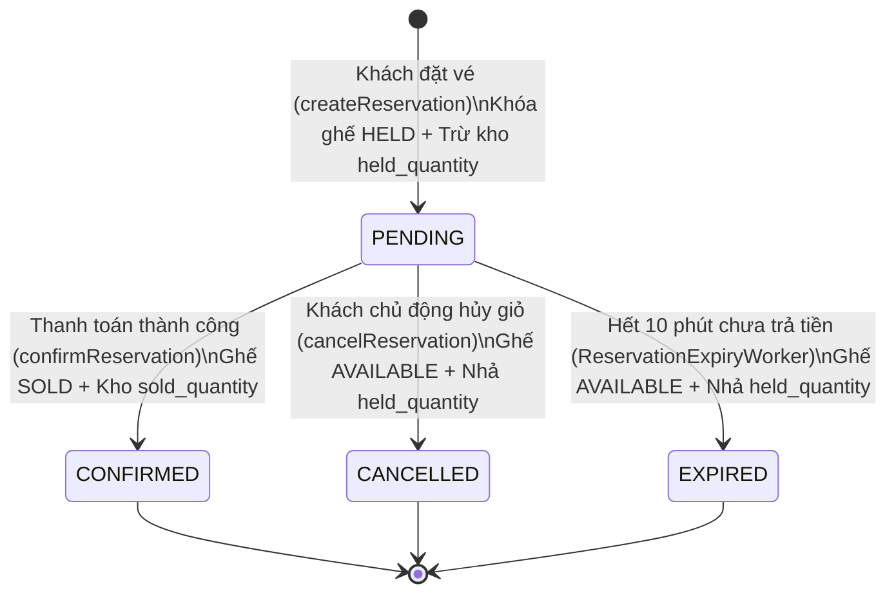

# 🎟️ MODULE 5: RESERVATION & REAL-TIME BOOKING PIPELINE
## (ĐẶT GIỮ CHỖ THỜI GIAN THỰC & ĐẾM NGƯỢC 10 PHÚT)

**Ngày hoàn thành:** 20/08/2026  
**Trạng thái:** Hoàn thành 100% · 13/13 Unit Tests Pass (100%) · Sẵn sàng tích hợp Ordering  
**Tác giả / Hệ thống:** Backend Engineering Team  

---

## 🧭 1. Tổng Quan Bài Toán Nghiệp Vụ

Trong hệ thống bán vé sự kiện, giai đoạn **Đặt giữ chỗ (Reservation)** là cây cầu nối quan trọng giữa **Tồn kho vé (Ticketing)** và **Thanh toán (Ordering / Payment)**:
* Khách hàng chọn vé và bấm **"Tiến hành đặt vé"**.
* Hệ thống **chưa thể tạo Đơn hàng hay trừ tiền ngay**, mà phải tạo một **Phiên giữ chỗ (Reservation)** có hiệu lực trong **10 phút (`expiresAt = NOW() + 10 phút`)**.
* Trong 10 phút này:
  * Khách hàng được **đảm bảo 100% số vé và số ghế cụ thể** không bị bất kỳ ai khác cướp mất.
  * Khách hàng có đủ thời gian nhập thông tin người tham dự và thanh toán qua cổng VNPay/Ngân hàng.

```
                          KHÁCH HÀNG BẤM "ĐẶT VÉ" (VD: 2 VÉ VIP)
                                             │
                       ┌─────────────────────┴─────────────────────┐
                       ▼                                           ▼
            【 VÉ ĐỨNG (STANDING) 】                      【 VÉ NGỒI (SEATED) 】
            • Sân cỏ Fanzone A                            • Khán đài VIP Hàng A Ghế 12, 13
            • `eventSeatId = null`                        • `eventSeatId = UUID ghế`, `quantity = 1`
            • Trừ kho tổng (InventoryCounter)             • Khóa ghế: `AVAILABLE -> HELD`
            • Trừ hạn mức (UserCounter)                   • Trừ kho tổng + Trừ hạn mức user
                       │                                           │
                       └─────────────────────┬─────────────────────┘
                                             ▼
                         TẠO RESERVATION (STATUS = 'PENDING')
                               BẮT ĐẦU ĐẾM NGƯỢC 10:00
```

---

## 🗃️ 2. Lược Đồ Database (`V6__reservation_schema.sql`)

```sql
-- 1. Bảng Phiên Giữ Chỗ
CREATE TABLE reservations (
    id              UUID PRIMARY KEY,
    user_id         UUID NOT NULL REFERENCES users(id) ON DELETE RESTRICT,
    event_id        UUID NOT NULL REFERENCES events(id) ON DELETE RESTRICT,
    status          VARCHAR(30) NOT NULL DEFAULT 'PENDING',
    expires_at      TIMESTAMPTZ NOT NULL,
    idempotency_key VARCHAR(100),
    created_at      TIMESTAMPTZ NOT NULL DEFAULT NOW(),
    updated_at      TIMESTAMPTZ NOT NULL DEFAULT NOW(),
    CONSTRAINT chk_reservation_expiry CHECK (expires_at > created_at)
);

-- CHỐNG GĂM VÉ ẢO: Mỗi user chỉ có tối đa 1 Reservation PENDING trên 1 event tại cùng 1 thời điểm!
CREATE UNIQUE INDEX idx_reservations_active_per_user_event 
    ON reservations(user_id, event_id) 
    WHERE status = 'PENDING';

-- 2. Bảng Chi Tiết Từng Mục Vé Trong Phiên
CREATE TABLE reservation_items (
    id             UUID PRIMARY KEY,
    reservation_id UUID NOT NULL REFERENCES reservations(id) ON DELETE CASCADE,
    ticket_type_id UUID NOT NULL REFERENCES ticket_types(id) ON DELETE RESTRICT,
    sale_phase_id  UUID NOT NULL REFERENCES ticket_sale_phases(id) ON DELETE RESTRICT,
    event_seat_id  UUID REFERENCES event_seats(id) ON DELETE RESTRICT,
    quantity       INT NOT NULL,
    unit_price     DECIMAL(15,2) NOT NULL,
    created_at     TIMESTAMPTZ NOT NULL DEFAULT NOW(),
    CONSTRAINT chk_res_item_quantity CHECK (quantity > 0),
    CONSTRAINT chk_res_item_price CHECK (unit_price >= 0)
);
```

---

## 🔄 3. Vòng Đời 4 Trạng Thái Của Reservation (State Machine)



---

## 🏗️ 4. Chi Tiết Triển Khai Từng Tầng (Layer-by-Layer)

```
src/main/java/com/smartevent/modules/reservation/
  ├── entity/
  │     ├── Reservation.java                  ← Kế thừa BaseEntity, chứa status, expiresAt, idempotencyKey
  │     └── ReservationItem.java              ← Không kế thừa BaseEntity, có @PrePersist và getTotalPrice()
  ├── repository/
  │     ├── ReservationRepository.java        ← findByStatusAndExpiresAtBefore (quét hết hạn)
  │     └── ReservationItemRepository.java    ← findByReservationId, findByEventSeatId
  ├── dto/
  │     ├── request/
  │     │     ├── ReservationItemRequest.java ← ticketTypeId, salePhaseId, eventSeatId, quantity
  │     │     └── CreateReservationRequest.java ← eventId, items, idempotencyKey
  │     └── response/
  │           ├── ReservationItemResponse.java ← Chi tiết từng vé kèm seatCode, unitPrice, totalPrice
  │           └── ReservationResponse.java    ← Thông tin phiên giữ chỗ kèm expiresAt và totalAmount
  ├── service/
  │     ├── ReservationService.java           ← Interface nghiệp vụ 6 phương thức
  │     ├── ReservationExpiryWorker.java      ← Background Sweeper chạy mỗi 30s giải phóng vé hết hạn
  │     └── impl/
  │           └── ReservationServiceImpl.java ← Bộ điều phối logic 5 bước an toàn
  ├── controller/
  │     └── ReservationController.java        ← 4 REST API Endpoints phân quyền isAuthenticated()
  └── exception/
        └── ReservationException.java         ← Custom exception kế thừa BusinessException
```

---

## 🧠 5. Mổ Xẻ 5 Bước Thuật Toán Của `createReservation`

Khi người dùng gửi request đặt vé, `ReservationServiceImpl` thực thi tuần tự 5 bước nghiêm ngặt:

1. **Bước 1: Kiểm Tra Idempotency (Chống Bấm Đúp):**
   * Nếu có `idempotencyKey`, kiểm tra xem key này đã được xử lý chưa. Nếu có $\rightarrow$ Trả về kết quả cũ, không tạo đơn mới, không trừ trùng vé.
2. **Bước 2: Active Reservation Guard (Chống Găm Vé Ảo):**
   * Kiểm tra `existsByUserIdAndEventIdAndStatus(userId, eventId, PENDING)`. Nếu người dùng đang có 1 giỏ hàng chưa thanh toán $\rightarrow$ Ném lỗi `RESERVATION_ALREADY_EXISTS`.
3. **Bước 3: Event & Sale Phase Guards:**
   * Sự kiện phải ở trạng thái `PUBLISHED`.
   * Đợt mở bán phải đang `ACTIVE`, thời gian hiện tại nằm trong khoảng `[saleStartAt, saleEndAt]`.
   * Số lượng vé không vượt quá `maxPerOrder`.
4. **Bước 4: Phân Nhánh Vé Đứng vs Vé Ngồi:**
   * **Vé Đứng (`STANDING`):** Bắt buộc `eventSeatId == null`.
   * **Vé Ngồi (`SEATED`):** Bắt buộc `eventSeatId != null`, `quantity == 1`. Ghế phải ở trạng thái `AVAILABLE`. Tiến hành khóa ghế: `seat.setStatus(SeatStatus.HELD)`.
5. **Bước 5: Trừ Kho Tổng & Trừ Quota Cá Nhân (Atomic Execution):**
   * Gọi `inventoryService.holdInventory(phaseId, quantity)`.
   * Gọi `userSalePhaseCounterService.holdUserTickets(userId, phaseId, quantity, maxPerUser)`.
   * Lấy giá gốc chính thống từ Database `phase.getPrice()`, tính tổng tiền và lưu vào Database với thời hạn 10 phút.

---

## 🌐 6. Danh Mục REST API Endpoints

| HTTP Method | Endpoint | Phân Quyền | Request Body / Params | Mô Tả |
|:---:|---|:---:|---|---|
| `POST` | `/api/v1/reservations` | `isAuthenticated()` | `CreateReservationRequest` | Tạo phiên giữ vé 10 phút (Khóa ghế & Trừ kho) |
| `GET` | `/api/v1/reservations/{id}` | `isAuthenticated()` | Path: `id` | Xem chi tiết phiên giữ chỗ (Chính chủ hoặc ADMIN) |
| `GET` | `/api/v1/reservations/active` | `isAuthenticated()` | Param: `eventId` | Lấy phiên PENDING đang đếm ngược của user trên sự kiện |
| `POST` | `/api/v1/reservations/{id}/cancel` | `isAuthenticated()` | Path: `id` | Khách hàng chủ động hủy phiên giữ chỗ (Nhả vé & ghế) |

### 📝 Ví Dụ Payload Thực Tế:

#### 1. Request Tạo Phiên Giữ Vé: `POST /api/v1/reservations`
```json
{
    "eventId": "550e8400-e29b-41d4-a716-446655440000",
    "idempotencyKey": "order-req-8899aabb",
    "items": [
        {
            "ticketTypeId": "770e8400-e29b-41d4-a716-446655440002",
            "salePhaseId": "880e8400-e29b-41d4-a716-446655440003",
            "eventSeatId": "990e8400-e29b-41d4-a716-446655440004",
            "quantity": 1
        }
    ]
}
```

#### 2. Response Thành Công: `201 Created`
```json
{
    "success": true,
    "message": "Tạo phiên giữ chỗ thành công",
    "data": {
        "id": "aa0e8400-e29b-41d4-a716-446655440005",
        "userId": "110e8400-e29b-41d4-a716-446655440000",
        "eventId": "550e8400-e29b-41d4-a716-446655440000",
        "eventName": "Concert Âm Nhạc Mỹ Tâm 2026",
        "status": "PENDING",
        "expiresAt": "2026-08-20T10:10:00Z",
        "totalAmount": 500000.00,
        "items": [
            {
                "id": "bb0e8400-e29b-41d4-a716-446655440006",
                "ticketTypeId": "770e8400-e29b-41d4-a716-446655440002",
                "ticketTypeName": "Vé VIP",
                "salePhaseId": "880e8400-e29b-41d4-a716-446655440003",
                "salePhaseName": "Early Bird",
                "eventSeatId": "990e8400-e29b-41d4-a716-446655440004",
                "seatCode": "A-12",
                "quantity": 1,
                "unitPrice": 500000.00,
                "totalPrice": 500000.00
            }
        ],
        "createdAt": "2026-08-20T10:00:00Z"
    }
}
```

---

## 🧪 7. Kết Quả Kiểm Thử Unit Test (Mockito 100%)

Toàn bộ **13 Test Cases** trong [`ReservationServiceTest.java`](../../ticketing/src/test/java/com/smartevent/modules/reservation/service/ReservationServiceTest.java) đều đạt kết quả **PASSED**:
- ✅ `createReservation_Standing_Success`
- ✅ `createReservation_Seated_Success`
- ✅ `createReservation_IdempotencyKey_ReturnsExisting`
- ✅ `createReservation_AlreadyHasPending_ThrowsException`
- ✅ `createReservation_EventNotPublished_ThrowsException`
- ✅ `createReservation_SalePhaseNotActive_ThrowsException`
- ✅ `createReservation_MaxPerOrderExceeded_ThrowsException`
- ✅ `createReservation_Seated_SeatAlreadyHeld_ThrowsException`
- ✅ `getReservationById_Success`
- ✅ `getReservationById_AccessDenied_ThrowsException`
- ✅ `cancelReservation_Success`
- ✅ `confirmReservation_Success`
- ✅ `expireReservation_Success`
