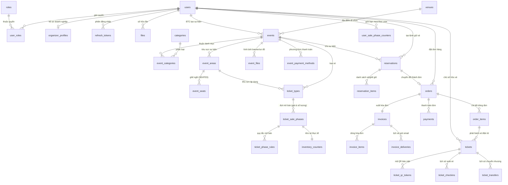

# 📚 TỪ ĐIỂN DỮ LIỆU CƠ SỞ DỮ LIỆU (DATABASE SCHEMA DICTIONARY)
## Hệ Thống Smart Event Ticketing Platform — Phase 1 (Core Ticketing)

- **Hệ quản trị CSDL:** PostgreSQL 16
- **Công cụ quản lý migration:** Flyway
- **Quy mô Phase 1:** 32 Bảng · 10 Phân hệ (Modules)
- **Chuẩn hóa:** 3NF + Denormalization tối ưu hiệu năng tra cứu
- **Đảm bảo toàn vẹn:** ACID, Chống bán vé trùng (Pessimistic/Atomic Locks), Chống trùng lịch địa điểm (`btree_gist`), Transactional Outbox Pattern

---

## 🗺️ Sơ Đồ Quan Hệ Tổng Thể (ER Diagram)



---

## 📖 Chi Tiết Từng Bảng & Từng Cột (Data Dictionary)

---

### 1. Phân Hệ Người Dùng & Xác Thực (Identity & RBAC)

#### 1.1. Bảng `users` (Tài khoản người dùng)
*Lưu trữ thông tin định danh của khách hàng, ban tổ chức và quản trị viên.*

| Tên Cột | Kiểu Dữ Liệu | Khóa | Nullable | Mặc Định / Ràng Buộc | Ý Nghĩa / Chú Thích Nghiệp Vụ |
|---|---|---|---|---|---|
| `id` | `UUID` | **PK** | NOT NULL | `gen_random_uuid()` | Định danh duy nhất của người dùng |
| `email` | `VARCHAR(255)` | **UK** | NOT NULL | UNIQUE | Email đăng nhập, không được trùng lặp |
| `password_hash` | `VARCHAR(255)` | | NOT NULL | | Mật khẩu đã được mã hóa (BCrypt) |
| `full_name` | `VARCHAR(255)` | | NOT NULL | | Họ và tên đầy đủ của người dùng |
| `phone` | `VARCHAR(30)` | | NULL | | Số điện thoại liên hệ |
| `status` | `VARCHAR(30)` | | NOT NULL | `'ACTIVE'` | Trạng thái tài khoản: `ACTIVE`, `DISABLED`, `DELETED` |
| `avatar_file_id` | `UUID` | **FK** | NULL | `REFERENCES files(id)` | Ảnh đại diện của người dùng (trỏ tới bảng `files`) |
| `deleted_at` | `TIMESTAMPTZ` | | NULL | | Thời điểm xóa mềm (soft delete), ẩn thông tin |
| `created_at` | `TIMESTAMPTZ` | | NOT NULL | `NOW()` | Thời điểm đăng ký tài khoản |
| `updated_at` | `TIMESTAMPTZ` | | NOT NULL | `NOW()` | Thời điểm cập nhật thông tin gần nhất |

---

#### 1.2. Bảng `roles` (Vai trò hệ thống)
*Danh mục vai trò phân quyền cấp hệ thống (System-level RBAC).*

| Tên Cột | Kiểu Dữ Liệu | Khóa | Nullable | Mặc Định / Ràng Buộc | Ý Nghĩa / Chú Thích Nghiệp Vụ |
|---|---|---|---|---|---|
| `id` | `UUID` | **PK** | NOT NULL | `gen_random_uuid()` | Định danh duy nhất của vai trò |
| `name` | `VARCHAR(50)` | **UK** | NOT NULL | UNIQUE | Tên vai trò: `CUSTOMER`, `ORGANIZER`, `ADMIN` |
| `created_at` | `TIMESTAMPTZ` | | NOT NULL | `NOW()` | Thời điểm tạo vai trò |
| `updated_at` | `TIMESTAMPTZ` | | NOT NULL | `NOW()` | Thời điểm cập nhật vai trò |

---

#### 1.3. Bảng `user_roles` (Gán vai trò cho người dùng - N:N)
*Bảng trung gian liên kết đa-đa giữa người dùng và vai trò.*

| Tên Cột | Kiểu Dữ Liệu | Khóa | Nullable | Mặc Định / Ràng Buộc | Ý Nghĩa / Chú Thích Nghiệp Vụ |
|---|---|---|---|---|---|
| `id` | `UUID` | **PK** | NOT NULL | | Định danh bản ghi gán quyền |
| `user_id` | `UUID` | **FK** | NOT NULL | `REFERENCES users(id)` | Khóa ngoại trỏ đến tài khoản người dùng |
| `role_id` | `UUID` | **FK** | NOT NULL | `REFERENCES roles(id)` | Khóa ngoại trỏ đến vai trò được gán |
| `created_at` | `TIMESTAMPTZ` | | NOT NULL | `NOW()` | Thời điểm gán vai trò |
| `updated_at` | `TIMESTAMPTZ` | | NOT NULL | `NOW()` | Thời điểm cập nhật |

> **Ràng buộc:** `UNIQUE(user_id, role_id)` — Đảm bảo 1 user không bị gán trùng 1 vai trò nhiều lần.

---

#### 1.4. Bảng `organizer_profiles` (Hồ sơ Ban tổ chức)
*Thông tin bổ sung dành riêng cho tài khoản có vai trò Ban Tổ Chức (ORGANIZER).*

| Tên Cột | Kiểu Dữ Liệu | Khóa | Nullable | Mặc Định / Ràng Buộc | Ý Nghĩa / Chú Thích Nghiệp Vụ |
|---|---|---|---|---|---|
| `id` | `UUID` | **PK** | NOT NULL | | Định danh hồ sơ ban tổ chức |
| `user_id` | `UUID` | **FK/UK** | NOT NULL | `REFERENCES users(id)` | Khóa ngoại trỏ đến người dùng, mỗi user tối đa 1 hồ sơ |
| `company_name` | `VARCHAR(255)` | | NOT NULL | | Tên doanh nghiệp / tổ chức đại diện |
| `tax_code` | `VARCHAR(50)` | | NULL | | Mã số thuế doanh nghiệp |
| `business_address` | `TEXT` | | NULL | | Địa chỉ trụ sở kinh doanh |
| `bank_account_status` | `VARCHAR(50)` | | NOT NULL | `'PENDING'` | Trạng thái xét duyệt tài khoản nhận tiền: `PENDING`, `VERIFIED`, `REJECTED` |
| `created_at` | `TIMESTAMPTZ` | | NOT NULL | `NOW()` | Thời điểm tạo hồ sơ |
| `updated_at` | `TIMESTAMPTZ` | | NOT NULL | `NOW()` | Thời điểm cập nhật hồ sơ |

---

#### 1.5. Bảng `refresh_tokens` (Phiên đăng nhập dài hạn)
*Quản lý refresh token xác thực JWT, hỗ trợ thu hồi quyền khi logout hoặc đổi mật khẩu.*

| Tên Cột | Kiểu Dữ Liệu | Khóa | Nullable | Mặc Định / Ràng Buộc | Ý Nghĩa / Chú Thích Nghiệp Vụ |
|---|---|---|---|---|---|
| `id` | `UUID` | **PK** | NOT NULL | | Định danh phiên làm việc |
| `user_id` | `UUID` | **FK** | NOT NULL | `REFERENCES users(id)` | Người dùng sở hữu token này |
| `token_hash` | `VARCHAR(255)` | **UK** | NOT NULL | UNIQUE | Chuỗi băm bảo mật của refresh token |
| `expires_at` | `TIMESTAMPTZ` | | NOT NULL | | Thời điểm token hết hạn |
| `revoked_at` | `TIMESTAMPTZ` | | NULL | | Thời điểm bị hủy bỏ (nếu user chủ động Logout) |
| `created_at` | `TIMESTAMPTZ` | | NOT NULL | `NOW()` | Thời điểm cấp phát token |

---

### 2. Phân Hệ Lưu Trữ Tệp (Storage)

#### 2.1. Bảng `files` (Metadata tệp tin lưu tại MinIO)
*Lưu thông tin quản lý hình ảnh, PDF, hóa đơn... được lưu trữ trên Object Storage (MinIO).*

| Tên Cột | Kiểu Dữ Liệu | Khóa | Nullable | Mặc Định / Ràng Buộc | Ý Nghĩa / Chú Thích Nghiệp Vụ |
|---|---|---|---|---|---|
| `id` | `UUID` | **PK** | NOT NULL | | Định danh duy nhất của tệp |
| `owner_id` | `UUID` | **FK** | NULL | `REFERENCES users(id)` | Người tải tệp lên (NULL nếu hệ thống tự tạo) |
| `bucket_name` | `VARCHAR(100)` | | NOT NULL | | Tên bucket trong MinIO (`event-assets`, `ticket-docs`...) |
| `object_name` | `VARCHAR(500)` | | NOT NULL | | Đường dẫn file chính xác trong MinIO storage |
| `original_name` | `VARCHAR(255)` | | NOT NULL | | Tên gốc của tệp khi tải lên |
| `content_type` | `VARCHAR(100)` | | NOT NULL | | Định dạng MIME (`image/png`, `application/pdf`...) |
| `file_size` | `BIGINT` | | NOT NULL | | Dung lượng tệp tính theo bytes |
| `checksum` | `VARCHAR(64)` | | NULL | | Mã băm SHA-256 xác thực tính toàn vẹn |
| `visibility` | `VARCHAR(30)` | | NOT NULL | `'PRIVATE'` | Mức độ công khai: `PUBLIC`, `PRIVATE` |
| `scan_status` | `VARCHAR(30)` | | NOT NULL | `'PENDING'` | Quét virus/an toàn: `PENDING`, `CLEAN`, `INFECTED` |
| `created_at` | `TIMESTAMPTZ` | | NOT NULL | `NOW()` | Thời điểm tải lên |

---

### 3. Phân Hệ Địa Điểm & Sự Kiện (Event & Venue)

#### 3.1. Bảng `venues` (Địa điểm tổ chức sự kiện)
*Địa điểm vật lý do Quản trị viên (Admin) tạo và quản lý.*

| Tên Cột | Kiểu Dữ Liệu | Khóa | Nullable | Mặc Định / Ràng Buộc | Ý Nghĩa / Chú Thích Nghiệp Vụ |
|---|---|---|---|---|---|
| `id` | `UUID` | **PK** | NOT NULL | | Định danh duy nhất của địa điểm |
| `name` | `VARCHAR(255)` | | NOT NULL | | Tên địa điểm (VD: Sân vận động Mỹ Đình, Trung tâm Hội nghị Quốc gia) |
| `address` | `VARCHAR(500)` | | NOT NULL | | Địa chỉ chi tiết |
| `city` | `VARCHAR(100)` | | NOT NULL | | Tỉnh / Thành phố (Hà Nội, TP.HCM, Đà Nẵng...) |
| `latitude` | `DECIMAL(9,6)` | | NULL | | Tọa độ vĩ độ (phục vụ hiển thị bản đồ) |
| `longitude` | `DECIMAL(9,6)` | | NULL | | Tọa độ kinh độ |
| `capacity` | `INT` | | NULL | `CHECK (capacity > 0)` | Sức chứa tối đa của địa điểm |
| `status` | `VARCHAR(30)` | | NOT NULL | `'ACTIVE'` | Trạng thái hoạt động: `ACTIVE`, `INACTIVE` |
| `created_at` | `TIMESTAMPTZ` | | NOT NULL | `NOW()` | Thời điểm tạo địa điểm |
| `updated_at` | `TIMESTAMPTZ` | | NOT NULL | `NOW()` | Thời điểm cập nhật thông tin |

---

#### 3.2. Bảng `categories` (Danh mục sự kiện)
*Phân loại sự kiện (Âm nhạc, Thể thao, Hội thảo, Nghệ thuật...).*

| Tên Cột | Kiểu Dữ Liệu | Khóa | Nullable | Mặc Định / Ràng Buộc | Ý Nghĩa / Chú Thích Nghiệp Vụ |
|---|---|---|---|---|---|
| `id` | `UUID` | **PK** | NOT NULL | | Định danh danh mục |
| `name` | `VARCHAR(100)` | | NOT NULL | | Tên danh mục (VD: Âm nhạc, Workshop...) |
| `slug` | `VARCHAR(100)` | **UK** | NOT NULL | UNIQUE | Đường dẫn thân thiện SEO (VD: `am-nhac`) |
| `description` | `TEXT` | | NULL | | Mô tả chi tiết danh mục |
| `status` | `VARCHAR(30)` | | NOT NULL | `'ACTIVE'` | Trạng thái: `ACTIVE`, `INACTIVE` |
| `created_at` | `TIMESTAMPTZ` | | NOT NULL | `NOW()` | Thời điểm tạo |
| `updated_at` | `TIMESTAMPTZ` | | NOT NULL | `NOW()` | Thời điểm cập nhật |

---

#### 3.3. Bảng `events` (Sự kiện)
*Bảng trung tâm lưu trữ thông tin sự kiện do Ban tổ chức đăng ký.*

| Tên Cột | Kiểu Dữ Liệu | Khóa | Nullable | Mặc Định / Ràng Buộc | Ý Nghĩa / Chú Thích Nghiệp Vụ |
|---|---|---|---|---|---|
| `id` | `UUID` | **PK** | NOT NULL | | Định danh duy nhất của sự kiện |
| `organizer_id` | `UUID` | **FK** | NOT NULL | `REFERENCES users(id)` | Ban tổ chức sở hữu sự kiện này |
| `venue_id` | `UUID` | **FK** | NULL | `REFERENCES venues(id)` | Địa điểm tổ chức (chọn từ danh mục `venues`) |
| `name` | `VARCHAR(255)` | | NOT NULL | | Tên sự kiện |
| `slug` | `VARCHAR(255)` | **UK** | NOT NULL | UNIQUE | Đường dẫn tĩnh thân thiện SEO (VD: `concert-ha-anh-tuan-2026`) |
| `description` | `TEXT` | | NULL | | Mô tả chi tiết nội dung sự kiện |
| `start_time` | `TIMESTAMPTZ` | | NOT NULL | | Thời gian bắt đầu sự kiện |
| `end_time` | `TIMESTAMPTZ` | | NOT NULL | `CHECK (end_time > start_time)` | Thời gian kết thúc sự kiện |
| `status` | `VARCHAR(30)` | | NOT NULL | `'DRAFT'` | Trạng thái: `DRAFT`, `PENDING_APPROVAL`, `PUBLISHED`, `CANCELLED`, `COMPLETED` |
| `resale_enabled` | `BOOLEAN` | | NOT NULL | `false` | Cho phép bán lại vé (Resale) hay không |
| `max_resale_price_multiplier`| `NUMERIC(5,2)` | | NULL | `CHECK (> 0)` | Tỉ lệ trần giá bán lại (VD: `1.20` = tối đa 120% giá gốc) |
| `resale_deadline_hours_before`| `INT` | | NULL | `CHECK (>= 0)` | Hạn chót được bán lại (số giờ trước giờ bắt đầu) |
| `virtual_queue_enabled` | `BOOLEAN` | | NOT NULL | `false` | Bật phòng chờ ảo (Waiting Room) khi mở bán vé hot |
| `queue_batch_size` | `INT` | | NULL | `50` | Số lượng người được duyệt vào mua mỗi đợt |
| `city` | `VARCHAR(100)` | | NULL | | Tỉnh/thành (denormalized từ `venues` để tìm kiếm siêu tốc) |
| `search_vector` | `TSVECTOR` | | NULL | GIN Index | Dữ liệu chỉ mục tìm kiếm toàn văn Full-Text Search |
| `published_at` | `TIMESTAMPTZ` | | NULL | | Thời điểm công khai mở bán sự kiện |
| `created_at` | `TIMESTAMPTZ` | | NOT NULL | `NOW()` | Thời điểm tạo sự kiện |
| `updated_at` | `TIMESTAMPTZ` | | NOT NULL | `NOW()` | Thời điểm cập nhật sự kiện |

> **Ràng buộc đặc biệt:** `EXCLUDE USING gist (venue_id WITH =, tstzrange(start_time, end_time) WITH &&)` — Đảm bảo 2 sự kiện đã công khai không thể trùng giờ tại cùng 1 địa điểm.

---

#### 3.4. Bảng `event_categories` (Phân loại danh mục sự kiện - N:N)
*Liên kết một sự kiện có thể thuộc nhiều danh mục khác nhau.*

| Tên Cột | Kiểu Dữ Liệu | Khóa | Nullable | Mặc Định / Ràng Buộc | Ý Nghĩa / Chú Thích Nghiệp Vụ |
|---|---|---|---|---|---|
| `event_id` | `UUID` | **PK/FK** | NOT NULL | `REFERENCES events(id)` | Mã sự kiện |
| `category_id` | `UUID` | **PK/FK** | NOT NULL | `REFERENCES categories(id)`| Mã danh mục |

---

#### 3.5. Bảng `event_areas` (Khu vực trong sự kiện)
*Khu vực khán đài / phân vùng sự kiện (Khu đứng hoặc Khu ghế ngồi).*

| Tên Cột | Kiểu Dữ Liệu | Khóa | Nullable | Mặc Định / Ràng Buộc | Ý Nghĩa / Chú Thích Nghiệp Vụ |
|---|---|---|---|---|---|
| `id` | `UUID` | **PK** | NOT NULL | | Định danh khu vực |
| `event_id` | `UUID` | **FK** | NOT NULL | `REFERENCES events(id)` | Sự kiện sở hữu khu vực này |
| `name` | `VARCHAR(100)` | | NOT NULL | | Tên khu vực (VD: Khán đài A, Khu VIP Fanzone, Tầng 2) |
| `area_type` | `VARCHAR(30)` | | NOT NULL | `'STANDING'` | Loại khu vực: `STANDING` (Vé đứng) hoặc `SEATED` (Ghế ngồi) |
| `capacity` | `INT` | | NOT NULL | `CHECK (capacity > 0)` | Sức chứa tối đa của khu vực |
| `sort_order` | `INT` | | NOT NULL | `0` | Thứ tự hiển thị trên giao diện sơ đồ |
| `description` | `TEXT` | | NULL | | Ghi chú thêm cho khu vực |
| `created_at` | `TIMESTAMPTZ` | | NOT NULL | `NOW()` | Thời điểm tạo |
| `updated_at` | `TIMESTAMPTZ` | | NOT NULL | `NOW()` | Thời điểm cập nhật |

---

#### 3.6. Bảng `event_seats` (Ghế ngồi cụ thể)
*Lưu từng ghế cụ thể trong khu vực có loại `SEATED`.*

| Tên Cột | Kiểu Dữ Liệu | Khóa | Nullable | Mặc Định / Ràng Buộc | Ý Nghĩa / Chú Thích Nghiệp Vụ |
|---|---|---|---|---|---|
| `id` | `UUID` | **PK** | NOT NULL | | Định danh duy nhất của ghế |
| `event_area_id`| `UUID` | **FK** | NOT NULL | `REFERENCES event_areas(id)` | Thuộc khu vực ghế ngồi nào |
| `row_name` | `VARCHAR(50)` | | NOT NULL | | Tên hàng (VD: Hàng A, Hàng B, Hàng 01) |
| `seat_number` | `VARCHAR(50)` | | NOT NULL | | Số ghế (VD: Ghế 1, Ghế 12) |
| `label` | `VARCHAR(100)` | | NULL | | Nhãn hiển thị đầy đủ (VD: `A-12`) |
| `status` | `VARCHAR(30)` | | NOT NULL | `'AVAILABLE'` | Trạng thái ghế: `AVAILABLE` (Trống), `HELD` (Đang giữ 10p), `SOLD` (Đã bán), `BLOCKED` (Khóa kỹ thuật) |
| `hold_expires_at`| `TIMESTAMPTZ`| | NULL | | Hạn giữ chỗ (sau thời gian này ghế tự mở lại `AVAILABLE`) |
| `created_at` | `TIMESTAMPTZ` | | NOT NULL | `NOW()` | Thời điểm tạo ghế |
| `updated_at` | `TIMESTAMPTZ` | | NOT NULL | `NOW()` | Thời điểm cập nhật ghế |

> **Ràng buộc:** `UNIQUE(event_area_id, row_name, seat_number)` — Trong 1 khu vực không thể có 2 ghế cùng hàng cùng số.

---

#### 3.7. Bảng `event_files` (Tệp tin đính kèm sự kiện)
*Quản lý danh sách hình ảnh banner, poster, sơ đồ khán đài của sự kiện.*

| Tên Cột | Kiểu Dữ Liệu | Khóa | Nullable | Mặc Định / Ràng Buộc | Ý Nghĩa / Chú Thích Nghiệp Vụ |
|---|---|---|---|---|---|
| `id` | `UUID` | **PK** | NOT NULL | | Định danh bản ghi đính kèm |
| `event_id` | `UUID` | **FK** | NOT NULL | `REFERENCES events(id)` | Sự kiện liên quan |
| `file_id` | `UUID` | **FK** | NOT NULL | `REFERENCES files(id)` | Khóa ngoại trỏ đến bảng `files` |
| `file_type` | `VARCHAR(30)` | | NOT NULL | | Loại tệp: `BANNER`, `GALLERY`, `SEAT_MAP`, `DOCUMENT` |
| `sort_order` | `INT` | | NOT NULL | `0` | Thứ tự hiển thị hình ảnh trên trang chi tiết |
| `created_at` | `TIMESTAMPTZ` | | NOT NULL | `NOW()` | Thời điểm gắn file vào sự kiện |

---

#### 3.8. Bảng `event_payment_methods` (Cấu hình thanh toán theo sự kiện)
*Cho phép BTC chọn phương thức thanh toán áp dụng cho sự kiện.*

| Tên Cột | Kiểu Dữ Liệu | Khóa | Nullable | Mặc Định / Ràng Buộc | Ý Nghĩa / Chú Thích Nghiệp Vụ |
|---|---|---|---|---|---|
| `event_id` | `UUID` | **PK/FK** | NOT NULL | `REFERENCES events(id)` | Sự kiện áp dụng |
| `method` | `VARCHAR(30)` | **PK** | NOT NULL | | Phương thức: `VNPAY`, `MOMO`, `BANK_TRANSFER` |
| `enabled` | `BOOLEAN` | | NOT NULL | `true` | Trạng thái kích hoạt phương thức này |
| `config_json` | `JSONB` | | NULL | | Cấu hình Merchant ID / tham số riêng (nếu có) |

---

### 4. Phân Hệ Đợt Mở Bán & Tồn Kho (Ticketing & Inventory)

#### 4.1. Bảng `ticket_types` (Loại vé)
*Danh mục loại vé trong từng khu vực (VD: VIP, Early Access, Standard...).*

| Tên Cột | Kiểu Dữ Liệu | Khóa | Nullable | Mặc Định / Ràng Buộc | Ý Nghĩa / Chú Thích Nghiệp Vụ |
|---|---|---|---|---|---|
| `id` | `UUID` | **PK** | NOT NULL | | Định danh loại vé |
| `event_id` | `UUID` | **FK** | NOT NULL | `REFERENCES events(id)` | Thuộc sự kiện nào |
| `event_area_id`| `UUID` | **FK** | NOT NULL | `REFERENCES event_areas(id)` | Áp dụng tại khu vực nào |
| `name` | `VARCHAR(100)` | | NOT NULL | | Tên loại vé (VD: Vé VIP Fanzone, Vé Khán Đài Thường) |
| `description` | `TEXT` | | NULL | | Quyền lợi của loại vé |
| `status` | `VARCHAR(30)` | | NOT NULL | `'ACTIVE'` | Trạng thái: `ACTIVE`, `INACTIVE` |
| `created_at` | `TIMESTAMPTZ` | | NOT NULL | `NOW()` | Thời điểm tạo |
| `updated_at` | `TIMESTAMPTZ` | | NOT NULL | `NOW()` | Thời điểm cập nhật |

---

#### 4.2. Bảng `ticket_sale_phases` (Đợt mở bán vé)
*Nơi duy nhất cấu hình **Giá vé** và **Số lượng vé** theo từng đợt (Early Bird, Phase 1, Last Minute).*

| Tên Cột | Kiểu Dữ Liệu | Khóa | Nullable | Mặc Định / Ràng Buộc | Ý Nghĩa / Chú Thích Nghiệp Vụ |
|---|---|---|---|---|---|
| `id` | `UUID` | **PK** | NOT NULL | | Định danh đợt mở bán |
| `ticket_type_id`| `UUID` | **FK** | NOT NULL | `REFERENCES ticket_types(id)`| Loại vé được bán trong đợt này |
| `name` | `VARCHAR(100)` | | NOT NULL | | Tên đợt (VD: Đợt mở bán sớm Early Bird, Đợt vé thường) |
| `price` | `DECIMAL(15,2)`| | NOT NULL | `CHECK (price >= 0)` | **Giá vé của đợt này (VNĐ)** |
| `quantity` | `INT` | | NOT NULL | `CHECK (quantity > 0)` | **Tổng số lượng vé phát hành của đợt này** |
| `sale_start_at`| `TIMESTAMPTZ`| | NOT NULL | | Thời điểm bắt đầu mở bán |
| `sale_end_at` | `TIMESTAMPTZ` | | NOT NULL | `CHECK (sale_end_at > sale_start_at)` | Thời điểm đóng đợt bán |
| `sold_out_at` | `TIMESTAMPTZ` | | NULL | | Thời điểm hết sạch vé |
| `max_per_order`| `INT` | | NOT NULL | `4` (CHECK > 0) | Số lượng vé tối đa được mua trên 1 đơn hàng |
| `max_per_user` | `INT` | | NULL | `CHECK (> 0)` | Số lượng vé tối đa 1 người dùng được mua trong đợt |
| `status` | `VARCHAR(30)` | | NOT NULL | `'DRAFT'` | Trạng thái: `DRAFT`, `SCHEDULED`, `ACTIVE`, `PAUSED`, `CLOSED`, `SOLD_OUT` |
| `created_at` | `TIMESTAMPTZ` | | NOT NULL | `NOW()` | Thời điểm tạo đợt bán |
| `updated_at` | `TIMESTAMPTZ` | | NOT NULL | `NOW()` | Thời điểm cập nhật |

---

#### 4.3. Bảng `ticket_phase_rules` (Quy tắc nâng cao đợt bán)
*Cấu hình mở rộng như: mã code truy cập sớm, chỉ dành cho thành viên VIP...*

| Tên Cột | Kiểu Dữ Liệu | Khóa | Nullable | Mặc Định / Ràng Buộc | Ý Nghĩa / Chú Thích Nghiệp Vụ |
|---|---|---|---|---|---|
| `id` | `UUID` | **PK** | NOT NULL | | Định danh quy tắc |
| `sale_phase_id`| `UUID` | **FK** | NOT NULL | `REFERENCES ticket_sale_phases(id)` | Đợt mở bán áp dụng |
| `rule_type` | `VARCHAR(50)` | | NOT NULL | | Loại quy tắc (`ACCESS_CODE`, `MEMBER_ONLY`, `EARLY_ACCESS`) |
| `rule_value` | `TEXT` | | NULL | | Giá trị quy tắc (mã code hoặc giá trị so sánh) |
| `created_at` | `TIMESTAMPTZ` | | NOT NULL | `NOW()` | Thời điểm tạo |

---

#### 4.4. Bảng `inventory_counters` (Nguồn sự thật quản lý tồn kho vé)
*Trọng tâm chống Oversell cho vé đứng STANDING và tổng hợp số lượng vé.*

| Tên Cột | Kiểu Dữ Liệu | Khóa | Nullable | Mặc Định / Ràng Buộc | Ý Nghĩa / Chú Thích Nghiệp Vụ |
|---|---|---|---|---|---|
| `id` | `UUID` | **PK** | NOT NULL | | Định danh bản ghi tồn kho |
| `event_id` | `UUID` | **FK** | NOT NULL | `REFERENCES events(id)` | Mã sự kiện |
| `event_area_id`| `UUID` | **FK** | NOT NULL | `REFERENCES event_areas(id)` | Mã khu vực |
| `ticket_type_id`| `UUID` | **FK** | NOT NULL | `REFERENCES ticket_types(id)`| Mã loại vé |
| `sale_phase_id`| `UUID` | **FK/UK**| NOT NULL | `REFERENCES ticket_sale_phases(id)` | Mỗi đợt bán có chính xác 1 bản ghi tồn kho |
| `total_quantity`| `INT` | | NOT NULL | | Tổng số vé mở bán trong đợt |
| `held_quantity`| `INT` | | NOT NULL | `0` (CHECK >= 0) | **Số lượng vé đang bị giữ chỗ (chờ thanh toán)** |
| `sold_quantity`| `INT` | | NOT NULL | `0` (CHECK >= 0) | **Số lượng vé đã thanh toán thành công** |
| `updated_at` | `TIMESTAMPTZ` | | NOT NULL | `NOW()` | Thời điểm cập nhật số liệu |

> **Ràng buộc toàn vẹn:** `CHECK (held_quantity + sold_quantity <= total_quantity)`  
> **Cơ chế cập nhật:** Dùng phép tính **Atomic Conditional UPDATE** trong Database, không bao giờ dùng đọc-rồi-ghi.

---

#### 4.5. Bảng `user_sale_phase_counters` (Theo dõi giới hạn mua theo người dùng)
*Đảm bảo 1 tài khoản không thể mua vượt `max_per_user` của đợt mở bán.*

| Tên Cột | Kiểu Dữ Liệu | Khóa | Nullable | Mặc Định / Ràng Buộc | Ý Nghĩa / Chú Thích Nghiệp Vụ |
|---|---|---|---|---|---|
| `id` | `UUID` | **PK** | NOT NULL | | Định danh bản ghi đếm |
| `user_id` | `UUID` | **FK** | NOT NULL | `REFERENCES users(id)` | Người mua vé |
| `sale_phase_id`| `UUID` | **FK** | NOT NULL | `REFERENCES ticket_sale_phases(id)` | Đợt mở bán vé |
| `held_quantity`| `INT` | | NOT NULL | `0` (CHECK >= 0) | Số vé người này đang giữ chỗ |
| `purchased_quantity`| `INT` | | NOT NULL | `0` (CHECK >= 0) | Số vé người này đã mua thành công |
| `refunded_quantity` | `INT` | | NOT NULL | `0` (CHECK >= 0) | Số vé người này đã được hoàn trả |
| `updated_at` | `TIMESTAMPTZ` | | NOT NULL | `NOW()` | Thời điểm cập nhật |

> **Ràng buộc:** `UNIQUE(user_id, sale_phase_id)` — Mỗi user có 1 bản ghi theo dõi trên 1 đợt bán.

---

### 5. Phân Hệ Giữ Chỗ & Đơn Hàng (Reservation & Ordering)

#### 5.1. Bảng `reservations` (Lệnh giữ chỗ vé)
*Khóa giữ ghế hoặc số lượng vé tạm thời trong 10 phút để người dùng thanh toán.*

| Tên Cột | Kiểu Dữ Liệu | Khóa | Nullable | Mặc Định / Ràng Buộc | Ý Nghĩa / Chú Thích Nghiệp Vụ |
|---|---|---|---|---|---|
| `id` | `UUID` | **PK** | NOT NULL | | Định danh phiên giữ vé |
| `user_id` | `UUID` | **FK** | NOT NULL | `REFERENCES users(id)` | Khách hàng thực hiện giữ chỗ |
| `event_id` | `UUID` | **FK** | NOT NULL | `REFERENCES events(id)` | Sự kiện đang mua vé |
| `status` | `VARCHAR(30)` | | NOT NULL | `'PENDING'` | Trạng thái: `PENDING` (Đang giữ), `CONFIRMED` (Đã thanh toán), `EXPIRED` (Hết hạn 10p), `CANCELLED` (Hủy) |
| `expires_at` | `TIMESTAMPTZ` | | NOT NULL | `CHECK (expires_at > created_at)` | **Thời điểm hết hạn giữ vé (NOW + 10 phút)** |
| `idempotency_key`| `VARCHAR(100)` | | NULL | | Khóa chống trùng lặp yêu cầu tạo giữ chỗ |
| `created_at` | `TIMESTAMPTZ` | | NOT NULL | `NOW()` | Thời điểm bắt đầu giữ chỗ |
| `updated_at` | `TIMESTAMPTZ` | | NOT NULL | `NOW()` | Thời điểm cập nhật |

> **Chỉ mục độc quyền:** `UNIQUE INDEX ON reservations(user_id, event_id) WHERE status = 'PENDING'` — Mỗi khách hàng chỉ được có **tối đa 1 phiên giữ chỗ đang PENDING** cho 1 sự kiện.

---

#### 5.2. Bảng `reservation_items` (Chi tiết các vé/ghế được giữ chỗ)

| Tên Cột | Kiểu Dữ Liệu | Khóa | Nullable | Mặc Định / Ràng Buộc | Ý Nghĩa / Chú Thích Nghiệp Vụ |
|---|---|---|---|---|---|
| `id` | `UUID` | **PK** | NOT NULL | | Định danh mục giữ chỗ |
| `reservation_id`| `UUID` | **FK** | NOT NULL | `REFERENCES reservations(id)`| Thuộc phiên giữ chỗ nào |
| `ticket_type_id`| `UUID` | **FK** | NOT NULL | `REFERENCES ticket_types(id)`| Loại vé giữ |
| `sale_phase_id`| `UUID` | **FK** | NOT NULL | `REFERENCES ticket_sale_phases(id)` | Đợt mở bán của vé |
| `event_seat_id`| `UUID` | **FK** | NULL | `REFERENCES event_seats(id)` | Ghế cụ thể (Bắt buộc nếu là khu ghế ngồi `SEATED`, NULL nếu là vé đứng `STANDING`) |
| `quantity` | `INT` | | NOT NULL | `CHECK (quantity > 0)` | Số lượng giữ (SEATED: = 1, STANDING: >= 1) |
| `unit_price` | `DECIMAL(15,2)`| | NOT NULL | `CHECK (unit_price >= 0)` | Đơn giá vé tại thời điểm giữ chỗ |
| `created_at` | `TIMESTAMPTZ` | | NOT NULL | `NOW()` | Thời điểm tạo |

---

#### 5.3. Bảng `orders` (Đơn hàng mua vé)
*Lưu đơn hàng sau khi khách hàng xác nhận giỏ vé.*

| Tên Cột | Kiểu Dữ Liệu | Khóa | Nullable | Mặc Định / Ràng Buộc | Ý Nghĩa / Chú Thích Nghiệp Vụ |
|---|---|---|---|---|---|
| `id` | `UUID` | **PK** | NOT NULL | | Định danh đơn hàng |
| `user_id` | `UUID` | **FK** | NOT NULL | `REFERENCES users(id)` | Khách hàng đặt mua |
| `reservation_id`| `UUID` | **FK** | NULL | `REFERENCES reservations(id)`| Phiên giữ chỗ tương ứng |
| `order_code` | `VARCHAR(50)` | **UK** | NOT NULL | UNIQUE | Mã đơn hàng hiển thị (VD: `ORD-20260815-ABCD`) |
| `subtotal` | `DECIMAL(15,2)`| | NOT NULL | `CHECK (subtotal >= 0)` | Tổng tiền vé gốc trước giảm giá |
| `discount_amount`| `DECIMAL(15,2)`| | NOT NULL | `0` (CHECK >= 0) | Số tiền được giảm giá |
| `fee_amount` | `DECIMAL(15,2)`| | NOT NULL | `0` (CHECK >= 0) | Phí tiện ích / thanh toán (nếu có) |
| `total_amount` | `DECIMAL(15,2)`| | NOT NULL | `CHECK (total_amount >= 0)` | **Tổng tiền thanh toán cuối cùng** |
| `currency` | `VARCHAR(10)` | | NOT NULL | `'VND'` | Đơn vị tiền tệ (VNĐ) |
| `payment_deadline`| `TIMESTAMPTZ`| | NULL | | Hạn chót thanh toán (khớp với hạn giữ chỗ) |
| `customer_note`| `TEXT` | | NULL | | Ghi chú của khách hàng |
| `coupon_id` | `UUID` | | NULL | | Mã giảm giá áp dụng (liên kết Phase 2) |
| `selected_payment_method`| `VARCHAR(30)` | | NULL | | Cổng thanh toán được chọn (`VNPAY`) |
| `status` | `VARCHAR(30)` | | NOT NULL | `'PENDING_PAYMENT'` | Trạng thái: `PENDING_PAYMENT`, `PAID`, `CANCELLED`, `EXPIRED`, `PARTIALLY_REFUNDED`, `REFUNDED` |
| `created_at` | `TIMESTAMPTZ` | | NOT NULL | `NOW()` | Thời điểm tạo đơn |
| `updated_at` | `TIMESTAMPTZ` | | NOT NULL | `NOW()` | Thời điểm cập nhật |

---

#### 5.4. Bảng `order_items` (Chi tiết dòng vé trong đơn hàng)

| Tên Cột | Kiểu Dữ Liệu | Khóa | Nullable | Mặc Định / Ràng Buộc | Ý Nghĩa / Chú Thích Nghiệp Vụ |
|---|---|---|---|---|---|
| `id` | `UUID` | **PK** | NOT NULL | | Định danh dòng đơn hàng |
| `order_id` | `UUID` | **FK** | NOT NULL | `REFERENCES orders(id)` | Thuộc đơn hàng nào |
| `ticket_type_id`| `UUID` | **FK** | NOT NULL | `REFERENCES ticket_types(id)`| Loại vé mua |
| `sale_phase_id`| `UUID` | **FK** | NOT NULL | `REFERENCES ticket_sale_phases(id)` | Đợt mở bán của vé |
| `event_seat_id`| `UUID` | **FK** | NULL | `REFERENCES event_seats(id)` | Ghế cụ thể (nếu là khu ghế ngồi) |
| `quantity` | `INT` | | NOT NULL | `CHECK (quantity > 0)` | Số lượng mua |
| `unit_price` | `DECIMAL(15,2)`| | NOT NULL | `CHECK (unit_price >= 0)` | Đơn giá tại thời điểm mua |
| `total_price` | `DECIMAL(15,2)`| | NOT NULL | `CHECK (total_price >= 0)`| Thành tiền của dòng vé này |
| `created_at` | `TIMESTAMPTZ` | | NOT NULL | `NOW()` | Thời điểm tạo |

---

### 6. Phân Hệ Thanh Toán (Payment & Webhook)

#### 6.1. Bảng `payments` (Lịch sử giao dịch thanh toán)
*Ghi nhận từng lần thực hiện thanh toán (Payment attempt).*

| Tên Cột | Kiểu Dữ Liệu | Khóa | Nullable | Mặc Định / Ràng Buộc | Ý Nghĩa / Chú Thích Nghiệp Vụ |
|---|---|---|---|---|---|
| `id` | `UUID` | **PK** | NOT NULL | | Định danh giao dịch |
| `order_id` | `UUID` | **FK** | NOT NULL | `REFERENCES orders(id)` | Đơn hàng được thanh toán |
| `payment_method`| `VARCHAR(30)` | | NOT NULL | | Phương thức thanh toán (`VNPAY_QR`, `ATM_CARD`...) |
| `provider` | `VARCHAR(30)` | | NOT NULL | `'VNPAY'` | Cổng thanh toán tích hợp |
| `transaction_id`| `VARCHAR(100)` | | NULL | | Mã giao dịch từ phía cổng thanh toán (VNPAY Transaction No) |
| `amount` | `DECIMAL(15,2)`| | NOT NULL | `CHECK (amount > 0)` | Số tiền thanh toán |
| `currency` | `VARCHAR(10)` | | NOT NULL | `'VND'` | Loại tiền tệ |
| `status` | `VARCHAR(30)` | | NOT NULL | `'INITIATED'` | Trạng thái: `INITIATED`, `PENDING`, `SUCCESS`, `FAILED`, `CANCELLED`, `REFUNDED` |
| `paid_at` | `TIMESTAMPTZ` | | NULL | | Thời điểm thanh toán thành công thực tế |
| `created_at` | `TIMESTAMPTZ` | | NOT NULL | `NOW()` | Thời điểm khởi tạo giao dịch |
| `updated_at` | `TIMESTAMPTZ` | | NOT NULL | `NOW()` | Thời điểm cập nhật |

---

#### 6.2. Bảng `payment_webhook_events` (Sự kiện Callback Webhook từ Cổng thanh toán)
*Đảm bảo tính Idempotency (Chống xử lý lặp IPN callback).*

| Tên Cột | Kiểu Dữ Liệu | Khóa | Nullable | Mặc Định / Ràng Buộc | Ý Nghĩa / Chú Thích Nghiệp Vụ |
|---|---|---|---|---|---|
| `id` | `UUID` | **PK** | NOT NULL | | Định danh bản ghi webhook |
| `provider` | `VARCHAR(30)` | | NOT NULL | | Nhà cung cấp gửi webhook (`VNPAY`) |
| `provider_event_id`| `VARCHAR(100)`| **UK** | NOT NULL | UNIQUE cùng provider | Mã sự kiện định danh từ đối tác |
| `transaction_id`| `VARCHAR(100)` | | NULL | | Mã giao dịch đính kèm |
| `payload_hash` | `VARCHAR(64)` | | NULL | | Mã băm kiểm tra nội dung gói tin callback |
| `payload_json` | `JSONB` | | NULL | | Toàn bộ dữ liệu callback nguyên bản |
| `received_at` | `TIMESTAMPTZ` | | NOT NULL | `NOW()` | Thời điểm nhận callback |
| `processed_at` | `TIMESTAMPTZ` | | NULL | | Thời điểm xử lý xong |
| `status` | `VARCHAR(30)` | | NOT NULL | `'RECEIVED'` | Trạng thái xử lý: `RECEIVED`, `PROCESSED`, `IGNORED`, `FAILED` |

> **Ràng buộc:** `UNIQUE(provider, provider_event_id)` — Đảm bảo 1 sự kiện callback từ đối tác chỉ được xử lý đúng 1 lần duy nhất.

---

### 7. Phân Hệ Phát Hành Vé & Soát Vé (Ticket & Check-in)

#### 7.1. Bảng `tickets` (Vé điện tử chính thức)
*Mỗi vé tương ứng 1 người tham gia sau khi đơn hàng đã thanh toán thành công.*

| Tên Cột | Kiểu Dữ Liệu | Khóa | Nullable | Mặc Định / Ràng Buộc | Ý Nghĩa / Chú Thích Nghiệp Vụ |
|---|---|---|---|---|---|
| `id` | `UUID` | **PK** | NOT NULL | | Định danh duy nhất của vé |
| `order_item_id`| `UUID` | **FK** | NOT NULL | `REFERENCES order_items(id)`| Nguồn gốc từ dòng đơn hàng nào |
| `current_owner_user_id`| `UUID` | **FK** | NOT NULL | `REFERENCES users(id)` | **Chủ sở hữu hiện tại của vé** (thay đổi khi bán lại/chuyển nhượng) |
| `original_buyer_user_id`| `UUID` | **FK** | NOT NULL | `REFERENCES users(id)` | Người đầu tiên mua vé này |
| `event_id` | `UUID` | **FK** | NOT NULL | `REFERENCES events(id)` | Sự kiện |
| `event_seat_id`| `UUID` | **FK** | NULL | `REFERENCES event_seats(id)` | Ghế cụ thể (nếu là vé ngồi) |
| `event_area_id`| `UUID` | **FK** | NULL | `REFERENCES event_areas(id)` | Khu vực khán đài |
| `ticket_type_id`| `UUID` | **FK** | NULL | `REFERENCES ticket_types(id)`| Loại vé |
| `sale_phase_id`| `UUID` | **FK** | NULL | `REFERENCES ticket_sale_phases(id)` | Đợt mở bán gốc |
| `ticket_code` | `VARCHAR(100)` | **UK** | NOT NULL | UNIQUE | Mã vé bảo mật duy nhất (VD: `TICK-2026-X89J21`) |
| `status` | `VARCHAR(30)` | | NOT NULL | `'ISSUED'` | Trạng thái: `ISSUED` (Đã phát hành), `USED` (Đã check-in), `CANCELLED` (Hủy), `REFUNDED` (Hoàn tiền), `RESALE_LISTED` (Đang rao bán lại), `TRANSFERRED` (Đã chuyển nhượng) |
| `issued_at` | `TIMESTAMPTZ` | | NOT NULL | `NOW()` | Thời điểm phát hành |
| `used_at` | `TIMESTAMPTZ` | | NULL | | Thời điểm quét vé vào cổng |
| `created_at` | `TIMESTAMPTZ` | | NOT NULL | `NOW()` | Thời điểm tạo bản ghi |
| `updated_at` | `TIMESTAMPTZ` | | NOT NULL | `NOW()` | Thời điểm cập nhật |

---

#### 7.2. Bảng `ticket_qr_tokens` (Mã QR bảo mật động)
*Xác thực quét vé vào cổng. Khi chuyển nhượng/bán lại, token cũ bị REVOKED và sinh token mới.*

| Tên Cột | Kiểu Dữ Liệu | Khóa | Nullable | Mặc Định / Ràng Buộc | Ý Nghĩa / Chú Thích Nghiệp Vụ |
|---|---|---|---|---|---|
| `id` | `UUID` | **PK** | NOT NULL | | Định danh token QR |
| `ticket_id` | `UUID` | **FK** | NOT NULL | `REFERENCES tickets(id)` | Vé tương ứng |
| `token_hash` | `VARCHAR(255)` | | NOT NULL | | Chuỗi băm mã QR mã hóa |
| `status` | `VARCHAR(30)` | | NOT NULL | `'ACTIVE'` | Trạng thái mã QR: `ACTIVE` (Hợp lệ), `REVOKED` (Đã bị hủy) |
| `issued_at` | `TIMESTAMPTZ` | | NOT NULL | `NOW()` | Thời điểm phát hành mã QR |
| `revoked_at` | `TIMESTAMPTZ` | | NULL | | Thời điểm hủy (khi đổi chủ sở hữu) |

---

#### 7.3. Bảng `ticket_checkins` (Lịch sử soát vé tại cổng)
*Ghi nhận toàn bộ thao tác scan vé tại cổng, bao gồm cả các lần quét lỗi hoặc quét trùng.*

| Tên Cột | Kiểu Dữ Liệu | Khóa | Nullable | Mặc Định / Ràng Buộc | Ý Nghĩa / Chú Thích Nghiệp Vụ |
|---|---|---|---|---|---|
| `id` | `UUID` | **PK** | NOT NULL | | Định danh bản ghi quét vé |
| `ticket_id` | `UUID` | **FK** | NOT NULL | `REFERENCES tickets(id)` | Vé được quét |
| `event_id` | `UUID` | **FK** | NOT NULL | `REFERENCES events(id)` | Sự kiện diễn ra |
| `checked_by_user_id`| `UUID` | **FK** | NULL | `REFERENCES users(id)` | Nhân viên soát vé thực hiện scan |
| `gate_name` | `VARCHAR(100)` | | NULL | | Cổng ra vào (VD: Cổng A1, Cổng VIP) |
| `result` | `VARCHAR(30)` | | NOT NULL | | Kết quả scan: `SUCCESS` (Thành công), `INVALID` (Vé không hợp lệ/hết hạn), `DUPLICATE` (Vé đã bị scan trước đó) |
| `checked_at` | `TIMESTAMPTZ` | | NOT NULL | `NOW()` | Thời điểm quét vé |

---

#### 7.4. Bảng `ticket_transfers` (Lịch sử chuyển nhượng / đổi chủ vé)

| Tên Cột | Kiểu Dữ Liệu | Khóa | Nullable | Mặc Định / Ràng Buộc | Ý Nghĩa / Chú Thích Nghiệp Vụ |
|---|---|---|---|---|---|
| `id` | `UUID` | **PK** | NOT NULL | | Định danh bản ghi chuyển nhượng |
| `ticket_id` | `UUID` | **FK** | NOT NULL | `REFERENCES tickets(id)` | Vé bị chuyển đổi |
| `from_user_id` | `UUID` | **FK** | NOT NULL | `REFERENCES users(id)` | Người sở hữu cũ |
| `to_user_id` | `UUID` | **FK** | NOT NULL | `REFERENCES users(id)` | Người sở hữu mới |
| `source_type` | `VARCHAR(30)` | | NOT NULL | | Nguồn gốc: `RESALE` (Bán lại), `ADMIN` (Admin điều phối), `REFUND_REISSUE` (Phát hành lại sau khi hoàn tiền) |
| `source_id` | `UUID` | | NULL | | Mã tham chiếu nghiệp vụ |
| `status` | `VARCHAR(30)` | | NOT NULL | `'COMPLETED'` | Trạng thái chuyển giao: `COMPLETED`, `FAILED` |
| `transferred_at`| `TIMESTAMPTZ`| | NOT NULL | `NOW()` | Thời điểm hoàn tất chuyển giao |

---

### 8. Phân Hệ Hóa Đơn & Xuất Phiếu (Billing & Invoice)

#### 8.1. Bảng `invoices` (Hóa đơn điện tử)
*Mỗi đơn hàng thanh toán thành công sinh chính xác 1 hóa đơn (Exactly-once).*

| Tên Cột | Kiểu Dữ Liệu | Khóa | Nullable | Mặc Định / Ràng Buộc | Ý Nghĩa / Chú Thích Nghiệp Vụ |
|---|---|---|---|---|---|
| `id` | `UUID` | **PK** | NOT NULL | | Định danh hóa đơn |
| `order_id` | `UUID` | **FK/UK**| NOT NULL | `REFERENCES orders(id)` | **Đơn hàng (UNIQUE - đảm bảo phát hành đúng 1 hóa đơn)** |
| `user_id` | `UUID` | **FK** | NOT NULL | `REFERENCES users(id)` | Khách hàng nhận hóa đơn |
| `invoice_code` | `VARCHAR(100)` | **UK** | NOT NULL | UNIQUE | Mã số hóa đơn chính thức (VD: `INV-20260815-9982`) |
| `billing_email`| `VARCHAR(255)` | | NOT NULL | | Email nhận hóa đơn |
| `subtotal` | `DECIMAL(15,2)`| | NOT NULL | `CHECK (subtotal >= 0)` | Tổng tiền trước giảm |
| `discount_amount`| `DECIMAL(15,2)`| | NOT NULL | `0` (CHECK >= 0) | Tiền chiết khấu |
| `fee_amount` | `DECIMAL(15,2)`| | NOT NULL | `0` (CHECK >= 0) | Tiền thuế / phí dịch vụ |
| `total_amount` | `DECIMAL(15,2)`| | NOT NULL | `CHECK (total_amount >= 0)`| Tổng tiền thanh toán trên hóa đơn |
| `status` | `VARCHAR(30)` | | NOT NULL | `'ISSUED'` | Trạng thái: `ISSUED` (Đã xuất), `VOID` (Hủy bỏ) |
| `issued_at` | `TIMESTAMPTZ` | | NOT NULL | `NOW()` | Thời điểm xuất hóa đơn |
| `file_id` | `UUID` | **FK** | NULL | `REFERENCES files(id)` | Tệp PDF hóa đơn lưu trong MinIO |
| `created_at` | `TIMESTAMPTZ` | | NOT NULL | `NOW()` | Thời điểm tạo |
| `updated_at` | `TIMESTAMPTZ` | | NOT NULL | `NOW()` | Thời điểm cập nhật |

---

#### 8.2. Bảng `invoice_items` (Chi tiết dòng hóa đơn)

| Tên Cột | Kiểu Dữ Liệu | Khóa | Nullable | Mặc Định / Ràng Buộc | Ý Nghĩa / Chú Thích Nghiệp Vụ |
|---|---|---|---|---|---|
| `id` | `UUID` | **PK** | NOT NULL | | Định danh dòng hóa đơn |
| `invoice_id` | `UUID` | **FK** | NOT NULL | `REFERENCES invoices(id)` | Thuộc hóa đơn nào |
| `order_item_id`| `UUID` | **FK** | NULL | `REFERENCES order_items(id)`| Dòng đơn hàng tương ứng |
| `description` | `VARCHAR(255)` | | NOT NULL | | Diễn giải dòng dịch vụ / tên loại vé |
| `quantity` | `INT` | | NOT NULL | `CHECK (quantity > 0)` | Số lượng |
| `unit_price` | `DECIMAL(15,2)`| | NOT NULL | `CHECK (unit_price >= 0)` | Đơn giá |
| `total_price` | `DECIMAL(15,2)`| | NOT NULL | `CHECK (total_price >= 0)`| Thành tiền |
| `created_at` | `TIMESTAMPTZ` | | NOT NULL | `NOW()` | Thời điểm tạo |

---

#### 8.3. Bảng `invoice_deliveries` (Lịch sử gửi email hóa đơn bất đồng bộ)

| Tên Cột | Kiểu Dữ Liệu | Khóa | Nullable | Mặc Định / Ràng Buộc | Ý Nghĩa / Chú Thích Nghiệp Vụ |
|---|---|---|---|---|---|
| `id` | `UUID` | **PK** | NOT NULL | | Định danh lượt gửi |
| `invoice_id` | `UUID` | **FK** | NOT NULL | `REFERENCES invoices(id)` | Hóa đơn được gửi |
| `channel` | `VARCHAR(30)` | | NOT NULL | `'EMAIL'` | Kênh gửi thông tin (`EMAIL`) |
| `recipient_email`| `VARCHAR(255)`| | NOT NULL | | Địa chỉ email người nhận |
| `status` | `VARCHAR(30)` | | NOT NULL | `'PENDING'` | Trạng thái gửi: `PENDING`, `SENT`, `FAILED` |
| `sent_at` | `TIMESTAMPTZ` | | NULL | | Thời điểm gửi thành công |
| `provider_message_id`| `VARCHAR(255)`| | NULL | | ID xác nhận từ máy chủ SMTP / Mailgun |
| `created_at` | `TIMESTAMPTZ` | | NOT NULL | `NOW()` | Thời điểm tạo yêu cầu gửi |

---

### 9. Phân Hệ Thông Điệp & Đồng Bộ (Messaging & Outbox)

#### 9.1. Bảng `outbox_events` (Transactional Outbox Pattern)
*Đảm bảo các Domain Event phát sinh trong cùng Database Transaction và được đẩy sang RabbitMQ một cách tin cậy.*

| Tên Cột | Kiểu Dữ Liệu | Khóa | Nullable | Mặc Định / Ràng Buộc | Ý Nghĩa / Chú Thích Nghiệp Vụ |
|---|---|---|---|---|---|
| `id` | `UUID` | **PK** | NOT NULL | | Định danh sự kiện Outbox |
| `aggregate_type`| `VARCHAR(50)` | | NOT NULL | | Loại thực thể (`ORDER`, `TICKET`, `EVENT`, `PAYMENT`) |
| `aggregate_id` | `UUID` | | NOT NULL | | Khóa chính của thực thể phát sinh sự kiện |
| `event_type` | `VARCHAR(100)` | | NOT NULL | | Tên sự kiện (`OrderPaidEvent`, `TicketIssuedEvent`...) |
| `payload_json` | `JSONB` | | NOT NULL | | Toàn bộ dữ liệu chi tiết của Event dưới dạng JSON |
| `status` | `VARCHAR(30)` | | NOT NULL | `'PENDING'` | Trạng thái đẩy tin: `PENDING` (Chờ bắn sang RabbitMQ), `PUBLISHED` (Đã bắn xong), `FAILED` (Bị lỗi) |
| `created_at` | `TIMESTAMPTZ` | | NOT NULL | `NOW()` | Thời điểm sự kiện được ghi cùng transaction nghiệp vụ |
| `published_at` | `TIMESTAMPTZ` | | NULL | | Thời điểm worker gửi thành công vào RabbitMQ |
| `retry_count` | `INT` | | NOT NULL | `0` | Số lần đã thử lại khi RabbitMQ gặp sự cố |
| `last_error` | `TEXT` | | NULL | | Chi tiết thông báo lỗi lần cuối |

---

## 🎯 Các Ràng Buộc Kỹ Thuật Đáng Chú Ý

1. **Khóa chống bán trùng (Oversell Prevention):**  
   - Bảng `inventory_counters` dùng câu lệnh **Atomic Conditional UPDATE** trực tiếp trong PostgreSQL:
     ```sql
     UPDATE inventory_counters 
     SET held_quantity = held_quantity + :requested 
     WHERE sale_phase_id = :phaseId 
       AND (total_quantity - held_quantity - sold_quantity) >= :requested;
     ```
2. **Khóa chống trùng lịch địa điểm (Venue Overlap):**  
   - Sử dụng PostgreSQL Extension `btree_gist` trên bảng `events`:
     ```sql
     EXCLUDE USING gist (
         venue_id WITH =,
         tstzrange(start_time, end_time) WITH &&
     ) WHERE (status IN ('PUBLISHED', 'PENDING_APPROVAL') AND venue_id IS NOT NULL);
     ```
3. **Tìm kiếm sự kiện siêu tốc (Full-Text Search):**  
   - Tự động cập nhật cột `search_vector` qua Trigger `events_search_vector_update` đánh trọng số tên sự kiện (A), thành phố (B), mô tả (C) kết hợp GIN Index.
4. **Bảo mật mã vé QR:**  
   - Bảng `ticket_qr_tokens` không chứa plain text mà lưu hash; khi vé được bán lại hoặc chuyển nhượng, token cũ bị thu hồi (`REVOKED`) ngay lập tức và sinh token mới cho chủ sở hữu mới.
